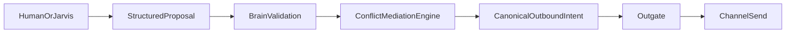

# Conflict Mediation Engine — concept and build plan

**Status:** **CME-2 in repo** — schema (`067`), policy seeds (`071`), read + write DAL (`src/conflictMediation/`), portal API (`POST /api/conflict/cases`, `POST …/issue-notice`), propera-app `/conflicts` report + courtesy notice UI (flag-gated). Complaint mediation, monitoring/escalation, Jarvis proposals: **not started** (CME-3+).

**Purpose:** Define Propera's **domain engine for building policy enforcement, resident conflict mediation, and auditable notice lifecycles**. This is separate from maintenance tickets, finance, preventive programs, and broadcast communications.

**Audience:** product, architecture, next agent implementing conflict/policy work.

**Jarvis alignment:** Conflict mediation is a **first-class Jarvis capability**, not a side feature. Staff, owner, and eventually tenant-facing surfaces propose operations; the **Conflict Mediation Engine** owns case truth; the **brain** validates tier, policy match, and permissions; **Outgate** renders neutral, policy-grounded language; the **Communication Engine** (or main outgate path) delivers messages.

**Related (do not duplicate):**

- [PROPERA_JARVIS_NORTH_STAR.md](./PROPERA_JARVIS_NORTH_STAR.md) — company operating delegate, common contract, phases
- [COMMUNICATION_ENGINE.md](./COMMUNICATION_ENGINE.md) — outbound send seam; CME does **not** own campaign blast logic
- [../propera-gas-reference/PROPERA_NORTH_COMPASS.md](../propera-gas-reference/PROPERA_NORTH_COMPASS.md) — mission and domain-engine doctrine
- [../propera-gas-reference/PROPERA_GUARDRAILS.md](../propera-gas-reference/PROPERA_GUARDRAILS.md) — no second brain, auditability, lifecycle purity
- [OPERATIONAL_POLICY_CONFIG.md](./OPERATIONAL_POLICY_CONFIG.md) — configurable rules (monitoring windows, tiers, thresholds); **not** hardcoded per property
- [ORCHESTRATOR_ROUTING.md](./ORCHESTRATOR_ROUTING.md) — maintenance inbound; CME routes **beside** `handleInboundCore`
- [TENANT_ROSTER_PORTAL.md](./TENANT_ROSTER_PORTAL.md) — resident identity for notices and complaints

**Naming note:** This engine is the **Conflict Mediation Engine (CME)**. Do **not** call it "Policy Engine" in code or docs — that name collides with the global **policy evaluation layer** (`property_policy`, schedule policy, lifecycle policy) in the brain stack.

---

## Core product insight (why this exists)

When a PM tells a tenant to move trash, it is **personal**. Pushback damages the relationship.

When the **building** speaks through a neutral, policy-grounded system, the message is not "Nick vs tenant." It is **building policy speaking**. Management stays human; enforcement stays structured and auditable.

That is a **human dynamics** problem, not a messaging-template problem. It only works when the system underneath has:

- real tenant and unit records
- structured building rules (not only a PDF on the wall)
- notice and complaint history in one place
- timestamped audit trail if conflict escalates to lease or legal review

Most PMS products optimized accounting and leasing first. Maintenance tools optimized work orders. Communication tools optimized blasts. **Conflict mediation with enforceable lifecycle and paper trail** is largely empty — and it requires the operational layer Propera is already building.

---

## What the Conflict Mediation Engine owns

| Domain truth | Owner |
|--------------|--------|
| **Building conduct policies** (structured, queryable) | CME |
| **Conflict / violation cases** | CME |
| **Complaint records** (including complainant confidentiality) | CME |
| **Notice tier and escalation sequence** | CME |
| **Case lifecycle state** (`MONITORING`, `ESCALATED`, `LEGAL_HOLD`, etc.) | CME |
| **Audit / legal paper trail** | CME |

| Not owned by CME | Owner |
|------------------|--------|
| Whether maintenance work is done | Maintenance / lifecycle |
| Rent balance, charges, ledger | Finance |
| Broadcast campaigns | Communication Engine |
| Who owns next action globally | Resolver + brain |
| Final outbound wording constraints | Outgate (expression) |
| TCPA / channel delivery | Transport + compliance |

---

## What the engine does **not** do

- Replace the global brain **policy evaluation layer** (schedule hours, lifecycle gates, etc.)
- Become a second brain that improvises enforcement without records
- Store rules only as unstructured PDFs with no machine-readable match
- Expose complainant identity to the subject tenant when policy requires confidentiality
- Send operational messages without going through canonical outbound intent → Outgate
- Bypass approval tiers for formal warnings or legal-sensitive escalation

---

## Architecture (one brain, dedicated domain engine)

```text
Staff / Owner / Agent (Jarvis)
  → structured proposal (report_violation, mediate_complaint, issue_notice, …)
  → brain validation (policy applies? tier correct? actor allowed?)
  → Conflict Mediation Engine (case + notice lifecycle writes)
  → canonical outbound intent
  → Outgate (neutral, policy-grounded voice)
  → Communication / main channel send
```



**Inbound:** Conflict-related tenant replies may arrive on existing channels. Classification may route to CME **beside** maintenance core — same adapter front door, dedicated domain handler — not a parallel interpretation brain.

---

## Case types (V1 concept)

| Type | Example | Confidentiality |
|------|---------|-------------------|
| **Policy violation (observed)** | "505 left trash in the hallway." | Subject is known; reporter may be staff |
| **Policy violation (reported by tenant)** | "My neighbor's dog barks all night." | Complainant identity protected from subject when required |
| **Staff/owner directive** | "Send courtesy notice to 302 for parking in fire lane." | N/A |
| **Repeat / escalation** | Second notice after monitoring window | Tier driven by CME + brain |

---

## Policy definitions (structured, not PDF-only)

Building rules live as **structured records** the brain and agent can cite:

- quiet hours
- trash / waste / bulk item placement
- guest policy
- pet policy
- parking / fire lane
- smoking
- common-area conduct
- noise

Each policy record should support at minimum:

- `property_code` (or portfolio scope)
- `policy_key` / category
- human-readable title and summary
- enforceable text snippet for notices
- default notice tier mapping (courtesy → formal)
- active / effective dates (future)

V1 may start with a small seeded set per property; the schema should not assume PDF upload only.

---

## Lifecycle state machine (engine-owned)

Distinct from maintenance ticket lifecycle:

```text
INTAKE
  → POLICY_MATCH          (policy found? else flag PM)
  → CASE_OPEN
  → NOTICE_DRAFTED        (brain validates tier + permission)
  → NOTICE_PENDING_APPROVAL (when tier requires)
  → NOTICE_SENT           (via outgate + send)
  → MONITORING            (did behavior stop within window?)
  → SUSPENDED_PENDING_MAINTENANCE   (root cause = building defect; handoff to maintenance — case not closed)
  → ESCALATED             (2nd notice / formal warning)
  → RESOLVED              (behavior corrected or case closed)
  → LEGAL_HOLD            (preserve record; restrict edits)
  → CLOSED
```

**Monitoring** and **LEGAL_HOLD** are why this is not a maintenance ticket: maintenance does not own "wait for tenant behavior to change" as enforceable case state.

**Monitoring window (not hardcoded):** The number of days in `MONITORING` is **not** a code constant. It resolves from [OPERATIONAL_POLICY_CONFIG.md](./OPERATIONAL_POLICY_CONFIG.md) (e.g. `conflict.monitoring_window_days`) at **property** scope with portfolio fallback. CME-4 must not ship escalation until that key exists and is logged on each transition.

---

## Jarvis proposal types (common contract)

Add to the shared agent contract in [PROPERA_JARVIS_NORTH_STAR.md](./PROPERA_JARVIS_NORTH_STAR.md):

| Proposal | Purpose |
|----------|---------|
| `report_policy_violation` | Staff/owner reports observed breach; open case |
| `mediate_resident_complaint` | Tenant-vs-tenant or neighbor complaint; protect reporter |
| `issue_policy_notice` | Draft/send notice for open case at validated tier |
| `escalate_conflict_case` | Move to next notice tier after monitoring |
| `query_conflict_history` | Owner/staff asks history for unit/tenant/property |
| `resolve_conflict_case` | Close with reason |
| `place_legal_hold` | Elevated; owner/PM only |

Agent may **gather** and **draft**. Brain assigns **approval tier**. CME commits **case truth**.

---

## Complaint mediation flow (confidentiality)

**Example:** Tenant X complains about Tenant Y's noise.

1. Agent acknowledges X; logs complaint case linked to Y's unit (not X's identity in outbound to Y).
2. Brain validates applicable quiet-hours / conduct policy.
3. CME opens case; selects notice tier.
4. Outgate sends Y a **policy reminder** — building management, not "your neighbor reported you."
5. All events timestamped on case timeline.

**Rule:** Complainant identity protection is **engine policy**, not prompt politeness.

---

## Escalation and paper trail

| Tier (example) | Typical use |
|----------------|-------------|
| Courtesy notice | First observation |
| Second notice | Repeat within monitoring window |
| Formal warning | Documented escalation |
| Legal hold | Preserve chain for counsel / lease action |

Hidden product value: when conflict reaches lease violation or legal dispute, operators today often have **texts and memory**. CME provides:

- what policy applied
- what was sent, when, to whom
- what tier
- who approved escalation
- tenant responses logged on case

That is **legal protection**, not just convenience.

---

## Delegation map

| Concern | Delegate to |
|---------|-------------|
| Send SMS/TG/WA | Communication Engine or main outgate + Twilio |
| Neutral wording | Outgate + `OUTGATE_VOICE_SPEC` |
| Actor permission, tier validity | Brain / resolver |
| Tenant phone / unit | `tenant_roster`, `units` |
| Maintenance if issue is actually a repair | Thin handoff: `createMaintenanceTicketFromConflict` (future, explicit) |

### Maintenance handoff (conduct vs defect)

Overlap is constant: neighbor "noise" may be plumbing vibration; a complaint may reveal a physical defect.

**Rule:**

- If investigation shows the **root cause is a physical building defect** (leak, HVAC, structural vibration, failed equipment), the agent proposes **`handoff_to_maintenance`** (or equivalent structured proposal).
- CME sets the conflict case to **`SUSPENDED_PENDING_MAINTENANCE`** (or equivalent) — **not** `RESOLVED` and **not** `CLOSED`.
- Maintenance owns repair lifecycle truth; CME retains the conduct case until repair outcome is known or PM explicitly closes.
- After maintenance completes (or PM directs), CME may resume (`MONITORING`, further notice, or `RESOLVED`).

**Who triggers:** staff, owner, or Jarvis agent via proposal; **brain** validates that handoff is appropriate; **CME** updates case state; maintenance path creates the ticket.

This prevents incorrectly closing a conduct case when the issue was always a building problem.

---

## Boundaries vs other engines

| If you need… | Use… |
|-------------|------|
| Fix the leak | Maintenance |
| Bill tenant for damage | Finance / ticket cost |
| Remind all residents of fire drill | Communication Engine |
| Enforce trash policy with audit trail | **Conflict Mediation Engine** |
| Answer "what notices did we send 302?" | CME query |

---

## Phased build (recommended)

| Phase | Scope | Exit |
|-------|--------|------|
| **CME-0** | This doc + North Compass + Jarvis north-star linkage | Doctrine locked |
| **CME-1** | Schema: policies, cases, case_events; portal read list | Records exist |
| **CME-2** | `report_policy_violation` + `issue_policy_notice` (courtesy tier); staff portal | First notice path live |
| **CME-3** | `mediate_resident_complaint` + confidentiality rules | Complaint mediation live |
| **CME-4** | Monitoring + `escalate_conflict_case` | Repeat offense path live; **`conflict.monitoring_window_days`** (and related keys) resolved via policy config layer with audit `record_id`; default documented if portfolio unset (e.g. 14 days — product decision at CME-4, not silent code magic) |
| **CME-5** | Jarvis staff/owner proposals via same API | Agent-ready |
| **CME-6** | Owner query + legal hold + export | Portfolio intelligence |

**Explicitly out of CME-1:** full lease enforcement automation, eviction workflow, court filing, AI-only policy invention without structured policy rows.

---

## Guardrails (non-negotiable)

1. **No second brain** — agent does not own case state or notice tier truth.
2. **Brain validates** — policy applies, tier, permissions, approval level.
3. **Outgate expresses** — neutral, policy-grounded; no personal attacks; no leaking complainant.
4. **Auditable** — every state change → `case_events` or `event_log`.
5. **No promises** — agent/outgate must not promise eviction, fines, or repair dates unless brain committed them (see Jarvis "What the Agent Is Allowed to Say").
6. **Containment** — prefer `src/conflictMediation/*` module; do not stuff violation lifecycle into `tickets` or `communication_campaigns`.
7. **Complainant confidentiality** — protected identity is **engine policy** enforced in DAL and outbound rules, not prompt politeness.
8. **No silent maintenance merge** — physical defects hand off to maintenance; conflict case stays open/suspended until outcome is explicit.

---

## Repo reality (today)

| Item | Status |
|------|--------|
| Doctrine in North Compass | **Added** (see `PROPERA_NORTH_COMPASS.md`) |
| Jarvis north-star linkage | **Added** |
| SQL migrations | **`067`** schema, **`068`** policy-config seeds, **`071`** starter `conflict_policies` per property |
| `src/conflictMediation/` | **CME-2** — read DAL + write DAL + notice outgate + portal routes |
| Portal UI | **`propera-app` `/conflicts`** — list, report violation, preview/send courtesy notice |
| GAS parity reference | **None** (V2-native product) |
| CME-3+ | Complaint confidentiality writes, monitoring cron, Jarvis proposal wiring — **not started** |

---

## Success criteria (product)

- Staff can report a violation and send a courtesy notice without becoming the emotional messenger.
- Owner can ask conflict history for a unit and get a coherent timeline.
- Repeat violations escalate with correct tier, not ad hoc texts.
- Complainant identity is protected when required.
- Case record is defensible months later (timestamps, policy cited, notices sent).

---

## Changelog

| Date | Note |
|------|------|
| 2026-05-26 | Initial concept doc — engine name **Conflict Mediation Engine**; Jarvis + North Compass linkage. |
| 2026-05-26 | Maintenance handoff rule; monitoring window via policy config; CME-4 exit criteria for config keys. |
| 2026-05-28 | **CME-2 shipped** — `report_policy_violation` + `issue_policy_notice` (courtesy tier), migration **`071`**, portal write UI. |
