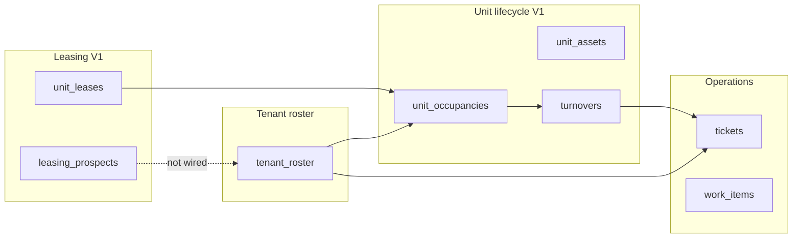

# Engine connectivity review — leasing, tickets, unit lifecycle

**Purpose:** Map how Propera engines connect today, where staff must duplicate work, and the **sync contract** so move-in/move-out/leasing/turnover stay aligned without Jarvis.

**Status:** **Sync V1–V4 shipped** (orchestrator + move-in / move-out + episode tickets + finance vacancy intervals). Jarvis Phase 6 deferred.

**Related:** [UNIT_LIFECYCLE_BUILD_PLAN.md](./UNIT_LIFECYCLE_BUILD_PLAN.md) · [PROPERA_NORTH_COMPASS.md](../PROPERA_NORTH_COMPASS.md) · leasing **085** · occupancies **087** · assets **088** · turnovers **039**

---

## North star

One **unit** has one **current truth** at a time:

| Question | Canonical answer (target) |
|----------|---------------------------|
| Who lives here now? | `unit_occupancies.status = current` + active `tenant_roster` |
| What are the lease terms? | `unit_leases` (current row) + snapshot on occupancy at move-in |
| Is the unit in make-ready? | Active `turnovers` (OPEN / IN_PROGRESS) |
| What's installed? | Active `unit_assets` |
| What broke? | `tickets` by property + unit label (episode; survives tenants) |

**Rule:** Portal UI and Jarvis **propose**; brain **commits**. Cross-engine effects go through **`src/lifecycle/unitLifecycleOrchestrator.js`** so DAL modules stay in their zones.

---

## Engine map (what exists)



| Engine | Table(s) | Portal surface | Flag |
|--------|----------|----------------|------|
| **Tenant roster** | `tenant_roster` | Unit hub, tenant editor | — |
| **Lease (current)** | `unit_leases` (1 row/unit) | Unit lease editor | — |
| **Leasing CRM** | `unit_leases.renewal_*`, `leasing_prospects` | `/leasing` | `PROPERA_LEASING_ENGINE_ENABLED` |
| **Occupancy history** | `unit_occupancies` | Unit → Overview / History | `PROPERA_UNIT_LIFECYCLE_ENABLED` |
| **Unit assets** | `unit_assets` | Unit → Assets | same lifecycle flag |
| **Turnover** | `turnovers`, `turnover_items` | `/turnovers`, unit section | `PROPERA_TURNOVER_ENGINE_ENABLED` |
| **Tickets** | `tickets` | Tickets, unit hub | — |
| **Unit status (finance)** | `unit_status_history` | Financial property view | finance flags |

---

## Connectivity matrix (today)

Legend: **Auto** = orchestrator or single action does it · **Manual** = staff must repeat · **Partial** = UI hint only · **None** = not linked

| Staff action | Tenant roster | unit_leases | unit_occupancies | turnover | unit status | tickets |
|--------------|---------------|-------------|------------------|----------|-------------|---------|
| **Record move-in** (occupancy open) | **Auto** `active=true` on open | Snapshot at open | **Manual** open (sync activates tenant) | — | — | — |
| **Record move-out** (occupancy close) | Still active until deactivate | Unchanged | **Manual** close | **Auto** optional `start_turnover` on close; banner links past occupancy | — | — |
| **Deactivate tenant** (unit page) | `active=false` | — | **Auto** close current occupancy (Sync V1) | — | — | — |
| **Lease → Vacating** (`/leasing`) | — | `renewal_status` | **Auto** close current occupancy (Sync V1) | — | — | — |
| **Prospect → Signed** | **Auto** create/reactivate | **Auto** upsert from budget/move-in | **Auto** open (or refresh snapshot) | — | — | — |
| **Start turnover** | — | — | — | **Manual** | — | Optional link on item |
| **Turnover READY** | — | — | — | Status only | — | — |
| **New lease signed / move-in** (prospect) | **None** | — | **None** | — | — | — |
| **Create ticket** | Uses roster phone | — | — | — | — | **Manual** |
| **Ticket closed** | — | — | — | — | — | No effect on unit |

---

## Gaps that hurt daily ops

### 1. Move-out ≠ history

**Before Sync V1:** Deactivating a tenant did **not** close `unit_occupancies`. History tab stayed empty while roster showed “inactive.”

**After Sync V1:** Deactivate tenant → orchestrator closes **current** occupancy for that unit (when lifecycle flag on).

**Still manual:** Explicit “Record move-out” on unit page (preferred for dated move-out); leasing “Vacating” now also closes occupancy.

### 2. Leasing and occupancy are parallel

- `/leasing` tracks **renewal intent** and **prospects**.
- Unit page tracks **occupancy episodes**.
- Marking **Vacating** does not deactivate the tenant row (intentional — notice period).
- **Prospect Signed** now creates roster + lease + occupancy when unit + phone are set (Sync V2).

### 3. Turnover is optional glue

- Move-out can start turnover in one step (`start_turnover` on close) or via banner (PATCH past occupancy).
- `move_out_turnover_id` is set at close when turnover starts with move-out.
- Turnover READY does not auto-open next occupancy (correct — new tenant unknown).

### 4. Tickets — unit-scoped; episode stamp for History only

- Tickets stay on the unit (CMMS).
- **Sync V3:** `unit_occupancy_id` + `tenant_roster_id_at_open` set at create when a current occupancy exists.
- Shown only under **Unit → History** per past stay — **not** on ticket detail panel.

### 5. `unit_leases` still overwrites

- One row per unit; no lease **history** table.
- Occupancy carries `lease_snapshot_json` at move-in (good for history).
- Versioned leases (plan option A) = Sync V4.

---

## Sync contract (orchestrator)

**Module:** `src/lifecycle/unitLifecycleOrchestrator.js`  
**Called from:** `registerPortalRoutes.js` only (portal write boundary — not inside Jarvis).

| Function | Trigger | Effects |
|----------|---------|---------|
| `syncAfterTenantDeactivated` | `DELETE /api/portal/tenants/:id` | Close current occupancy for tenant’s unit if `tenant_roster_id` matches |
| `syncAfterLeaseMarkedVacating` | `PATCH .../expiring-leases/:id` with `renewal_status=vacating` | Close current occupancy for lease’s `unit_catalog_id` |
| `closeOccupancyWithOptions` | `POST .../occupancies/:id/close` | Close; optional `start_turnover` → `startTurnover` + set `move_out_turnover_id` |
| `syncAfterProspectSigned` | `PATCH .../leasing/prospects/:id` → `status=signed` | Tenant roster + `unit_leases` + open/refreshed occupancy |
| `openOccupancyWithSync` | `POST .../occupancies/open` | `active=true` on tenant + open occupancy |
| `syncLeaseSnapshotToCurrentOccupancy` | `POST .../units/:id/sync-lease-occupancy` (+ app lease save) | Refresh current occupancy `lease_snapshot_json` from `unit_leases` |
| `syncUnitStatusOnOccupancyOpen/Close` | Occupancy open/close (+ prospect signed, tenant deactivate, lease vacating) | Updates `units.status` → trigger **064** writes `unit_status_history` |

All functions no-op when `PROPERA_UNIT_LIFECYCLE_ENABLED` is off. Turnover start requires `PROPERA_TURNOVER_ENGINE_ENABLED`.

Event log: `UNIT_LIFECYCLE_SYNC_*` payloads for audit.

---

## Recommended phases (pre-Jarvis)

### Sync V1 — shipped

- Orchestrator: `src/lifecycle/unitLifecycleOrchestrator.js`
- Portal hooks: tenant `DELETE`, lease vacating `PATCH`, occupancy close with `start_turnover`
- App: move-out confirm → optional turnover start; banner patches past occupancy with turnover id
- Tests: `tests/unitLifecycleOrchestrator.test.js`, past occupancy link in `unitOccupanciesDal.test.js`

### Sync V2 — shipped

| Trigger | Automation |
|---------|------------|
| Prospect `signed` (first transition) | `syncAfterProspectSigned` — roster + lease + occupancy |
| Occupancy `open` | `openOccupancyWithSync` — tenant `active=true` |
| Lease editor save (unit page) | V2 `sync-lease-occupancy` after app `unit_leases` upsert |

Optional body on prospect PATCH: `sync_lease` `{ rent_cents, lease_start, lease_end, … }` for explicit terms.

**Requires:** prospect has **unit** + **phone** before Signed (enforced in leasing UI).

### Sync V3 — shipped

| Trigger | Automation |
|---------|------------|
| New maintenance ticket (`finalizeMaintenance`) | Stamp `unit_occupancy_id` + `tenant_roster_id_at_open` when current occupancy exists |
| Unit → History tab | `GET .../episode-ticket-history` — tickets under each past occupancy (stamp or date fallback) |
| Ticket detail panel | **Unchanged** — no episode fields in `portal_tickets_v1` |

Migration **090**. Tests: `ticketEpisodeStamp.test.js`.

**Not in V3:** asset pre-fill on create (Jarvis/metadata — later).

### Sync V4 — shipped

| Trigger | `units.status` | Notes |
|---------|----------------|-------|
| Occupancy **open** (incl. prospect signed) | **Occupied** | `unitStatusSync.js`; uses occupancy `started_at` on `units.updated_at` |
| Occupancy **close** (move-out) | **Vacant** | Uses occupancy `ended_at` for timing |
| Tenant **deactivate** (closes occupancy) | **Vacant** | Same as close |
| Lease **vacating** (closes occupancy) | **Notice** | Avoids marking vacant during notice period |
| Unit already **Down** / **Model** | Skipped | Protected — staff manual status preserved |

No new migration: existing **`064`** trigger `units_status_history_sync` maintains `unit_status_history` and `portal_units_v1.vacancy_started_at`.

Tests: `tests/unitStatusSync.test.js`.

---

## What not to automate (yet)

- **Jarvis** writing across engines without confirm — still Phase 6.
- **Auto-deactivate tenant** on lease vacating — staff may need roster during notice.
- **Delete** occupancy or turnover rows — soft status only.
- **Merge ledger** by occupancy — separate finance project.

---

## Patch Law (this work)

| Target | Zone |
|--------|------|
| `src/lifecycle/unitLifecycleOrchestrator.js` | New lifecycle orchestration (allowed) |
| `registerPortalRoutes.js` | Portal hooks only |
| `propera-app` occupancy close + turnover banner | Thin client; still via V2 API |

Canonical flow unchanged: **signal → resolver → lifecycle engine** for tickets; orchestrator is **portal staff capture** only.

---

## Env checklist (all engines)

```bash
# V2 .env
PROPERA_UNIT_LIFECYCLE_ENABLED=1
PROPERA_TURNOVER_ENGINE_ENABLED=1
PROPERA_LEASING_ENGINE_ENABLED=1

# App .env.local
NEXT_PUBLIC_PROPERA_UNIT_LIFECYCLE_ENABLED=1
NEXT_PUBLIC_PROPERA_TURNOVER_ENABLED=1
NEXT_PUBLIC_PROPERA_LEASING_ENABLED=1
```

Migrations: **087** occupancies · **088** assets · **089** nameplates · **085** leasing · **039** turnovers · **049** unit_leases.
