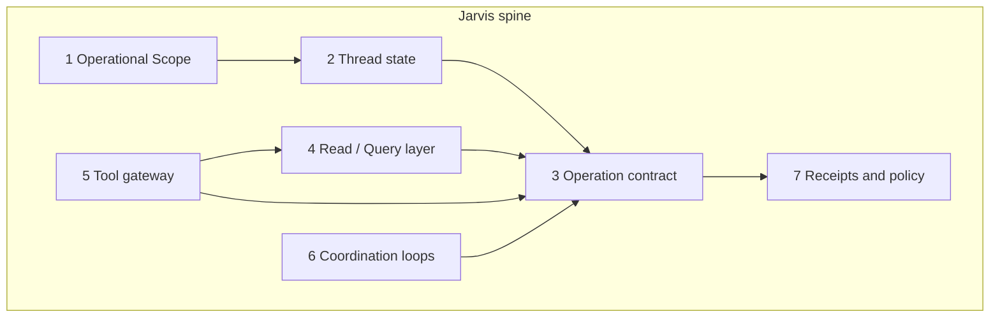

# Jarvis Spine — Foundation Architecture

## Purpose

This document defines **what to build** so Jarvis can eventually handle open-ended operational plays (parts → track → schedule → tenant message today; something else tomorrow) **without** shipping a new feature-specific bot for each workflow.

It is the **engineering spine** companion to [PROPERA_JARVIS_NORTH_STAR.md](./PROPERA_JARVIS_NORTH_STAR.md) (doctrine, phases, audience rules). The north star says *where we are going*; this doc says *which primitives must exist* and *in what order*.

**Not in scope here:** parity ledgers, per-channel UI specs, or step-by-step implementation of any one example (e.g. dishwasher heat exchanger ordering).

---

## Core principle

> **Build extensible operations + thread state + reads + tools — not workflows.**

A workflow is a **composition** of spine primitives. Parts ordering is an acceptance test, not a milestone.

---

## The invariant contract

Every Jarvis turn that touches the business must classify into one of these steps (same on portal, SMS, WhatsApp, Telegram):

| Step | Who decides | Mutates state? |
|------|-------------|----------------|
| **Read** | Brain read models / query layer | No |
| **Gather** | Agent asks; brain may require fields | No |
| **Propose** | Agent drafts structured op; brain assigns approval tier | No (draft only) |
| **Approve** | Human (or policy auto-approve where allowed) | No |
| **Validate** | Brain policy + domain validators | No |
| **Execute** | Brain domain handlers only | Yes |
| **Receipt** | Brain facts → agent/outgate phrasing | No |

Jarvis **never** executes. Jarvis may propose; the brain commits.

North Compass question after every turn:

**Given this signal, who owns the next action?**

---

## Anti-patterns (reject in review)

| Anti-pattern | Why it fails |
|--------------|--------------|
| Feature-specific Jarvis handler (`handlePartsOrder`, `jarvisDishwasher.js`) | Tomorrow needs another handler |
| Ask tab that mirrors cockpit lists | No reason to use Jarvis on portal |
| Agent calling vendor APIs / sending SMS directly | Bypasses brain; no audit or approval |
| LLM reply with no `Proposal` object for writes | Pretty promises, no safe commit |
| New adapter per domain or channel | Violates one operator / one spine |
| Skipping thread state for multi-turn plays | “Later, order it” cannot bind safely |

---

## Foundation layers (build program)

Seven layers. **Skipping a layer** produces either a UI parrot or a demo that cannot commit safely.



### Layer 1 — Operational Scope

**Question answered:** *What world are we in right now?*

Compiled **before** Ask, Plan, or brain reads. Hints and candidates — **not** committed identity.

| Slice | Role |
|-------|------|
| Actor | staff / owner / tenant, ids, channel |
| Anchor | `portal_page_context`, property/unit/ticket pins |
| Active work | Open WIs, property open tickets (candidates) |
| Focus | Best single work-item / ticket candidate |
| Story | Short deterministic summary for LLM/templates |
| Memory (later) | Briefs, digests, vectors — attached when needed |

**Code today:** `src/agent/operationalScope/` — `compileOperationalScope()` v0; logged on `portal_chat` as `OPERATIONAL_SCOPE_COMPILED`.

**Build toward:** stable on all channels; always logged; sufficient that proposals rarely rely on prose alone for target resolution.

**Related:** [STAFF_AGENT_V1.md](./STAFF_AGENT_V1.md), north star § Operational Scope.

---

### Layer 2 — Thread state

**Question answered:** *What play is in flight in this conversation?*

Required for: “find the cheapest part” → **later** “order it” → **later** “track and tell tenant.”

Minimum model (conceptual):

```json
{
  "thread_id": "actor+channel+anchor_fingerprint",
  "status": "idle | gathering | proposal_pending | executing | done",
  "scope_snapshot_ref": "last compiled scope id or hash",
  "pending_proposals": [
    {
      "proposal_id": "uuid",
      "op": "coordinate_schedule_with_tenant",
      "state": "draft | awaiting_confirm | approved | rejected | committed | failed",
      "depends_on": null,
      "created_at": "iso",
      "expires_at": "iso"
    }
  ],
  "fact_pack_refs": [],
  "last_receipt": {}
}
```

**Rules:**

- One thread may have **multiple pending proposals** only if explicitly modeled (e.g. parent/child chain).
- Child steps reference `depends_on: proposal_id` (order → track → schedule → message).
- Confirming a proposal does not clear thread until **receipt** is recorded.
- SMS “YES” / portal **Confirm** are the same approval surface.

**Code today:** `jarvis_operator_threads` (migration **070**), `src/agent/thread/`, `src/dal/jarvisOperatorThreads.js` — pending proposals + `last_receipt` keyed by actor + channel + anchor fingerprint. Flag: `JARVIS_THREAD_ENABLED`. Legacy `conversation_ctx` expense confirm remains for SMS YES shorthand.

**Build toward:** referential turns (“order it later”), `depends_on` chains, load thread without re-sending confirm token.

---

### Layer 3 — Operation contract (highest priority spine)

**Question answered:** *What structured action is being offered for commit?*

The **only** path from Jarvis to mutation:

```
Natural language → (optional gather) → Proposal → Approve → Brain validate → Domain execute
```

#### Proposal shape (canonical sketch)

```json
{
  "proposal_id": "uuid",
  "version": "1",
  "op": "attach_ticket_cost",
  "summary_human": "Attach $42.00 company cost to PENN-051926-7149",
  "target": {
    "ticket_row_id": "uuid",
    "property_code": "PENN",
    "unit_label": "423"
  },
  "payload": {},
  "approval_tier_suggested": 2,
  "approval_tier_assigned": null,
  "depends_on": null,
  "evidence": {
    "scope_ref": "",
    "fact_pack_ref": "",
    "tool_results_ref": []
  }
}
```

- **`op`** — registry key (extensible).
- **`target`** — hints; brain **resolves** canonical keys and permissions.
- **`payload`** — op-specific; validated only by that op’s brain validator.
- **`approval_tier_*`** — brain assigns tier; agent may suggest (tiers 0–4 per north star).

#### Operation registry (initial set)

Grow by **adding rows**, not new handlers.

| `op` | Domain owner | Brain path (existing / planned) | Typical tier |
|------|--------------|----------------------------------|--------------|
| `attach_ticket_cost` | Finance | ticket cost entries | 2–3 |
| `schedule_ticket` | Lifecycle | maintenance lifecycle | 2 |
| `close_ticket` | Lifecycle | maintenance lifecycle | 2 |
| `add_ticket_note` | Lifecycle | ticket mutation / timeline | 1–2 |
| `coordinate_schedule_with_tenant` | Lifecycle + comms | coordination loop | 2–3 |
| `propose_outbound_message` | Communications | [COMMUNICATION_ENGINE.md](./COMMUNICATION_ENGINE.md) | 2–3 |
| `send_communication_campaign` | Communications | comms engine | 3 |
| `create_program_run` | PM program | [PM_PROGRAM_ENGINE_V1.md](./PM_PROGRAM_ENGINE_V1.md) | 2–3 |
| `query_program_history` | PM program | read only → Ask | 0 |
| `propose_vendor_request` | Vendor lane | [VENDOR_LANE.md](./VENDOR_LANE.md) (planned) | 2–3 |
| `propose_purchase` | Finance / vendor | planned | 3 |
| `set_tracking_watch` | Ops metadata | planned (reminder + external ref) | 1–2 |
| `report_policy_violation` | Conflict mediation | [CONFLICT_MEDIATION_ENGINE.md](./CONFLICT_MEDIATION_ENGINE.md) | 2–4 |

**Example composition (not one op):**

| User intent | Composition |
|-------------|-------------|
| Order heat exchanger | `propose_purchase` or `propose_vendor_request` |
| Track package | `set_tracking_watch` |
| Schedule after delivery | `coordinate_schedule_with_tenant` (depends on watch or manual confirm) |
| Inform tenant | `propose_outbound_message` (after schedule commit or policy window) |

**Code today:** individual brain paths exist (lifecycle, cost, comms); **no unified `Proposal` registry or portal Plan renderer**.

**Build toward:**

1. `src/agent/proposals/` — schema, registry, `validateProposal(proposal)`, `routeProposalToDomain(proposal)`.
2. One validator per `op` → existing DAL/lifecycle/comms entrypoints.
3. `propera-app` — **generic Plan card** (summary, target, payload preview, Confirm / Cancel / Edit).

---

### Layer 4 — Read / Query layer

**Question answered:** *What does the human need to know that the cockpit does not surface in one click?*

Jarvis Ask earns its keep here — **not** by repeating open ticket lists.

#### Query kinds

| Kind | Example questions | Output |
|------|-------------------|--------|
| **Analytics** | “How many appliance issues at PENN **this month**?” vs “**this year**?” | Counts + breakdown; **month ≠ YTD** = different `QuerySpec` |
| **Entity detail** | “What is 423 about?” | Focused ticket fact pack |
| **Synthesis** | “What’s the cause?” | Grounded summary over timeline + notes + priors; must admit unknown |
| **Comparison** | “Cheapest heat exchanger for this model?” | Tool results as facts, not purchase |

#### QuerySpec (sketch)

```json
{
  "kind": "analytics | entity | synthesis | comparison",
  "anchor": { "property_code": "PENN" },
  "filters": {
    "category_contains": ["appliance"],
    "tags": [],
    "status_in": ["open", "closed"]
  },
  "time_range": {
    "preset": "month_utc | ytd_utc | custom",
    "from": null,
    "to": null
  },
  "group_by": ["category", "unit_label"],
  "limit": 50
}
```

Intent classification (agent or deterministic) → `QuerySpec` → SQL / read-model → **FactPack** → formatter or grounded LLM.

**Code today:** `src/agent/jarvisAsk/` — narrow fact pack + templates; no `QuerySpec` layer.

**Build toward:** `src/agent/jarvisQuery/` — shared by Ask and Plan (Plan may need reads to draft proposals).

---

### Layer 5 — Tool gateway

**Question answered:** *What does the outside world say, as auditable facts?*

External capabilities (parts search, tracking APIs, maps) plug in as **tools**, not Jarvis features.

| Mode | Tool use |
|------|----------|
| **Ask** | Read-only tool calls → merged into FactPack |
| **Plan** | Tools may **draft** proposal fields (SKU, URL, price band) |
| **Execute** | **No agent tools** — brain or approved integration commits |

Minimum gateway contract:

```json
{
  "tool": "parts_search",
  "input": { "query": "...", "model": "..." },
  "output": { "results": [], "fetched_at": "iso" },
  "permissions": ["staff"],
  "audit_id": "uuid"
}
```

**Rules:** log every call; timeout and allowlist; never auto-purchase from tool output.

**Code today:** not implemented for Jarvis (LLM helpers exist elsewhere for intake/tenant agent).

---

### Layer 6 — Coordination loops

**Question answered:** *Who owns the multi-day back-and-forth?*

Some operations are **state machines**, not one-shot writes:

- `coordinate_schedule_with_tenant`
- (future) parts arrival → schedule visit → tenant notify
- conflict mediation cases

Jarvis **starts** the loop via Proposal. The **domain engine** owns waits, tenant replies, policy, and transitions.

Agent responsibilities in a loop:

- surface status (“waiting on tenant window”)
- offer the **next** proposal when the loop allows
- never commit schedule or send outbound without brain validation

**Related:** north star § Coordination Loops Are First-Class; [COMMUNICATION_ENGINE.md](./COMMUNICATION_ENGINE.md).

---

### Layer 7 — Receipts and approval policy

**Question answered:** *What happened, and what is still pending?*

After execute, brain returns a **receipt** (structured):

```json
{
  "committed": true,
  "op": "attach_ticket_cost",
  "changes": [],
  "pending": [],
  "next_owner": "staff | tenant | system | vendor",
  "next_action_hint": "string",
  "event_log_refs": []
}
```

Agent/outgate may **paraphrase** receipt only — no new facts.

Approval tiers (brain-assigned, per north star):

| Tier | Meaning |
|------|---------|
| 0 | Read only |
| 1 | Clarify first — do not propose commit |
| 2 | Actor confirm (normal staff write) |
| 3 | Elevated (money, blast radius, policy) |
| 4 | Reject or escalate |

---

## Modes map to layers

| Mode | Uses |
|------|------|
| **Ask** | Scope + Query layer + FactPack (+ tools read) |
| **Plan** | Scope + Thread state + Operation contract + Plan card UI |
| **Execute** | Brain only (triggered by approved proposal) |

The **“feels different”** moment is **Plan + thread + coordination loop** — but it generalizes only if **Layer 3 + 2** exist first.

---

## Suggested build order

| Order | Deliverable | Unlocks |
|-------|-------------|---------|
| **1** | Operation registry + 2–3 validators wired to existing brain paths | Any Plan card, any channel |
| **2** | Thread state persistence + pending proposal lifecycle | Multi-turn, “later…”, chains |
| **3** | Generic Plan card in `propera-app` | Confirm-before-write UX |
| **4** | `QuerySpec` + analytics reads | Month vs YTD, category counts, non-UI questions |
| **5** | Tool gateway (read) | External comparison in Ask / Plan drafts |
| **6** | Coordination loop hooks in portal + SMS | track → schedule → notify compositions |
| **7** | Expand `op` registry + owner tiers | Portfolio-scale plays |

**Parallel work:** Layer 4 can proceed once Layer 1 is stable; do not block Layer 1–3 on analytics.

**Current repo focus:** finish **1 → 2 → 3** before marketing “full Jarvis.” Ask on portal is useful for SMS later and for validating scope; it is **not** the spine.

---

## Repository boundaries

Per north star and guardrails:

| Repo | Owns |
|------|------|
| **propera-v2** | Scope compiler, proposal validate/route, query layer, tool gateway, brain execute, `event_log` |
| **propera-app** | Shell, page context envelope, Plan card UI, approval UX, read-model display |
| **Outgate** | Tone and delivery of receipts — not truth |

Patch Law: spine changes stay in **agent/compiler** and **proposal routers**; do not bypass resolver/lifecycle for commits.

---

## Code map (status)

| Layer | Location | Status |
|-------|----------|--------|
| Operational Scope | `src/agent/operationalScope/` | **v0 live** |
| Thread state | `src/agent/thread/`, `src/dal/jarvisOperatorThreads.js`, migration `070` | **v0** — pending + receipt on propose/commit |
| Operation contract | `src/agent/proposals/` | **Slice 1** — `attach_ticket_cost` + confirm token |
| Jarvis Ask | `src/agent/jarvisAsk/` | **Portal read-only** behind `JARVIS_ASK_ENABLED` |
| Jarvis Plan | `src/agent/jarvisPlan/` | **Slice 1** — `jarvis_plan` mode, cost propose → confirm card |
| Query / analytics | — | **Not started** |
| Tool gateway | — | **Not started** |
| Coordination loops | lifecycle + comms partial | **Partial** (not Jarvis-wired) |
| Portal ingress | `runInboundPipeline.js`, `portal_chat_mode` | **Live** |

---

## How to review a Jarvis slice

Before merging any Jarvis-related PR, answer:

1. **Which layer** does this extend (1–7)?
2. Does it add a **new `op`** or a **new workflow handler**? (Only `op` is allowed.)
3. For writes: is there a **Proposal** object and brain validator path?
4. Does it preserve **who owns the next action** in logs/receipts?
5. Would tomorrow’s different example reuse this without new code paths?

If the answer to (2) is “workflow handler,” redesign.

---

## Related documents

- [PROPERA_JARVIS_NORTH_STAR.md](./PROPERA_JARVIS_NORTH_STAR.md) — doctrine, phases, audiences, Operational Scope
- [STAFF_AGENT_V1.md](./STAFF_AGENT_V1.md) — portal page context envelope
- [COMMUNICATION_ENGINE.md](./COMMUNICATION_ENGINE.md) — outbound proposals
- [VENDOR_LANE.md](./VENDOR_LANE.md) — vendor assignments and future purchase path
- [CONFLICT_MEDIATION_ENGINE.md](./CONFLICT_MEDIATION_ENGINE.md) — policy domain ops
- [OPERATIONAL_POLICY_CONFIG.md](./OPERATIONAL_POLICY_CONFIG.md) — brain policy keys for tiers
- [BRAIN_PORT_MAP.md](./BRAIN_PORT_MAP.md) — where commits land today

---

## Document status

| Field | Value |
|-------|--------|
| **Created** | 2026-05-27 |
| **Status** | Draft foundation spec — authoritative for spine build order |
| **Supersedes** | Ad-hoc “build parts ordering” or “improve Ask tab list” plans |

When the first `Proposal` type lands in code, link its module path in § Code map and update [HANDOFF_LOG.md](./HANDOFF_LOG.md).
