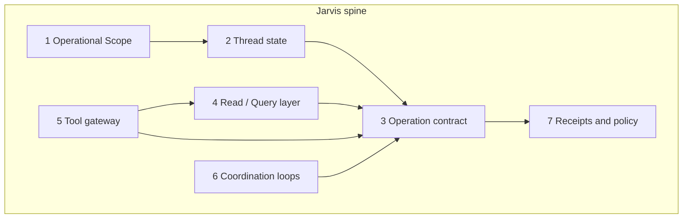

# Jarvis Spine — Foundation Architecture

## Purpose

This document defines **what to build** so Jarvis can eventually handle open-ended operational plays (parts → track → schedule → tenant message today; something else tomorrow) **without** shipping a new feature-specific bot for each workflow.

It is the **engineering spine** companion to [PROPERA_JARVIS_NORTH_STAR.md](./PROPERA_JARVIS_NORTH_STAR.md) (doctrine, phases, audience rules). The north star says *where we are going*; this doc says *which primitives must exist* and *in what order*.

**Not in scope here:** parity ledgers, per-channel UI specs, or step-by-step implementation of any one example (e.g. dishwasher heat exchanger ordering).

---

## Core principle

> **Build extensible operations + thread state + reads + tools — not workflows.**

A workflow is a **composition** of spine primitives. Parts ordering is an acceptance test, not a milestone.

---

## The invariant contract

Every Jarvis turn that touches the business must classify into one of these steps (same on portal, SMS, WhatsApp, Telegram):

| Step | Who decides | Mutates state? |
|------|-------------|----------------|
| **Read** | Brain read models / query layer | No |
| **Gather** | Agent asks; brain may require fields | No |
| **Propose** | Agent drafts structured op; brain assigns approval tier | No (draft only) |
| **Approve** | Human (or policy auto-approve where allowed) | No |
| **Validate** | Brain policy + domain validators | No |
| **Execute** | Brain domain handlers only | Yes |
| **Receipt** | Brain facts → agent/outgate phrasing | No |

Jarvis **never** executes. Jarvis may propose; the brain commits.

North Compass question after every turn:

**Given this signal, who owns the next action?**

---

## Anti-patterns (reject in review)

| Anti-pattern | Why it fails |
|--------------|--------------|
| Feature-specific Jarvis handler (`handlePartsOrder`, `jarvisDishwasher.js`) | Tomorrow needs another handler |
| Ask tab that mirrors cockpit lists | No reason to use Jarvis on portal |
| Agent calling vendor APIs / sending SMS directly | Bypasses brain; no audit or approval |
| LLM reply with no `Proposal` object for writes | Pretty promises, no safe commit |
| New adapter per domain or channel | Violates one operator / one spine |
| Skipping thread state for multi-turn plays | “Later, order it” cannot bind safely |

---

## Foundation layers (build program)

Seven layers. **Skipping a layer** produces either a UI parrot or a demo that cannot commit safely.



### Layer 1 — Operational Scope

**Question answered:** *What world are we in right now?*

Compiled **before** Ask, Plan, or brain reads. Hints and candidates — **not** committed identity.

| Slice | Role |
|-------|------|
| Actor | staff / owner / tenant, ids, channel |
| Anchor | `portal_page_context`, property/unit/ticket pins |
| Active work | Open WIs, property open tickets (candidates) |
| Focus | Best single work-item / ticket candidate |
| Story | Short deterministic summary for LLM/templates |
| Memory (later) | Briefs, digests, vectors — attached when needed |

**Code today:** `src/agent/operationalScope/` — `compileOperationalScope()` v0; logged on `portal_chat` as `OPERATIONAL_SCOPE_COMPILED`.

**Build toward:** stable on all channels; always logged; sufficient that proposals rarely rely on prose alone for target resolution.

**Related:** [STAFF_AGENT_V1.md](./STAFF_AGENT_V1.md), north star § Operational Scope.

---

### Layer 2 — Thread state

**Question answered:** *What play is in flight in this conversation?*

Required for: “find the cheapest part” → **later** “order it” → **later** “track and tell tenant.”

Minimum model (conceptual):

```json
{
  "thread_id": "actor+channel+anchor_fingerprint",
  "status": "idle | gathering | proposal_pending | executing | done",
  "scope_snapshot_ref": "last compiled scope id or hash",
  "pending_proposals": [
    {
      "proposal_id": "uuid",
      "op": "coordinate_schedule_with_tenant",
      "state": "draft | awaiting_confirm | approved | rejected | committed | failed",
      "depends_on": null,
      "created_at": "iso",
      "expires_at": "iso"
    }
  ],
  "fact_pack_refs": [],
  "last_receipt": {}
}
```

**Rules:**

- One thread may have **multiple pending proposals** only if explicitly modeled (e.g. parent/child chain).
- Child steps reference `depends_on: proposal_id` (order → track → schedule → message).
- Confirming a proposal does not clear thread until **receipt** is recorded.
- SMS “YES” / portal **Confirm** are the same approval surface.

**Code today:** `jarvis_operator_threads` (migration **070**), `src/agent/thread/`, `src/dal/jarvisOperatorThreads.js` — pending proposals + `last_receipt` keyed by actor + channel + anchor fingerprint. Flag: `JARVIS_THREAD_ENABLED`. Legacy `conversation_ctx` expense confirm remains for SMS YES shorthand.

**Build toward:** referential turns (“order it later”), `depends_on` chains, load thread without re-sending confirm token.

---

### Layer 3 — Operation contract (highest priority spine)

**Question answered:** *What structured action is being offered for commit?*

The **only** path from Jarvis to mutation:

```
Natural language → (optional gather) → Proposal → Approve → Brain validate → Domain execute
```

#### Proposal shape (canonical sketch)

```json
{
  "proposal_id": "uuid",
  "version": "1",
  "op": "attach_ticket_cost",
  "summary_human": "Attach $42.00 company cost to PENN-051926-7149",
  "target": {
    "ticket_row_id": "uuid",
    "property_code": "PENN",
    "unit_label": "423"
  },
  "payload": {},
  "approval_tier_suggested": 2,
  "approval_tier_assigned": null,
  "depends_on": null,
  "evidence": {
    "scope_ref": "",
    "fact_pack_ref": "",
    "tool_results_ref": []
  }
}
```

- **`op`** — registry key (extensible).
- **`target`** — hints; brain **resolves** canonical keys and permissions.
- **`payload`** — op-specific; validated only by that op’s brain validator.
- **`approval_tier_*`** — brain assigns tier; agent may suggest (tiers 0–4 per north star).

#### Operation registry (initial set)

Grow by **adding rows**, not new handlers.

| `op` | Domain owner | Brain path (existing / planned) | Typical tier |
|------|--------------|----------------------------------|--------------|
| `attach_ticket_cost` | Finance | ticket cost entries | 2–3 |
| `schedule_ticket` | Lifecycle | maintenance lifecycle | 2 |
| `close_ticket` | Lifecycle | maintenance lifecycle | 2 |
| `append_service_note` | Lifecycle | ticket timeline / notes | 1–2 |
| `coordinate_schedule_with_tenant` | Lifecycle + comms | coordination loop | 2–3 |
| `propose_outbound_message` | Communications | [COMMUNICATION_ENGINE.md](./COMMUNICATION_ENGINE.md) | 2–3 |
| `send_communication_campaign` | Communications | comms engine | 3 |
| `create_program_run` | PM program | [PM_PROGRAM_ENGINE_V1.md](./PM_PROGRAM_ENGINE_V1.md) | 2–3 |
| `query_program_history` | PM program | read only → Ask | 0 |
| `propose_vendor_request` | Vendor lane | [VENDOR_LANE.md](./VENDOR_LANE.md) | 2–3 |
| `create_service_request` | Lifecycle / intake | `finalizeMaintenanceDraft` | 2 |
| `book_amenity_reservation` | Access Engine | `createReservationForPortal` (staff override) | 2 |
| `set_amenity_schedule` | Access Engine | `replaceSchedulesForLocation` | 2 |
| `cancel_amenity_reservation` | Access Engine | `cancelReservation` | 2 |
| `update_amenity_policy` | Access Engine | `upsertAccessPolicyForLocation` (merge patch) | 2–3 |
| `propose_purchase` | Finance / vendor | planned | 3 |
| `set_tracking_watch` | Ops metadata | planned (reminder + external ref) | 1–2 |
| `report_policy_violation` | Conflict mediation | [CONFLICT_MEDIATION_ENGINE.md](./CONFLICT_MEDIATION_ENGINE.md) | 2–4 |

**Example composition (not one op):**

| User intent | Composition |
|-------------|-------------|
| Order heat exchanger | `propose_purchase` or `propose_vendor_request` |
| Track package | `set_tracking_watch` |
| Schedule after delivery | `coordinate_schedule_with_tenant` (depends on watch or manual confirm) |
| Inform tenant | `propose_outbound_message` (after schedule commit or policy window) |

**Code today:** individual brain paths exist (lifecycle, cost, comms); **no unified `Proposal` registry or portal Plan renderer**.

**Build toward:**

1. `src/agent/proposals/` — schema, registry, `validateProposal(proposal)`, `routeProposalToDomain(proposal)`.
2. One validator per `op` → existing DAL/lifecycle/comms entrypoints.
3. `propera-app` — **generic Plan card** (summary, target, payload preview, Confirm / Cancel / Edit).

---

### Layer 4 — Read / Query layer

**Question answered:** *What does the human need to know that the cockpit does not surface in one click?*

Jarvis Ask earns its keep here — **not** by repeating open ticket lists.

#### Query kinds

| Kind | Example questions | Output |
|------|-------------------|--------|
| **Analytics** | “How many appliance issues at PENN **this month**?” vs “**this year**?” | Counts + breakdown; **month ≠ YTD** = different `QuerySpec` |
| **Entity detail** | “What is 423 about?” | Focused ticket fact pack |
| **Synthesis** | “What’s the cause?” | Grounded summary over timeline + notes + priors; must admit unknown |
| **Comparison** | “Cheapest heat exchanger for this model?” | Tool results as facts, not purchase |

#### QuerySpec (sketch)

```json
{
  "kind": "analytics | entity | synthesis | comparison",
  "anchor": { "property_code": "PENN" },
  "filters": {
    "category_contains": ["appliance"],
    "tags": [],
    "status_in": ["open", "closed"]
  },
  "time_range": {
    "preset": "month_utc | ytd_utc | custom",
    "from": null,
    "to": null
  },
  "group_by": ["category", "unit_label"],
  "limit": 50
}
```

Intent classification (agent or deterministic) → `QuerySpec` → SQL / read-model → **FactPack** → formatter or grounded LLM.

**Code today:** `src/agent/jarvisAsk/` — portal Ask + voice `ask_propera`; `src/agent/jarvisQuery/` — **slice 1** service-history analytics (`query_service_history` voice tool + Ask intent). **`src/agent/jarvisReason/`** — the generalized read path: a tool-calling reasoning loop where the model chooses read-only lookups per question (`lookup_tickets`, `lookup_costs`, `get_ticket_detail`) instead of classifying into fixed intents. Behind `JARVIS_REASON_ENABLED`, used as the first path in Ask. This is the intended replacement for the intent-parser shape (`classifyJarvisIntent` / `parseServiceHistoryQuestion`); a formal `QuerySpec` schema is still open.

**Build toward:** a ticket-joined cost drill-down ("which tickets cost the most") and other read tools on the same loop; optional `QuerySpec` formalization → FactPack shared by Ask, voice reads, and Plan drafts.

---

### Layer 5 — Tool gateway

**Question answered:** *What does the outside world say, as auditable facts?*

External capabilities (parts search, tracking APIs, maps) plug in as **tools**, not Jarvis features.

| Mode | Tool use |
|------|----------|
| **Ask** | Read-only tool calls → merged into FactPack |
| **Plan** | Tools may **draft** proposal fields (SKU, URL, price band) |
| **Execute** | **No agent tools** — brain or approved integration commits |

Minimum gateway contract:

```json
{
  "tool": "parts_search",
  "input": { "query": "...", "model": "..." },
  "output": { "results": [], "fetched_at": "iso" },
  "permissions": ["staff"],
  "audit_id": "uuid"
}
```

**Rules:** log every call; timeout and allowlist; never auto-purchase from tool output.

**Code today:** not implemented for Jarvis (LLM helpers exist elsewhere for intake/tenant agent).

---

### Layer 6 — Coordination loops

**Question answered:** *Who owns the multi-day back-and-forth?*

Some operations are **state machines**, not one-shot writes:

- `coordinate_schedule_with_tenant`
- (future) parts arrival → schedule visit → tenant notify
- conflict mediation cases

Jarvis **starts** the loop via Proposal. The **domain engine** owns waits, tenant replies, policy, and transitions.

Agent responsibilities in a loop:

- surface status (“waiting on tenant window”)
- offer the **next** proposal when the loop allows
- never commit schedule or send outbound without brain validation

**Related:** north star § Coordination Loops Are First-Class; [COMMUNICATION_ENGINE.md](./COMMUNICATION_ENGINE.md).

---

### Layer 7 — Receipts and approval policy

**Question answered:** *What happened, and what is still pending?*

After execute, brain returns a **receipt** (structured):

```json
{
  "committed": true,
  "op": "attach_ticket_cost",
  "changes": [],
  "pending": [],
  "next_owner": "staff | tenant | system | vendor",
  "next_action_hint": "string",
  "event_log_refs": []
}
```

Agent/outgate may **paraphrase** receipt only — no new facts.

Approval tiers (brain-assigned, per north star):

| Tier | Meaning |
|------|---------|
| 0 | Read only |
| 1 | Clarify first — do not propose commit |
| 2 | Actor confirm (normal staff write) |
| 3 | Elevated (money, blast radius, policy) |
| 4 | Reject or escalate |

---

## Modes map to layers

| Mode | Uses |
|------|------|
| **Ask** | Scope + Query layer + FactPack (+ tools read) |
| **Plan** | Scope + Thread state + Operation contract + Plan card UI |
| **Execute** | Brain only (triggered by approved proposal) |

The **“feels different”** moment is **Plan + thread + coordination loop** — but it generalizes only if **Layer 3 + 2** exist first.

---

## Suggested build order

| Order | Deliverable | Unlocks |
|-------|-------------|---------|
| **1** | Operation registry + 2–3 validators wired to existing brain paths | Any Plan card, any channel |
| **2** | Thread state persistence + pending proposal lifecycle | Multi-turn, “later…”, chains |
| **3** | Generic Plan card in `propera-app` | Confirm-before-write UX |
| **4** | `QuerySpec` + analytics reads | Month vs YTD, category counts, non-UI questions |
| **5** | Tool gateway (read) | External comparison in Ask / Plan drafts |
| **6** | Coordination loop hooks in portal + SMS | track → schedule → notify compositions |
| **7** | Expand `op` registry + owner tiers | Portfolio-scale plays |

**Parallel work:** Layer 4 can proceed once Layer 1 is stable; do not block Layer 1–3 on analytics.

**Current repo focus:** finish **1 → 2 → 3** before marketing “full Jarvis.” Ask on portal is useful for SMS later and for validating scope; it is **not** the spine.

---

## Repository boundaries

Per north star and guardrails:

| Repo | Owns |
|------|------|
| **propera-v2** | Scope compiler, proposal validate/route, query layer, tool gateway, brain execute, `event_log` |
| **propera-app** | Shell, page context envelope, Plan card UI, approval UX, read-model display |
| **Outgate** | Tone and delivery of receipts — not truth |

Patch Law: spine changes stay in **agent/compiler** and **proposal routers**; do not bypass resolver/lifecycle for commits.

---

## Code map (status)

| Layer | Location | Status |
|-------|----------|--------|
| Operational Scope | `src/agent/operationalScope/` | **v0 live** |
| Thread state | `src/agent/thread/`, `src/dal/jarvisOperatorThreads.js`, migrations `070` + `092` | **v0** — pending + receipt on propose/commit. Confirm claim (`awaiting_confirm → executing`) is **atomic** via `jarvis_transition_proposal` RPC (`092`), with legacy read-modify-write fallback when unapplied. |
| Operation contract | `src/agent/proposals/` | **Live** — cost, note, vendor, create, schedule, access amenity ops (see § Proposal payload map) |
| Jarvis Ask | `src/agent/jarvisAsk/` | **Portal + voice** behind `JARVIS_ASK_ENABLED` |
| Jarvis Plan | `src/agent/jarvisPlan/` | **Live** — propose → confirm card; portal + voice share spine |
| Staff live voice | `src/voice/jarvisVoice*.js`, `propera-app` co-pilot | **Slice 3** — full-screen overlay, structured confirm card, multi-ticket create, access ops |
| Query / analytics | `src/agent/jarvisQuery/` | **Slice 1** — service history counts + unit breakdown (`query_service_history`) |
| Tool-driven reads | `src/agent/jarvisReason/` | **Live** behind `JARVIS_REASON_ENABLED` — bounded tool-calling loop where the model picks read-only lookups instead of a fixed intent parser. Tools: `lookup_tickets` (filters + groupBy/countOnly), `lookup_costs` (spend aggregation, finance-flag gated → `finance_not_enabled` when off), `get_ticket_detail` (one-ticket story + cost summary), `get_unit_assets` (installed equipment make/model/serial; lifecycle-flag gated), `get_unit_service_history` (a unit's past work incl. service notes / what was tried — for diagnosis), `search_parts` (deep links to buy a part — Amazon + PartSelect/RepairClinic; links only, no price fetch, never auto-purchase). Wired as the first path in Jarvis Ask; falls back to the deterministic fact pack. Staff-activity is covered by `lookup_tickets`. **Layer 5 / parts arc:** Phase 1 (equipment→model) + Phase 2 (diagnosis) + Phase 3a (parts deep links) **done**; next is Phase 3b (paid search API for cheapest-price ranking) and Phase 4 (photo→asset capture) — see HANDOFF_LOG |
| Access reads (voice) | `src/agent/access/` | **Live** — `list_amenity_locations`, `lookup_amenity_booking`, `get_amenity_booking_rules` (requires `PROPERA_ACCESS_ENGINE_ENABLED=1`) |
| Tool gateway | `src/agent/jarvisReason/partsSearchTool.js` | **Phase 3a live** — `search_parts` builds deep links (Amazon + PartSelect model page + RepairClinic) for a resolved make/model + part. Read-only, **links only (no price fetch), never auto-purchase**. Phase 3b (paid search API for real cheapest-price ranking) + tracking APIs still not started |
| Coordination loops | lifecycle + comms partial | **Partial** (not Jarvis-wired) |
| Portal ingress | `runInboundPipeline.js`, `portal_chat_mode` | **Live** |

---

## How to review a Jarvis slice

Before merging any Jarvis-related PR, answer:

1. **Which layer** does this extend (1–7)?
2. Does it add a **new `op`** or a **new workflow handler**? (Only `op` is allowed.)
3. For writes: is there a **Proposal** object and brain validator path?
4. Does it preserve **who owns the next action** in logs/receipts?
5. Would tomorrow’s different example reuse this without new code paths?

If the answer to (2) is “workflow handler,” redesign.

---

## Related documents

- [PROPERA_JARVIS_NORTH_STAR.md](./PROPERA_JARVIS_NORTH_STAR.md) — doctrine, phases, audiences, Operational Scope
- [STAFF_AGENT_V1.md](./STAFF_AGENT_V1.md) — portal page context envelope
- [COMMUNICATION_ENGINE.md](./COMMUNICATION_ENGINE.md) — outbound proposals
- [VENDOR_LANE.md](./VENDOR_LANE.md) — vendor assignments and future purchase path
- [CONFLICT_MEDIATION_ENGINE.md](./CONFLICT_MEDIATION_ENGINE.md) — policy domain ops
- [OPERATIONAL_POLICY_CONFIG.md](./OPERATIONAL_POLICY_CONFIG.md) — brain policy keys for tiers
- [BRAIN_PORT_MAP.md](./BRAIN_PORT_MAP.md) — where commits land today

---

## Proposal payload map (portal + voice confirm cards)

**Doctrine:** A **rich package** is structured fields routed to the correct `op` — not a long service note. Service notes stay **lean** (field facts only: *needs replacement*, *replaced gasket*). Unit, property, issue, schedule, and status belong on the ticket or their own ops.

**Confirm UI:** `propera-app` `JarvisProposalCard` renders labeled rows via `buildProposalDisplayFields()` — one renderer for all ops. Add a row by extending the map below + display builder; do not ship op-specific card components.

**Multi-intent rules (voice):**

| Staff says | Jarvis does |
|------------|-------------|
| One issue + visit window in same breath | Single `create_service_request` with `preferred_window` — **one confirm** creates and schedules |
| **Two+ separate issues, same unit** (e.g. fridge **and** AC at 505 PENN) | **`propose_create_service_request` once per issue** — never merge into one ticket; brain does **not** split. Reuse `property_code`, `unit_label`, `preferred_window` from first unless staff changes them. Flow: propose #1 → confirm → propose #2 → confirm. Only one pending create at a time |
| Existing ticket + new window | `schedule_ticket` alone — not a service note |
| Same issue accidentally twice within ~5 min | Blocked by issue-aware dedupe (`createIssueDedupe.js` + `findRecentDuplicateCreate`) — different issues same unit **allowed** |

Do not put schedule/access window in a service note.

### Shipped ops

| `op` | Voice tool | Commit path | Payload fields (confirm card) | Service note? |
|------|------------|-------------|--------------------------------|---------------|
| `append_service_note` | `propose_append_service_note` | `appendServiceNote.js` → ticket timeline | Ticket, **Note** (lean) | Yes — append only |
| `attach_ticket_cost` | `propose_attach_ticket_cost` | `attachTicketCost.js` | Ticket, Amount, Type, Vendor | No |
| `propose_vendor_request` | `propose_vendor_request` | `proposeVendorRequest.js` → `assignVendorToTicket` | Ticket, Vendor, Dispatch (SMS yes/no) | No |
| `create_service_request` | `propose_create_service_request` | `createServiceRequest.js` → `finalizeMaintenanceDraft` (+ optional schedule) | Property, Unit, Issue; optional category/urgency/window | No |
| `schedule_ticket` | `propose_schedule_ticket` | `scheduleTicket.js` → `applyPreferredWindowByTicketKey` + lifecycle | Ticket, Window, Status scheduled | No |
| `book_amenity_reservation` | `propose_book_amenity` | `bookAmenityReservation.js` → `createReservationForPortal` (staff override) | Property, Unit, Amenity, When, Tenant | No |
| `set_amenity_schedule` | `propose_set_amenity_hours` | `setAmenitySchedule.js` → `replaceSchedulesForLocation` | Property, Amenity, Hours summary | No |
| `cancel_amenity_reservation` | `propose_cancel_amenity_booking` | `cancelAmenityReservation.js` → `cancelReservation` | Property, Unit, Amenity, When | No |
| `update_amenity_policy` | `propose_update_amenity_policy` | `updateAmenityPolicy.js` → `upsertAccessPolicyForLocation` (merged patch) | Property, Amenity, Rules (max block, etc.) | No |

**Voice read tools (no confirm):** `list_open_service_tickets`, `query_service_history`, `list_amenity_locations`, `lookup_amenity_booking` (PIN), `get_amenity_booking_rules`, `ask_propera`, `resolve_open_ticket`.

**Portal field decode:** `src/agent/proposals/proposalPortalFields.js` — shared by pending-proposal API and voice bridge when restoring thread state. App renderer: `propera-app/src/lib/jarvisProposalView.ts` → `JarvisProposalCard`.

### Ticket lifecycle ops (voice, 2026-06)

| `op` | Brain commit | Voice tool |
|------|--------------|------------|
| `set_ticket_status` | `portalTicketMutations` via `ticketLifecycleOps.js` | `propose_set_ticket_status` |
| `set_ticket_category` | same | `propose_set_ticket_category` |
| `update_ticket_issue` | same | `propose_update_ticket_issue` |
| `close_ticket` | same (status Completed) | `propose_close_ticket` |
| `cancel_ticket` | same (soft delete) | `propose_cancel_ticket` |

Each new op: `PROPOSAL_OPS` row → `commitProposal` case → voice tool → `proposalPortalFields` + `jarvisProposalView` → test in `ticketLifecycleOps.test.js`.

---

## Staff Live Voice & Call Co-pilot

**Status:** Slice 3 — operator flows on voice + portal (2026-06). Expression layer only; all writes via proposal spine.

Jarvis on portal is **not** the tenant phone agent (**Max**). Staff live voice is a separate expression layer: hands-free operator while moving through the portal (overview, property, tickets — ticket pin optional).

### What works today

| Piece | Location | Notes |
|-------|----------|-------|
| Live voice WS bridge | `propera-v2/src/voice/jarvisVoiceWebSocketBridge.js` | Portal browser ↔ OpenAI Realtime GA at `WS /voice/jarvis` |
| Staff session context | `jarvisStaffSessionContext.js` | Operational scope + thread hints compiled before session |
| Voice tools | `jarvisVoiceTools.js`, `jarvisVoiceProposals.js` | **Read:** `ask_propera`, `resolve_open_ticket`, `list_open_service_tickets`, `query_service_history`, amenity lookups. **Write:** note, cost, vendor, create, schedule, status/category/issue/complete/cancel, amenity book/hours/cancel/policy, confirm. **Session:** `end_voice_session` |
| Proposal spine | `src/agent/proposals/` | Maintenance + access ops in `types.js` → `commitProposal.js`; dedupe: `createIssueDedupe.js`, `findRecentDuplicateCreate` |
| Multi-ticket create | `jarvisVoiceProposals.js`, `jarvisStaffSessionContext.js` | Sequential propose per issue; receipt carries property/unit/window for reuse; thread `last_receipt` |
| Portal field decode | `proposalPortalFields.js` | Pending proposal restores note/cost/vendor/dispatch on reconnect |
| Thread persistence | `jarvis_operator_threads`, `handleJarvisPendingProposal.js` | Pending confirm survives hang-up |
| Portal UI | `JarvisVoiceOverlay.tsx`, `JarvisCallCopilot.tsx`, `JarvisProposalCard.tsx` | Full-screen call UI; structured confirm rows |
| Staff pref | `jarvis-settings` page, `jarvisStaffPrefs.ts` | Per-staff toggle hides headset when off |

### Interaction model

```
Staff speaks → Realtime + tools → copilot.* WS events → Full-screen co-pilot
Writes: resolve ticket (if needed) → propose → voice "yes" OR tap Confirm → commitProposal
End: End call button OR end_voice_session tool → overlay closes
```

**Global context:** Staff may be on property overview with no ticket pinned. They name a ticket id or unit; `resolve_open_ticket` finds it — page anchor is a hint, not required.

**Service note rule:** Lean field text only — never repeat unit/property/issue/schedule in the note.

**Greeting rule:** One casual hello by first name. **Do not** recite capabilities at session start.

### Env flags

| Flag | Repo | Purpose |
|------|------|---------|
| `JARVIS_VOICE_ENABLED=1` | propera-v2 | WS route + bridge |
| `JARVIS_PLAN_ENABLED=1` | propera-v2 | Write propose/confirm |
| `JARVIS_ASK_ENABLED=1` | propera-v2 | `ask_propera` read tool |
| `JARVIS_THREAD_ENABLED=1` | propera-v2 | Thread + pending persistence |
| `PROPERA_ACCESS_ENGINE_ENABLED=1` | propera-v2 | Amenity voice tools + commit paths |
| `NEXT_PUBLIC_PROPERA_JARVIS_VOICE_ENABLED=1` | propera-app | Headset + overlay UI |

### Polish backlog (next passes)

1. ~~**Agent tone** — shorter confirm readbacks; disambiguation~~ **Done**
2. ~~**Co-pilot UI** — errors, candidates, receipt~~ **Done**
3. ~~**Voice cost + vendor propose**~~ **Done**
4. ~~**Full-screen overlay + end call + staff toggle**~~ **Done**
5. ~~**Structured confirm card**~~ **Done**
6. ~~**Create + schedule on voice**~~ **Done**
7. ~~**Multi-ticket same unit (sequential propose)**~~ **Done (2026-06)**
8. ~~**Access Engine on voice** (book, hours, cancel, policy, PIN lookup)~~ **Done (2026-06)** — requires access flag
9. ~~**Service history analytics read**~~ **Done (slice 1)**
10. ~~**Portfolio open list** (`list_open_service_tickets`)~~ **Done**
11. ~~**Confirm loop hardening** — idempotent confirm, portal/voice dedupe, partial schedule success receipts~~ **Done (2026-06)**
12. **Reconnect** — server-side foundation **done** (2026-06-04): heartbeat ping/pong terminates half-open sockets + idempotent `teardown()` on close/error frees the paired OpenAI connection (`heartbeatSweep` in `jarvisVoiceWebSocketBridge.js`). **Remaining:** client-side reconnect + conversation resume (multi-repo, live-tested)
13. ~~**Phase 3 ticket lifecycle** (status, category, issue, complete, cancel)~~ **Done (2026-06)**
14. **Access follow-ups** — regenerate PIN, edit booking time, blackouts (portal today; voice later)
15. **Batch create op** (optional) — one confirm for N tickets if operators want it; today = sequential only

### Boundaries (do not break)

- AI is expression layer; brain commits via proposal spine
- No workflow-specific Jarvis handlers — extend `op` registry instead
- Rich package = structured ops; service notes stay lean

---

## Document status

| Field | Value |
|-------|--------|
| **Created** | 2026-05-27 |
| **Updated** | 2026-06-02 — multi-ticket create, access amenity ops, service history reads, code map refresh |
| **Status** | Living spec — authoritative for spine build order |
| **Supersedes** | Ad-hoc “build parts ordering” or “improve Ask tab list” plans |

When adding a new `op`, update § Proposal payload map, § Code map, and [HANDOFF_LOG.md](./HANDOFF_LOG.md).
