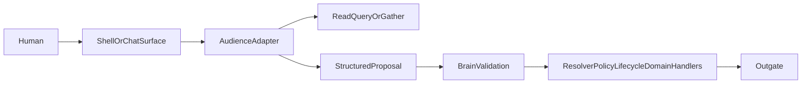

# Propera Jarvis North Star

## Purpose

This is the canonical north-star document for the **Jarvis direction inside Propera**.

Its job is to keep the system from drifting into isolated slices like "tenant agent only," "receipt helper only," or "staff chat only" without a shared architecture.

This doc defines:

- the **one-brain / multi-agent** model
- the role of **Tenant**, **Staff**, **Owner**, and **Outgate**
- what the **agent may do** vs what the **brain must own**
- how `propera-app` and `propera-v2` divide responsibility
- the **phased rollout** so each slice fits the same long-term system
- **Operational Scope** — the “open project” model (portfolio/property/unit/work story) every channel shares

This doc is **not** a parity ledger, and it is **not** a per-feature spec. It is the system-level doctrine for the Jarvis buildout.

Related docs:

- [JARVIS_SPINE.md](./JARVIS_SPINE.md) — **foundation layers, operation contract, thread state, build order** (what to build so any workflow composes on one spine)
- [../AGENTS.md](../AGENTS.md)
- [TENANT_AGENT_ADAPTER.md](./TENANT_AGENT_ADAPTER.md)
- [COMMUNICATION_ENGINE.md](./COMMUNICATION_ENGINE.md)
- [CONFLICT_MEDIATION_ENGINE.md](./CONFLICT_MEDIATION_ENGINE.md) — building policy enforcement, complaints, notice tiers (planned)
- [OPERATIONAL_POLICY_CONFIG.md](./OPERATIONAL_POLICY_CONFIG.md) — multi-tenant operational rules (thresholds, windows, tiers); brain resolves, agent does not read config directly
- [STAFF_AGENT_V1.md](./STAFF_AGENT_V1.md) — portal page context envelope (Phase 2 foundation)
- Implementation: `src/agent/operationalScope/` — scope compiler v0 (read-only)
- [PM_PROGRAM_ENGINE_V1.md](./PM_PROGRAM_ENGINE_V1.md)
- [PROPERA_V2_APP_CAPABILITIES_AND_FINANCE_DEPTH.md](./PROPERA_V2_APP_CAPABILITIES_AND_FINANCE_DEPTH.md)
- [BRAIN_PORT_MAP.md](./BRAIN_PORT_MAP.md)
- [ORCHESTRATOR_ROUTING.md](./ORCHESTRATOR_ROUTING.md)

---

## Core Statement

**Propera has one operational brain and multiple conversational agents.**

The brain owns truth.

The agents own conversation.

The outgate owns expression.

That means:

- Tenant, Staff, and Owner may each speak to Propera in natural language.
- Each audience may get a different tone, level of detail, and interaction style.
- None of those audience agents becomes the authority on routing, lifecycle, schedule truth, cost truth, or ownership.

The real authority remains:

`signal -> context -> resolver -> policy -> lifecycle -> canonical action -> outgate`

If a future "smart" feature skips that chain, it is wrong even if it appears useful.

---

## Agent As The Company's Operating Delegate

The Propera agent is not meant to feel like a narrow feature bot.

It should feel like the **company's operational delegate**:

- the person the owner runs to in the morning for answers
- the person staff runs to when work needs to be coordinated
- the person operations leans on when multiple domains collide at once

That means the agent must eventually operate across multiple domains in a single conversation:

- maintenance and ticket state
- schedule coordination and tenant access
- preventive/program work
- balances, charges, and receipts
- outbound reminders and notices
- tenant history, complaints, and service context
- **conflict mediation and policy enforcement** (violation cases, neutral notices, escalation paper trail)

### What this means

The agent is not only extracting data from one table or one engine at a time.

It is expected to:

- understand the operational situation
- assemble relevant history across systems
- explain the situation in business terms
- propose the next best action
- hand that action to the correct brain-owned domain path

### What this does **not** mean

This does **not** create a new super-engine inside the agent.

The agent may move across domains conversationally.

The brain must still keep domain ownership explicit:

- lifecycle paths own lifecycle truth
- finance paths own financial truth
- preventive/program paths own program truth
- communications paths own outbound campaign truth
- **conflict mediation paths own violation/complaint case truth and notice-tier lifecycle**

The operating delegate feels unified to the human.

The system underneath stays responsibility-aware and domain-correct.

### Cross-domain thread continuity

A real company conversation does not stay in one domain.

The same thread may move like this:

1. owner asks why a tenant is late
2. agent explains balance history
3. owner asks whether the same tenant is also complaining about service
4. agent pulls ticket and communication history
5. owner asks what should happen next
6. agent proposes a notice, follow-up, or coordination action

Or:

1. a staff member says a tenant cancelled service
2. the staff member asks to reuse the free afternoon slot
3. the agent looks for other schedulable work
4. the agent coordinates access and availability
5. later in the same thread, the staff member asks for help with a ticket cost or status

This cross-domain continuity is part of the north star.

It should not be treated as an edge case.

### Product test

If the system only works when the human stays inside one rigid workflow at a time, it is not Jarvis yet.

If the system can carry the business situation across domains while still routing every action to the right validating engine, it is moving toward the right product.

---

## One Brain, Four Agent Surfaces

### Agent / Tenant

**Channel**

- SMS
- WhatsApp
- Telegram
- later: voice / Alexa

**Job**

- gather messy maintenance information
- clarify missing details
- hand off a structured operation to the same maintenance brain
- shape the reply using facts returned by the brain

**Tone**

- warm
- patient
- simple

**Authority**

- may ask and clarify
- may not create operational truth on its own

Today, this is the most advanced agent surface in repo reality. See [TENANT_AGENT_ADAPTER.md](./TENANT_AGENT_ADAPTER.md).

### Agent / Staff

**Channel**

- portal chat
- Telegram
- later: SMS / WhatsApp for staff where appropriate

**Job**

- act like a responsible operations coordinator
- understand natural staff language without forcing rigid command patterns
- gather missing information when needed
- use current page or ticket context when available
- carry context across tickets, schedules, preventive work, receipts, and tenant follow-up
- convert staff intent into structured proposals for the brain

**Examples**

- "I think we should schedule this ticket."
- "Bought this at Home Depot for the shower leak we did today."
- "Please handle 10 preventive AC filters. I'm free 1-5."

**Authority**

- may understand, summarize, and gather freely
- may propose actions
- may not directly schedule, close, post cost, or mutate program state without brain validation

### Agent / Owner

**Channel**

- portal chat
- later: mobile

**Job**

- operational intelligence for the portfolio
- answer natural-language questions about what is happening
- assemble business context across balances, complaints, tickets, communications, and preventive history
- prepare actions for approval
- trigger approved operations through the same backend contracts

**Examples**

- "Who is behind 30 days at Penn?"
- "When was the last time the gutters were cleaned?"
- "What is going on with all these receipts for property X?"
- "Send notices."

**Authority**

- may query, summarize, compare, and recommend
- may draft actions
- mutating actions should go through explicit approval and then brain validation

### Outgate

**Channel**

- all outbound channels

**Job**

- take a brain-approved outcome and express it correctly for the audience
- vary tone, style, and detail by audience
- preserve compliance, policy, and factual boundaries

**Personality responsibilities**

- make Propera feel coherent across tenant, staff, and owner surfaces
- translate the same operational truth into audience-appropriate wording
- sound calm, capable, and context-aware without fabricating certainty
- preserve the difference between **fact**, **proposal**, **question**, and **promise**

**Authority**

- may decide how to say it
- may not decide what is true

**Jarvis voice doctrine**

- tenant voice should feel warm, clear, and low-friction
- staff voice should feel capable, concise, and operational
- owner voice should feel strategic, concise, and trustworthy
- no audience voice may imply approval, commitment, or schedule truth unless the brain has validated it

Outgate is the future "personality" layer. Jarvis voice lives here, not in the control plane.

---

## Non-Negotiable Rules

### 1. No second brain

No agent may become a hidden router, hidden lifecycle engine, hidden finance engine, or hidden staff resolver.

The agent may interpret and gather.

The brain must decide and write.

### 2. Natural language freedom is allowed at the edge

We do **not** want to over-constrain the staff or owner agent into rigid phrases.

The point of Jarvis is that a human should be able to speak naturally, as if speaking to another capable staff member.

That freedom belongs in:

- understanding
- clarification
- summarization
- recommendation

It does **not** belong in bypassing validation.

### 3. Brain validation is mandatory

Every mutating action must become a structured proposal and then pass through brain validation.

Examples:

- schedule ticket
- close ticket
- attach receipt and post cost
- create preventive run
- contact tenants
- log vendor spend
- add tenant charge

The brain may accept, reject, downgrade, defer, or ask for confirmation.

### 4. App context is a hint, not truth

If the user is looking at a ticket detail page and says "schedule this ticket," the app may send that page context.

That is useful context.

It is **not** the final authority.

The brain must still confirm:

- the ticket exists
- the action is valid
- the actor has permission
- the lifecycle and policy allow it

### 5. `propera-app` stays cockpit, `propera-v2` stays brain

`propera-app` may:

- host the shell
- pass page context
- show proposals and approvals
- render read models
- display replies and receipts

`propera-v2` must own:

- routing
- lifecycle
- responsibility
- scheduling policy
- ticket mutation truth
- finance mutation truth
- preventive/program logic
- communications sends
- auditability

### 6. Outbound still flows through Outgate

No new agent path should send user-facing operational messages directly.

All real outbound communication must continue to converge through the canonical outbound seam.

### 7. Escalation must be explicit

When the agent cannot safely resolve, clarify, or validate the next step, the system must not stall silently.

Every agent slice must define:

- when the agent should stop trying
- what the fallback action is
- who owns the next human action
- what the user is told

Escalation is not an implementation detail. It is part of the operating doctrine.

---

## System Shape

Interpretation may be flexible.

Execution must be deterministic.

---

## The Common Contract

Every audience agent should eventually speak the same high-level contract, even if the prompts and channel rendering differ.

The contract is shared, but real conversations may cross multiple domains before they end.

The agent should be able to:

- stay in one thread while the human shifts domains
- keep the business situation coherent
- turn each new ask into the correct read, proposal, approval, or execution step

without pretending that all domains are owned by one hidden control layer.

### A. Read / query

The agent asks the brain for facts.

Examples:

- last gutter cleaning
- open tickets for a property
- outstanding tenant balances
- what receipts are attached to recent shower leak work

### B. Gather / clarify

The agent asks follow-up questions when the intended action is under-specified.

Examples:

- which property
- which ticket
- which unit
- what amount
- is this company spend, tenant charge, or both

### C. Proposed action

The agent produces a structured proposed operation.

Examples:

- `schedule_ticket`
- `coordinate_schedule_with_tenant`
- `close_ticket`
- `attach_ticket_cost`
- `create_program_run`
- `query_program_history`
- `send_communication_campaign`
- `report_policy_violation`
- `mediate_resident_complaint`
- `issue_policy_notice`
- `escalate_conflict_case`
- `query_conflict_history`

See [CONFLICT_MEDIATION_ENGINE.md](./CONFLICT_MEDIATION_ENGINE.md) for the dedicated domain engine (not started in code).

### D. Approval

For owner/staff write actions, the system should support explicit approval before commit.

This is especially important for:

- financial writes
- tenant charges
- outbound communications
- schedule commitments
- completion / closure

**Approval tiers are brain policy, not agent preference**

The agent may recommend an approval tier.

The brain decides the actual tier.

Minimum rule-level tiers:

- **Tier 0 — read only**: query or summarize; no approval needed
- **Tier 1 — clarify first**: missing or ambiguous information; do not commit
- **Tier 2 — actor confirm**: normal staff/owner write with enough confidence to propose but not auto-commit
- **Tier 3 — elevated approval**: owner approval or explicit senior approval required because of money, audience impact, or policy sensitivity
- **Tier 4 — reject or escalate**: unsafe, blocked, low-confidence, or policy-disallowed action

At minimum, brain policy should consider:

- action type
- confidence level
- financial impact
- recipient count / outbound blast radius
- commitment risk
- reversibility
- policy or permission sensitivity

The key rule is simple: **the brain assigns the approval tier**.

### E. Brain execution

The brain validates and then routes the proposal into the appropriate domain path.

Examples:

- maintenance lifecycle path
- program engine path
- finance cost path
- communications engine path
- conflict mediation engine path

Cross-domain conversations may touch several paths in one thread, but each committed action must still resolve to an explicit domain owner.

### F. Receipt shaping

The agent or outgate explains what happened using brain-returned facts only.

### G. Escalate / fallback

If the agent cannot safely continue, the system must choose an explicit fallback.

Typical triggers:

- identity ambiguity
- ticket ambiguity
- low confidence after retries
- policy block
- safety concern
- missing permissions
- max-turn exhaustion

Typical fallback outcomes:

- ask one more clarifying question
- defer to a responsible human
- create or queue a human-review task through the brain
- send a safe blocked reply and log the need for follow-up

The fallback owner must still answer the Propera question:

**Given this signal, who owns the next action?**

---

## Coordination Loops Are First-Class

Some actions are not a single write. They are a **coordination loop**.

The most important early example is:

- `coordinate_schedule_with_tenant`

This pattern matters because the system may need to:

1. accept a PM/staff/owner request to coordinate
2. contact the tenant on behalf of operations
3. gather availability
4. validate schedule options and policy
5. commit the appointment through the brain
6. notify the right parties

This is not a side channel and not a prompt-only trick.

It is a first-class proposal type that still obeys the same contract:

`read/gather -> propose -> approve -> brain validation -> execution -> receipt`

The agent may run the conversational loop.

The brain must still own:

- whether outreach is allowed
- what availability is valid
- whether an appointment may be committed
- who gets notified
- what becomes schedule truth

---

## Current Repo Reality

This north star is not greenfield. Important pieces already exist.

### Already live or partially live

- **Tenant Agent** as a thin conversational adapter before core
- **Portal command chat** as a real staff/owner shell
- **Natural-language lifecycle updates** for staff, but still more rigid than the Jarvis target
- **Deterministic cost capture** and receipt-adjacent capture flows
- **Preventive / program engine** with runs, lines, proof, vendor assignment, and timeline
- **Communication Engine** built portal-first and agent-ready
- **Conflict Mediation Engine** — doctrine + spec only ([CONFLICT_MEDIATION_ENGINE.md](./CONFLICT_MEDIATION_ENGINE.md)); North Compass updated

### Not yet at Jarvis level

- staff conversation that feels like a real operations coordinator
- owner conversational intelligence across operations, finance, and history
- preventive planning and scheduling coordination
- receipt understanding as a first-class structured proposal path
- broad cross-domain query services for owner/staff agent use
- company-delegate behavior across multiple domains in one continuous conversation
- conflict mediation: neutral notices, complaint confidentiality, escalation paper trail

---

## Jarvis Feature Domains (eventual unified surface)

Jarvis is not a single feature. It is the **conversational layer** over Propera's domain engines. Every capability below should eventually be reachable through the same operating delegate (staff/owner/tenant surfaces + outgate), without merging domain truth into the agent.

| Domain | Engine / module | Jarvis role |
|--------|-----------------|-------------|
| Maintenance intake & tickets | Brain + maintenance lifecycle | Gather, hand off, explain status |
| Staff coordination | Portal / staff lifecycle | Natural updates, schedule, close |
| Preventive / programs | PM program engine | Plan, query history, coordinate work |
| Finance / costs | Finance + ticket costs | Receipts, charges, explain spend |
| Broadcast & notices | Communication Engine | Draft/send campaigns, reminders |
| **Conflict & policy** | **Conflict Mediation Engine** | Violations, complaints, neutral notices, escalation |
| Access (when live) | Access engine | Reservations, coordination |
| Expression | Outgate | Voice, tone, compliance-safe wording |

**Rule:** Jarvis proposes; engines commit; brain validates. New domains (like conflict mediation) join this table — they do not become prompt-only side features.

---

## What the Agent Is Allowed to Say

This is where real liability risk lives.

The agent may sound natural and confident.

It may **not** sound authoritative about facts or commitments the brain has not validated.

### Allowed

The agent may:

- explain facts returned by the brain
- summarize current state
- ask clarifying questions
- propose next steps
- present approval choices
- say when something is pending, blocked, or awaiting confirmation
- communicate that it is reaching out, gathering, checking, or proposing

### Not allowed

The agent may not, on its own:

- promise a repair date
- promise a technician will arrive at a certain time
- promise a refund, credit, or tenant charge
- say a ticket is closed, scheduled, approved, or completed unless the brain committed that truth
- imply that a message was sent, a campaign launched, or a vendor assigned unless the brain executed it
- invent legal, safety, or policy conclusions

### Language rule

When truth is not yet committed, the language must stay visibly provisional.

Good examples:

- "I can coordinate that."
- "I can propose that schedule."
- "I am checking the ticket and availability now."
- "I can prepare that charge for approval."
- "This still needs confirmation before I commit it."

Bad examples:

- "We'll fix it tomorrow."
- "The appointment is set" when no brain commit happened
- "I already charged the tenant" when a proposal is only drafted

### Liability boundary

Outgate and agent prompts must preserve the difference between:

- **fact**
- **question**
- **proposal**
- **pending approval**
- **committed action**

If the wording blurs those states, the system becomes unsafe.

---

## What Jarvis Means In Propera

Jarvis does **not** mean "LLM does whatever it wants."

Jarvis means:

- humans speak naturally
- Propera understands the operational intent
- Propera understands the business situation, not just isolated fields
- Propera asks clarifying questions when needed
- Propera proposes actions clearly
- Propera validates everything through the brain
- Propera responds in the right voice for the audience

Jarvis is the interface and expression layer on top of the Propera operational system.

The Propera brain remains the authority.

---

## Operational Scope — the “open project”

Jarvis must feel like **opening the operational project**, the way Cursor feels like opening a codebase: the human should not re-explain the building on every turn.

This is **not** a separate product per domain (turnover bot, receipt bot, preventive bot). It is **one 24/7 operator** on the transports you already use — portal chat, SMS, WhatsApp, Telegram — with the same spine and different hint quality per channel.

### Cursor analogy (intent, not a clone)

| Cursor | Propera / Jarvis |
|--------|------------------|
| Repository | Company / portfolio |
| Current file / selection | Portal anchor, pinned ticket, last thread, message hints |
| Symbols & structure | Units, tenants, open work, programs, vendors |
| History & search | Ticket timeline, costs, `event_log`, later semantic memory |
| “Add this to `inboundCore`” | “Attach this receipt to 511 turnover” — few words because **scope is already loaded** |

### What Operational Scope is

**Operational Scope** is the compiled object assembled **before** Jarvis reads, proposes, or answers. It is built in the **Compiler / Context Layer** (see guardrails). It is **not** truth; it is **situation** for the agent and resolver.

Every compile produces (at minimum):

| Slice | Role |
|-------|------|
| **Actor** | Who is speaking (staff / owner / tenant), ids, channel |
| **Anchor** | Where they are in Propera right now — `portal_page_context`, pathname/surface, property/unit pins (**hints only**) |
| **Active work** | Open tickets / work items relevant to anchor (staff portfolio, property-scoped list when pinned) |
| **Focus** | Best single work item candidate from anchor + open set (**candidates**, not committed identity) |
| **Story** | Short deterministic summary for LLM or template replies (counts, focus label, property name) |
| **Memory** (later) | Briefs, digests, vector chunks — attached when the question needs depth |

**Rule:** Scope **surfaces** candidates and narrative. The **brain** commits ticket identity, permissions, policy, and writes.

### No new adapters per domain or channel

- **One** inbound spine: `runInboundPipeline` (`sms` \| `whatsapp` \| `telegram` \| `portal`).
- **One** scope compiler: `compileOperationalScope()` in `src/agent/operationalScope/`.
- **One** proposal contract for writes (`attach_cost`, `schedule_ticket`, …) — parent target resolved by brain from scope + language.
- Portal sends richer **anchors**; SMS/WA may send photo + six words — same operator, more resolution work.

Receipt attach, preventive line cost, turnover materials, and maintenance ticket cost are **the same proposal family**, not separate Jarvis products.

### Modes on one operator

| Mode | Behavior | Writes |
|------|----------|--------|
| **Ask** | Retrieve scope + brain reads → answer / summarize | None |
| **Plan** | Structured proposal → confirm (portal UI or YES on SMS) | After brain validation only |
| **Execute** | Brain only | Jarvis never direct |

Proactive briefings (morning digest, SLA nudges) use the **same scope compiler**, pushed on a schedule — not a second architecture.

### Semantic memory (later, not blocking)

- **Structured ops** stay in Postgres (SQL + scope).
- **Fuzzy narrative** (notes, “smells like heat exchanger again”) may use embeddings later.
- **Materialized unit/property briefs** on ticket close are preferred before pgvector for v1 depth.

Vectors deepen story; they do not replace scope.

### Implementation readiness

| Step | When | Risk |
|------|------|------|
| Doctrine + types (this doc) | **Now** | None |
| `compileOperationalScope` v0 (reads only) | **Now** | Low — no user behavior change until wired |
| Ask-mode Jarvis on portal chat | When scope stable on real tickets | Low liability |
| NL cost/receipt proposals on all channels | After Ask + finance stable on live properties | Medium — money |
| Proactive briefings + vectors | After spine proven | — |

**Do not delay** the scope schema and compiler. **Do delay** marketing “full Jarvis” until Ask-mode works on live ops.

**Blockers for user-facing Jarvis writes:** flaky property/unit resolution (`INTAKE_COMPILE_TURN` / explicit grounding), finance flags unreliable on live properties, or scope compiler not logged/observed on real portal turns.

### Code map

| Piece | Location |
|-------|----------|
| Scope types & compiler | `src/agent/operationalScope/` |
| Portal observe (`portal_chat`) | `logOperationalScopeForPortalChat` in `runInboundPipeline` → `OPERATIONAL_SCOPE_COMPILED` |
| Portal anchor (hint) | `src/agent/contextEnvelope.js` |
| Page-context WI candidate | `src/agent/resolvePageContextTarget.js` |
| Jarvis Ask handler | `src/agent/jarvisAsk/` — `portal_chat_mode: jarvis_ask`, fact pack + deterministic reply (+ optional LLM) |
| Writes | Existing brain paths + unified `proposal` → validate → commit |

---

## Phase Program

The point of these phases is to stop the system from shipping isolated intelligence without a unifying contract.

### Phase 0 — Doctrine and Canonical Contract

**Goal**

Lock the architecture before deeper implementation.

**Deliverables**

- this north-star doc
- shared audience-agent doctrine
- common proposal / approval / execution model
- explicit repo boundary rules

**Exit**

No future agent slice is designed as a standalone mini-product.

### Phase 1 — Shared Agent Spine

**Goal**

Create the common staff/owner/tenant adapter pattern without changing core authority.

**Deliverables**

- shared structured operation contract
- shared context envelope contract
- **`OperationalScope` schema + `compileOperationalScope()` v0** (read-only; all channels)
- common approval model
- common escalation doctrine
- reusable reply-shaping model

**Exit**

Tenant, staff, and owner surfaces can all target the same backend shape even if they enable different operations. Scope compiler returns actor + anchor + active work + focus candidates for any inbound turn.

### Phase 2 — Staff Agent: Ticket-Aware Coordination

**Goal**

Make staff chat feel like speaking to another responsible staff member.

**Deliverables**

- current-page context support from `propera-app` (feeds **Operational Scope** anchor)
- **Ask-mode** portal Jarvis using compiled scope + brain reads (no writes)
- smarter natural-language gathering for staff operations
- ticket-aware actions like schedule, close, note, follow-up
- PM/staff-triggered `coordinate_schedule_with_tenant` proposal path
- explicit confirmation before writes where needed

**Examples**

- "Schedule this ticket."
- "Coordinate with the tenant and get me a window for tomorrow."
- "Close this one."
- "Tell tenant we're waiting on the part."

**Exit**

Staff no longer need brittle patterns for common ticket coordination.

### Phase 3 — Staff Agent: Receipt and Cost Intelligence

**Goal**

Turn "I bought this for today's leak" into a validated cost proposal, not a rigid form fill.

**Deliverables**

- receipt / photo / OCR as proposal input
- structured cost proposal
- ticket-aware attach flow
- finance validation and confirmation tiers

**Examples**

- "Bought this at Home Depot for the shower leak we did today."
- "Attach this receipt to that ticket."
- "Post 80 company cost and 180 tenant charge."

**Exit**

Staff can log real-world spend in the motion of work without leaving the operational shell.

### Phase 4 — Preventive Coordination and History

**Goal**

Give the agent real memory and coordination power over preventive work.

**Deliverables**

- natural-language query over `program_runs`, `program_lines`, timelines, and linked tickets
- preventive coordination proposals
- schedule / capacity proposals for staff or owner approval

**Examples**

- "When was the last gutter cleaning?"
- "Schedule 10 preventive AC filters. I'm free 1-5."

**Exit**

Preventive is no longer only a structured page; it becomes conversationally reachable through the same brain.

### Phase 5 — Owner Agent: Portfolio Intelligence and Approval

**Goal**

Let the owner operate directly through the system for routine operational decisions.

**Deliverables**

- owner query layer across tickets, communications, preventive history, and finance read models
- action proposals with explicit approval
- communication and operational approvals through existing engines

**Examples**

- "Who's behind 30 days at Penn?"
- "What is going on with all these receipts for property X?"
- "Send notices."

**Exit**

Owner can act through Propera directly without introducing a parallel control system.

### Phase 6 — Cross-Domain Agent Operations

**Goal**

Unify maintenance, preventive, communications, finance-facing, and **conflict mediation** operations under one conversational contract.

**Deliverables**

- cross-domain query services
- cross-domain action proposals
- stronger summarization across portfolio operations
- first **Conflict Mediation Engine** slice (policy + courtesy notice) agent-ready

**Examples**

- "Show me unresolved preventive issues that turned into reactive tickets."
- "What did we spend this month on HVAC at Morris, and what is still open?"
- "Jake is late on rent and complaining we are not servicing his apartment. What is the actual situation?"
- "A tenant cancelled this afternoon. What other services can we move into that slot?"
- "505 left trash outside — send a courtesy notice per building policy."
- "Tenant in 410 complained about noise from 412. Handle it without telling 412 who complained."

**Exit**

The system feels like one operational intelligence layer, not disconnected modules.

### Phase 6b — Conflict Mediation Engine (domain build)

**Goal**

Ship the **Conflict Mediation Engine** as its own module with case lifecycle and audit trail; wire into Jarvis as proposals only.

**Deliverables**

- structured building policies
- violation and complaint cases
- notice tiers + monitoring + escalation
- complainant confidentiality rules
- portal and Jarvis proposal paths per [CONFLICT_MEDIATION_ENGINE.md](./CONFLICT_MEDIATION_ENGINE.md)

**Exit**

Policy enforcement is a real Propera domain, not ad hoc texts from staff phones.

### Phase 7 — Jarvis Voice and Experience Layer

**Goal**

Make the experience feel cohesive across audiences without moving authority away from the brain.

**Deliverables**

- role-aware expression policies
- richer owner/staff/tenant tone shaping
- explicit allowed / prohibited promise language
- fact vs proposal vs commitment language rules
- possible voice surfaces

**Exit**

Jarvis becomes a recognizable interface layer on top of the same validated system.

---

## Design Rules For Phase Work

Every future phase should answer these questions before implementation:

### What can the agent understand freely?

Examples:

- messy natural language
- shorthand
- implied references like "this ticket"
- attached receipt context

### What must be validated by the brain?

Examples:

- ticket identity
- property identity
- amount and charge meaning
- schedule validity
- allowed lifecycle transitions
- communication audience
- approval requirements

### What domain owns the write?

Examples:

- maintenance lifecycle
- finance cost capture
- preventive/program engine
- communications engine

### What is the user-facing approval moment?

Examples:

- immediate high-confidence post
- confirm pill
- owner approval
- reject and clarify

### What happens when the agent cannot safely resolve?

Examples:

- retries exhausted
- confidence too low
- no valid target
- policy block
- human takeover required

### What is the agent allowed to say?

Examples:

- what is provisional
- what is committed
- what is pending approval
- what must never be promised

If a slice cannot answer those six questions clearly, it is not ready.

---

## Examples Mapped To This Architecture

### Example 1

**Staff says:** "I think we should schedule this ticket."

**Flow**

- shell sends current ticket context
- staff agent interprets likely intent
- agent asks follow-up if schedule details are missing
- agent creates `schedule_ticket` proposal
- brain validates ticket, policy, schedule rules, and actor permissions
- outgate returns the approved result

### Example 2

**Staff says:** "Bought this at Home Depot for the shower leak we did today."

**Flow**

- shell sends ticket/page context plus attached receipt
- agent interprets spend intent
- OCR may help extract merchant and amount
- agent creates `attach_ticket_cost` proposal
- finance path validates target ticket, amount confidence, and charge semantics
- system asks for confirmation if needed
- write happens through canonical cost path

### Example 3

**Owner says:** "When was the last time the gutters were cleaned?"

**Flow**

- owner agent turns question into a PM/history query
- brain queries program runs, timeline, and linked work
- response is summarized for owner

### Example 4

**Owner or staff says:** "Please handle 10 preventive AC filters. I'm free from 1-5."

**Flow**

- agent interprets a preventive coordination request
- system resolves property/scope/time/capacity questions
- agent gathers missing information if needed
- preventive engine receives a structured planning proposal
- brain returns a plan or action options for approval

### Example 5

**PM or staff says:** "Coordinate with the tenant and lock in a schedule for this ticket."

**Flow**

- shell sends current ticket context
- agent interprets a `coordinate_schedule_with_tenant` request
- brain validates that outreach is allowed and identifies the responsible operational path
- outgate contacts the tenant through the correct channel
- agent gathers availability
- brain validates the returned window and commits appointment truth
- system notifies the right parties and records the result

### Example 6

**Owner says:** "Jake is late on rent and complaining we are not servicing his apartment. What is the situation?"

**Flow**

- owner agent interprets this as a cross-domain business question
- brain queries balance, ledger, ticket, communication, and recent service context
- agent assembles the history into one coherent explanation
- agent distinguishes facts from interpretation
- agent proposes next actions if asked, such as outreach, notice, or service follow-up

### Example 7

**Staff says:** "Tenant cancelled the afternoon service. Can you move something else into that slot?"

**Flow**

- staff agent interprets schedule capacity and coordination intent
- brain checks open schedulable work, property constraints, and tenant-access rules
- agent proposes the best candidate moves
- if approved, coordination and outreach run through the appropriate validated paths

---

## What This Doc Prevents

This doc exists so we do **not** accidentally build:

- a tenant agent that cannot generalize
- a staff chat that only works on narrow patterns
- an owner agent that bypasses real domain rules
- receipt intelligence that posts directly to finance without validation
- preventive "AI planning" that lives only in prompts and not in the PM engine

Every slice must strengthen the same Propera operating system.

---

## Build Order Rule

When planning or implementing future work:

1. Start from this north-star doc.
2. Decide which phase the work belongs to.
3. Identify the existing domain engine that should own the write.
4. Define the proposal and validation contract.
5. Only then design the audience-specific conversation.

The conversation is not the product.

The validated operational result is the product.

---

## Next Linked Docs To Author After This

This doc should eventually be supported by narrower execution docs:

- [JARVIS_SPINE.md](./JARVIS_SPINE.md) — foundation architecture (started)
- `STAFF_AGENT_V1.md` or equivalent
- `OWNER_AGENT_V1.md` or equivalent
- `PREVENTIVE_AGENT_COORDINATION.md` or equivalent
- `RECEIPT_AND_COST_INTELLIGENCE.md` or equivalent
- [CONFLICT_MEDIATION_ENGINE.md](./CONFLICT_MEDIATION_ENGINE.md) — domain spec (started)

Those docs should inherit this doctrine rather than replacing it.

---

## Status

**Status today:** north star defined; **Operational Scope** live; **Jarvis Ask** on portal (`jarvis_ask` mode, read-only) behind `JARVIS_ASK_ENABLED`. Plan/write proposals not wired yet.

**Current beginning of Jarvis in repo reality:**

- tenant conversational adapter
- portal command shell + page context envelope
- **`compileOperationalScope()` v0** — read-only scope assembly (staff open WIs, portal anchor, property open tickets)
- communications backend prepared for future agent surface
- preventive and finance domain spines partially ready
- conflict mediation doctrine documented; implementation not started

**Immediate product direction:** finish Phase 1 spine per [JARVIS_SPINE.md](./JARVIS_SPINE.md) (operation contract + thread state + Plan card), then deepen Ask via query layer — not separate adapters per domain or channel. Portal Ask v0 is observe/validate scope only; do not invest in cockpit-parity Ask. Conflict Mediation Engine is a planned domain build (Phase 6b), not a separate product.
