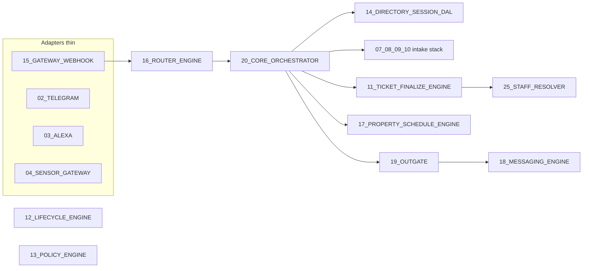
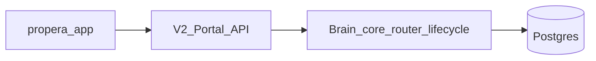

# Propera V2 — Migration plan (codebase-grounded)

## Plain-language instruction (non-negotiable for execution)

Nick is the architect and operator; **deep comfort is with the GAS + Sheets codebase**, not with databases, Docker, or cloud consoles. **Every phase that touches new tooling must ship with:**

- **Step-by-step instructions in plain English** — what to click, what to type, what “success” looks like on screen — **without assuming prior ops experience**.
- A **tiny glossary** when a new word appears the first time (e.g. what “deploy” means in Cloud Run vs “run” in Apps Script).
- **One diagram or numbered checklist** per milestone (“first time you open Supabase,” “first time you point Telegram at the new URL”) so nothing is “obvious only if you already know.”

Code and architecture live in the repo; **the human runbook is part of the deliverable**, not an afterthought. If a step can’t be explained clearly, the phase isn’t ready.

**Documentation discipline:** Treat **[docs/BRAIN_PORT_MAP.md](BRAIN_PORT_MAP.md)** and this file as **living**. When a milestone lands or scope shifts (router, core, migrations, operator steps), update the handoff table, YAML `todos` content, and **[docs/OUTSIDE_CURSOR.md](OUTSIDE_CURSOR.md)** if Supabase/env steps change. Prefer the same PR as the code, or an immediate follow-up commit so the next session does not rely on chat memory.

---

## Parallel build — GAS + Sheets stay production (until you choose to switch)

**Yes.** While V2 is built and tested, **nothing forces you to change what real tenants and staff use today.**

- **Production** keeps running on the **current Apps Script project** and **Google Sheets** — same webhooks, same numbers, same portal tied to Sheets, until you **explicitly** move a channel or the portal to V2.
- V2 runs as a **separate system**: its own URL, its own database, and (usually) **test Telegram bot / test Twilio number** so you can break things without touching live traffic.
- **Cutover** (point Twilio prod, or portal API, at V2) happens only in **late phases**, after traces and behavior match what you expect — not on day one of coding.

So: **build parallel, prove parallel, switch when ready** — not “replace overnight.”

---

## How this differs from the external draft

- **Size and shape**: The live split is **27 numbered `*.gs` modules** plus `[01_PROPERA MAIN.gs](01_PROPERA%20MAIN.gs)` (thin shell: `COL`, config, UI). Rough line counts from the repo: core spine alone is large (e.g. `[20_CORE_ORCHESTRATOR.gs](20_CORE_ORCHESTRATOR.gs)` ~~3.3k lines, `[16_ROUTER_ENGINE.gs](16_ROUTER_ENGINE.gs)` ~2.4k, `[11_TICKET_FINALIZE_ENGINE.gs](11_TICKET_FINALIZE_ENGINE.gs)` ~2.8k, `[10_CANONICAL_INTAKE_ENGINE.gs](10_CANONICAL_INTAKE_ENGINE.gs)` ~2.3k, `[19_OUTGATE.gs](19_OUTGATE.gs)` ~2k). The earlier “~~15k lines / 22 files” understates the current codebase.
- **No `propera-v2/` tree in this repo**: Treat “Phase 0 done” as **conditional** — either import the existing POC or scaffold `[propera-v2/](propera-v2/)` (Express, Dockerfile, `supabase-schema.sql`) **here** so migration work and GAS stay versioned together.
- **Extra production surfaces** (must be in the plan, not forgotten):
  - `**[apps-script/ProperaPortalAPI.gs](apps-script/ProperaPortalAPI.gs)`** — today: reads (and any writes) against Sheets. **V2 requirement**: Portal API is **critical path** — **fast, smooth** deck/detail/list. **Non-negotiable**: edits, deletes, completes, and other ticket actions are **commands through the brain** (resolver + lifecycle + policy), **not** direct SQL/Sheet row hacks from the handler. HTTP → normalized command → same engine as SMS/Telegram → DAL. **No bypassing lifecycle.**
  - `**propera-app/`** — Next.js consumer; keep contracts stable or versioned while backend moves to V2.
- **Classifier / fast paths are not one module**: Logic is spread across `[16_ROUTER_ENGINE.gs](16_ROUTER_ENGINE.gs)` (e.g. `routerInboundStrongStageMatch_`, fast continuation), `[10_CANONICAL_INTAKE_ENGINE.gs](10_CANONICAL_INTAKE_ENGINE.gs)` (attach/slot authority), and `[19_OUTGATE.gs](19_OUTGATE.gs)` (CIG / intent map). Porting “Phase 4 classifier” means **extracting contracts from these**, not inventing a single new file blindly.

Non-negotiables from `**[PROPERA_GUARDRAILS.md](PROPERA_GUARDRAILS.md)`** align with your draft: **Signal → Brain (resolver + lifecycle + policy) → Outgate**; adapters thin; AI not authoritative; channel neutrality.

---

## Why this migration matters now (you)

- **Conversation latency**: GAS + Sheets is too slow for a **live back-and-forth** — tenants and staff wait too long between turns. V2 targets a runtime that can answer on human time scales (Node + Postgres, no spreadsheet round-trips on the hot path).
- **Portal latency and correctness**: Sheet-backed **reads** and **writes** feel slow; staff need a portal that **updates quickly** and **never fights the engine**. V2 serves **Portal API** from Postgres with the same **brain-mediated mutations** as every other channel — edits, deletes, completes, and schedule changes are **commands through lifecycle/policy**, not ad-hoc cell updates.
- **Staff operations**: Staff need **fast answers** and **fast ticket creation**; lifecycle steps (done, verify, dispatch) need to feel immediate. The same stack that fixes tenant SMS threads fixes **staff + lifecycle** responsiveness once resolver + lifecycle + policy run on DB-backed services.
- **Why “now”**: The pain is **operational** — every day on GAS+Sheets is another day of slow loops for you and the team. The migration is not cosmetic; it is **throughput and trust** in the tool under real load.

---

## Testing reality: channels (do not skip)

- **Production truth**: SMS (and eventually WhatsApp) are the **main live signals** when campaigns and routing are approved.
- **Your reliable test lane today**: **Telegram** — you can exercise real multi-turn flows without SMS campaign approval; WhatsApp is similarly **sandbox-constrained**. The **emulator** helps for SMS shape but is not a substitute for a real transport loop.
- **Design implication**: The **brain is channel-agnostic** (same Compass spine). **Proof strategy**: validate **router → core → intake → finalize → outgate** on **Telegram first**; then treat SMS/WhatsApp as **adapter + compliance parity**, not a second brain. If the brain is correct for one normalized inbound signal, the same pipeline applies to all — **adapters stay thin**, **one trace**, **one dedupe/idempotency story per channel**.

---

## Target runtime (unchanged intent)

| Layer                      | Choice                                          |
| -------------------------- | ----------------------------------------------- |
| HTTP / webhooks            | Cloud Run (Node.js)                             |
| Persistence                | Supabase (Postgres)                             |
| SMS / WhatsApp             | Twilio (same account; test number first)        |
| Telegram / Alexa / sensors | Same APIs; later HTTP routes                    |
| AI                         | OpenAI (same; secrets via env / Secret Manager) |

---

## Canonical flow (as implemented today)

This matches module headers and `[FILE_SPLIT_MAP.md](FILE_SPLIT_MAP.md)`:

**Migration rule**: Preserve **entrypoint contracts** (`normalizeInboundEvent_` → `handleInboundRouter_(e)` → `handleInboundCore_(e)` → `dispatchOutboundIntent_`) as **TypeScript interfaces** in V2, even if internals are rewritten.

---

## GAS module → V2 package map (working alignment)

Use this when splitting the Node tree so ownership stays clear:

| GAS module                                                                                                                                                                              | V2 responsibility                                                                                        |
| --------------------------------------------------------------------------------------------------------------------------------------------------------------------------------------- | -------------------------------------------------------------------------------------------------------- |
| `[01_PROPERA MAIN.gs](01_PROPERA%20MAIN.gs)`                                                                                                                                            | `config/`, constants, `COL` → SQL views or typed column maps for one-time ETL                            |
| `[15_GATEWAY_WEBHOOK.gs](15_GATEWAY_WEBHOOK.gs)`                                                                                                                                        | `adapters/http.ts`, Twilio verify, `normalizeInboundEvent_`                                              |
| `[16_ROUTER_ENGINE.gs](16_ROUTER_ENGINE.gs)`                                                                                                                                            | `brain/router.ts` — lanes, compliance, continuation match, **no ticket writes**                          |
| `[14_DIRECTORY_SESSION_DAL.gs](14_DIRECTORY_SESSION_DAL.gs)`                                                                                                                            | `dal/conversation.ts`, `dal/session.ts`, identity enrichment — **replaces Ctx/Session/Directory sheets** |
| `[07_PROPERA_INTAKE_PACKAGE.gs](07_PROPERA_INTAKE_PACKAGE.gs)` + `[08_INTAKE_RUNTIME.gs](08_INTAKE_RUNTIME.gs)`                                                                         | `brain/intakePackage.ts`, `brain/compileTurn.ts`                                                         |
| `[10_CANONICAL_INTAKE_ENGINE.gs](10_CANONICAL_INTAKE_ENGINE.gs)`                                                                                                                        | `brain/canonicalIntake.ts` — stage authority, merge rules                                                |
| `[09_ISSUE_CLASSIFICATION_ENGINE.gs](09_ISSUE_CLASSIFICATION_ENGINE.gs)`                                                                                                                | `brain/issueClassification.ts`                                                                           |
| `[11_TICKET_FINALIZE_ENGINE.gs](11_TICKET_FINALIZE_ENGINE.gs)` + `[17_PROPERTY_SCHEDULE_ENGINE.gs](17_PROPERTY_SCHEDULE_ENGINE.gs)`                                                     | `services/finalize.ts`, `services/schedulePolicy.ts`, ticket/work_item creation                          |
| `[25_STAFF_RESOLVER.gs](25_STAFF_RESOLVER.gs)`                                                                                                                                          | `services/staffResolver.ts` — **single responsibility resolver**                                         |
| `[12_LIFECYCLE_ENGINE.gs](12_LIFECYCLE_ENGINE.gs)`                                                                                                                                      | `services/lifecycle.ts`                                                                                  |
| `[13_POLICY_ENGINE.gs](13_POLICY_ENGINE.gs)`                                                                                                                                            | `services/policy.ts` + `property_policy` rows                                                            |
| `[26_VENDOR_ENGINE.gs](26_VENDOR_ENGINE.gs)`                                                                                                                                            | `services/vendor.ts`                                                                                     |
| `[18_MESSAGING_ENGINE.gs](18_MESSAGING_ENGINE.gs)` + `[19_OUTGATE.gs](19_OUTGATE.gs)`                                                                                                   | `outgate/templates.ts`, `outgate/dispatcher.ts`, `OG_INTENT_TEMPLATE_MAP` → DB or versioned map          |
| `[21_AMENITY_ENGINE.gs](21_AMENITY_ENGINE.gs)` / `[23_LEASING_ENGINE.gs](23_LEASING_ENGINE.gs)` / `[24_COMM_ENGINE.gs](24_COMM_ENGINE.gs)` / `[22_WATER_ENGINE.gs](22_WATER_ENGINE.gs)` | Domain engines behind router after core maintenance path is stable                                       |
| `[05_AI_MEDIA_TRANSPORT.gs](05_AI_MEDIA_TRANSPORT.gs)` + `[06_STAFF_CAPTURE_ENGINE.gs](06_STAFF_CAPTURE_ENGINE.gs)`                                                                     | `adapters/media.ts`, queues (Cloud Tasks / Pub/Sub later)                                                |
| `[02_TELEGRAM_ADAPTER.gs](02_TELEGRAM_ADAPTER.gs)` etc.                                                                                                                                 | `adapters/telegram.ts`, `alexa.ts`, `sensor.ts`                                                          |
| `[27_DEV_TOOLS_HARNESS.gs](27_DEV_TOOLS_HARNESS.gs)`                                                                                                                                    | `scripts/`, integration tests, emulator                                                                  |

---

## Data migration (Sheets → Postgres)

Before coding “brain” logic, produce a **written schema mapping** (one doc, living in repo):

- **Directory** row → `conversation_ctx` + draft fields (`PendingStage`, `IssueBuffer` JSON, pointers).
- **Sheet1** (`COL` in `[01_PROPERA MAIN.gs](01_PROPERA%20MAIN.gs)`) → `work_items` / `tickets` tables (your Supabase script may need **columns parity** with portal expectations).
- **Ctx / Sessions / WorkItems** sheets → normalized tables + **transaction boundaries** replacing `dalWithLock`_ / `withWriteLock`_.
- **Templates** sheet → `templates` table or seeded JSON with version column.
- **PropertyPolicy** → `property_policy` (already in draft schema; ensure keys match `[ppGet](17_PROPERTY_SCHEDULE_ENGINE.gs)`_ contract).

**Portal parity (reads)**: List/detail/deck endpoints today backed by Sheet1 and related sheets become **SQL or RPC** against the same logical model staff already trust — **fast**, indexed, cacheable where safe.

**Portal mutations (writes) — through brain, always**:

- Portal “save” actions map to **commands** (e.g. complete ticket, edit field where allowed, cancel, assign-related flows if present).
- Each command: **authenticate actor** → **normalize** → **router/lane or staff lane** as appropriate → **lifecycle + policy** → **single transactional write** + **event_log** + optional **outgate** (e.g. tenant SMS). Same invariants as `handleInboundCore`_ for operational truth.
- **Forbidden in V2**: API handlers that `UPDATE work_items SET …` for business state without going through **lifecycle gateway** and **policy**; **forbidden**: direct Sheet writes from portal for ticket state. (Cosmetic/logging-only exceptions, if any, must be explicitly listed and reviewed.)

---

## Phased execution (reordered for risk)

Phases follow **strangler pattern**: GAS remains source of truth until a phase’s **shadow** metrics pass.

1. **Phase 0 — Repo + skeleton**
  Add or merge V2 service: Express/Fastify, health check, Dockerfile, deploy doc, Supabase migrations in git. **Trace**: port the observability contract (`trace.step` / `decision` / `snap` / `error`) as a **middleware + async context**, not an afterthought.
2. **Phase 1 — Database + seed + identity**
  ETL or one-time scripts: Properties, Contacts, Staff, StaffAssignments, Tenants, Vendors, PropertyPolicy, Templates. Implement `**resolveActor(phone)`** equivalent to router’s staff/tenant/vendor checks (see `[16_ROUTER_ENGINE.gs](16_ROUTER_ENGINE.gs)` + `[14_DIRECTORY_SESSION_DAL.gs](14_DIRECTORY_SESSION_DAL.gs)`). **Kill switch**: `V2_IDENTITY_READ_ONLY=1` to log decisions without sending.
3. **Phase 2 — Gateway + Router (Telegram-first proof, Twilio in parallel)**
  Port `[15_GATEWAY_WEBHOOK.gs](15_GATEWAY_WEBHOOK.gs)` normalization concepts + `[handleInboundRouter](16_ROUTER_ENGINE.gs)_` **through** to a stub core. **Primary Nick validation**: `[02_TELEGRAM_ADAPTER.gs](02_TELEGRAM_ADAPTER.gs)` webhook → same router entry → stub reply — so you can **ship confidence on real threads** without SMS campaign approval. **In parallel**: Twilio **test number** where sandbox allows — prove signature validation, `MessageSid` dedupe, and trace parity. Emulator covers SMS **shape** when Twilio live testing is blocked.
4. **Phase 3 — Outgate + templates (tenant-visible quality)**
  Port `[OG_INTENT_TEMPLATE_MAP](19_OUTGATE.gs)_` + `[renderTenantKey](18_MESSAGING_ENGINE.gs)_` behavior to `**dispatchOutboundIntent`** with real template rendering. **Success**: branded prompts (ASK_PROPERTY, ASK_UNIT, etc.), not POC echoes.
5. **Phase 4 — Intake vertical slice (maintenance; channel-agnostic)**
  In order: `[08_INTAKE_RUNTIME.gs](08_INTAKE_RUNTIME.gs)` `compileTurn`_ → `[07_PROPERA_INTAKE_PACKAGE.gs](07_PROPERA_INTAKE_PACKAGE.gs)` package → `[10_CANONICAL_INTAKE_ENGINE.gs](10_CANONICAL_INTAKE_ENGINE.gs)` merge → draft persistence in Postgres. **Validate end-to-end on Telegram first** (your reliable lane); SMS/WhatsApp attach as adapters once brain + outgate match GAS behavior. This is the **largest** port; keep **pure functions** unit-tested without Sheets.
6. **Phase 5 — Finalize + schedule + ticket creation**
  `[11_TICKET_FINALIZE_ENGINE.gs](11_TICKET_FINALIZE_ENGINE.gs)` `finalizeDraftAndCreateTicket`_ + `[17_PROPERTY_SCHEDULE_ENGINE.gs](17_PROPERTY_SCHEDULE_ENGINE.gs)` schedule policy + `[processTicket](17_PROPERTY_SCHEDULE_ENGINE.gs)`_ sheet write becomes **transactional inserts** + idempotency keys (inbound SID / dedupe id already in logs).
7. **Phase 6 — Resolver + lifecycle + policy**
  `[25_STAFF_RESOLVER.gs](25_STAFF_RESOLVER.gs)`, `[12_LIFECYCLE_ENGINE.gs](12_LIFECYCLE_ENGINE.gs)`, `[13_POLICY_ENGINE.gs](13_POLICY_ENGINE.gs)` — wire **event_log** and replace PolicyTimers with **Cloud Scheduler** hitting a signed `/internal/tick` route.
8. **Phase 7 — Staff / vendor lanes**
  `[26_VENDOR_ENGINE.gs](26_VENDOR_ENGINE.gs)`, staff commands, `[06_STAFF_CAPTURE_ENGINE.gs](06_STAFF_CAPTURE_ENGINE.gs)`.
9. **Phase 8 — Remaining adapters + media**
  **Telegram** may already be proven in Phase 2–4; this phase completes **Alexa**, **sensors**, and **vision/media** (`[05_AI_MEDIA_TRANSPORT.gs](05_AI_MEDIA_TRANSPORT.gs)`, `[06_STAFF_CAPTURE_ENGINE.gs](06_STAFF_CAPTURE_ENGINE.gs)`). **Media always “heavy”** per guardrails.
10. **Phase 9 — Portal API + `propera-app` (priority: smooth + correct)**
  Replace `[apps-script/ProperaPortalAPI.gs](apps-script/ProperaPortalAPI.gs)` Sheet reads with **V2 REST** backed by Postgres — **performance** is a success metric (deck load, ticket open, list filters). Implement **POST/PATCH/DELETE** (or RPC) for staff actions so **every mutation** goes **through brain** (lifecycle + policy + resolver rules), **not** direct table edits. Trace portal commands the same as inbound SMS (`trace.decision`, `event_log`). Optionally keep a thin GAS proxy **only** during transition. Coordinate CORS, auth (`PORTAL_API_TOKEN_PM` / session equivalent), and **JSON shapes** for `propera-app` to minimize churn.
11. **Phase 10 — Production cutover**
  Twilio webhook → Cloud Run; GAS on standby; week-long trace review; then retire dual-run.

---

## Operator notes (explicit “why” for someone new to Docker/DB)

- **Supabase**: Hosted Postgres + dashboard for SQL + auth; you run **migrations** from laptop (`supabase db push` or SQL files), not hand-editing prod.
- **Cloud Run**: Runs your container; **no SSH** — you deploy by pushing an image; **secrets** live in Google Secret Manager, injected as env vars.
- **Twilio test number**: Point dev number at V2 when you can; production number stays on GAS until Phase 10. When SMS is **blocked** (campaign/sandbox), rely on **Telegram** + emulator — do not block brain progress on Twilio approval.
- **Idempotency**: Twilio retries POST; V2 must **dedupe by MessageSid** (already conceptually in GAS `DEDUP_RESULT` logs).

---

## Deliverables checklist (before calling a phase “done”)

- **Tests at the right stage** — See **[propera-v2/docs/TESTING_STRATEGY.md](propera-v2/docs/TESTING_STRATEGY.md)** (*Staged test implementation*). When a brain slice lands, add the **automated tests that slice can support** in the same milestone (unit → scenario → integration as boundaries stabilize). Full matrix upfront is not required; **empty layers** until the code exists is OK.
- **Plain-language runbook** for Nick: steps, screenshots or exact UI paths where helpful, glossary for new terms; validated by walking through once without code context.
- Trace covers: inbound normalize, lane, ctx snapshot, each DB write, each **decision** with reason, outbound intent + rendered body.
- **Portal**: read paths meet latency expectations; **write** paths are proven to call **brain/lifecycle**, not sneaky DAL shortcuts for ticket state.
- Feature flag env vars for every new path (`V2_ROUTER_ENABLED`, `V2_FINALIZE_ENABLED`, …).
- Contract tests: compare V2 JSON outputs to golden fixtures captured from GAS (where safe).

---

## Suggested first concrete sprint (after Phase 0–1)

Implement the **maintenance tenant vertical slice** on **one channel you can trust**: **Telegram** — PROPERTY → UNIT → ISSUE → SCHEDULE → finalize → staff notify. **No** amenity/leasing yet. Keep **Twilio adapter** in lockstep where sandbox allows so SMS does not drift, but **do not gate brain correctness on SMS campaign approval** — the brain is shared; adapters are thin. This matches Compass (**one spine, many adapters**) and your real-world ability to test.
