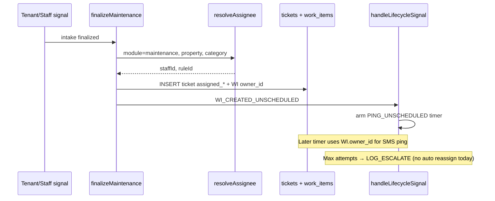
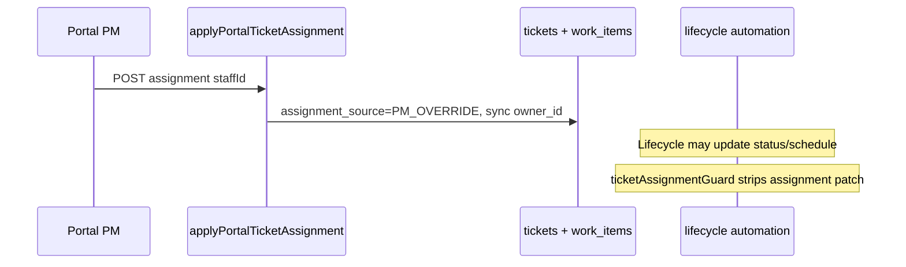

# Responsibility Routing Refactor — V2-native design

**Status:** **Operator-approved** (Grand org, 2026-05-30) — ready to start **Phase 0**. Phases 1+ remain gated on lifecycle tests per section 7.  
**Purpose:** Replace fragmented assignment data (GAS-shaped `staff_assignments`, lone `ASSIGN_DEFAULT_OWNER` policy key) with a **single Propera responsibility model** that supports property + module + category routing **without breaking maintenance lifecycle, pings, or PM override.**

**Audience:** product (Grand org), architecture, implementers of Settings, finalize paths, and future domain engines.

**North Compass:** Given this signal, **who owns the next action?** One deterministic resolver answers that at assign time; lifecycle timers and escalations **follow the assignee already on the work item** unless an explicit escalation rule changes ownership.

**Explicitly out of scope:** Porting GAS `25_STAFF_RESOLVER.gs`, `StaffAssignments` sheet semantics, or `RoutingRules` sheets. GAS stays in the past. This doc defines **new Propera V2 contracts**.

**Related (do not duplicate):**

- [PM_ASSIGNMENT_OVERRIDE.md](./PM_ASSIGNMENT_OVERRIDE.md) — `assignment_source`, PM lock, `work_items` sync
- [OPERATIONAL_POLICY_CONFIG.md](./OPERATIONAL_POLICY_CONFIG.md) — timer/ping/escalation **thresholds** (hours, max attempts)
- [VENDOR_LANE.md](./VENDOR_LANE.md) — category → vendor policy pattern (parallel to staff routing)
- [CONFLICT_MEDIATION_ENGINE.md](./CONFLICT_MEDIATION_ENGINE.md) — conflict **cases** are separate domain truth (not maintenance tickets)
- [PROPERTY_POLICY_PARITY.md](./PROPERTY_POLICY_PARITY.md) — schedule/contact policy (precursor to unified config)
- [../propera-gas-reference/PROPERA_NORTH_COMPASS.md](../propera-gas-reference/PROPERA_NORTH_COMPASS.md)

---

## 1. Problem today (why this refactor)

Three different concepts are mixed in one messy table and one policy key:

| Concept | Where it lives today | What it actually drives |
|--------|----------------------|-------------------------|
| **Ticket assignee on create** | `property_policy.ASSIGN_DEFAULT_OWNER` | Maintenance intake only → `tickets.assigned_*` + `work_items.owner_id` |
| **Staff ↔ property “roles”** | `staff_assignments.role` as `RoleType\|Domain` | Mostly **tenant deflect phone** (`SUPER\|` then `PM\|`); seed gives everyone everything |
| **PM manual assign** | Portal → `applyPortalTicketAssignment` | Any active staff/vendor; locks with `PM_OVERRIDE` ✅ |

Settings → Assignments UI writes bare `"PM"` instead of `PM|GENERAL`, so rows created in the app **do not match** engine prefix lookups.

**Product gap:** There is no configurable path for “office → Britsy”, “leasing → Yesenia”, “cleaning → roster staff”, “conflict → Nick/Juliana/Geff” on **ticket/case create**. Maintenance works only because `ASSIGN_DEFAULT_OWNER` hard-codes Nick/Geff by property.

---

## 2. Non-negotiable lifecycle contract (must preserve)

Maintenance lifecycle is **live** in V2. Any routing refactor **must not change behavior** until explicitly tested. These invariants are extracted from `finalizeMaintenance.js`, `handleLifecycleSignal.js`, `evaluateLifecyclePolicy.js`, `executeLifecycleDecision.js`, and `portalTicketAssignment.js`.

### 2.1 Dual write on assign

On ticket/work-item create, assignee is stored in **two places**:

| Store | Columns | Used by |
|-------|---------|---------|
| `tickets` | `assigned_type`, `assigned_id`, `assigned_name`, `assign_to`, `assignment_source`, `assigned_by`, … | Portal UI, tenant portal read, vendor lane guards |
| `work_items` | `owner_id`, `owner_type` (`STAFF` \| `VENDOR`) | **Lifecycle pings**, staff SMS reminders, WI state machine |

**Rule:** `resolveAssignee()` (new) must produce one result that is written to **both** stores in the same create transaction — same as `finalizeMaintenance` today.

**Rule:** PM reassignment (`applyPortalTicketAssignment`) already updates **both**; the refactor must keep calling that path for manual assign, not duplicate logic.

### 2.2 Lifecycle pings follow `work_items.owner_id`

After create, timers arm on the work item (`WI_CREATED_UNSCHEDULED` → `PING_UNSCHEDULED`, staff outcomes → `PING_STAFF_UPDATE`, schedule → `PING_STAFF_UPDATE`, etc.).

When a timer fires, outbound staff reminders use:

```text
work_items.owner_id  →  getStaffPhoneE164ByStaffId  →  dispatchStaffLifecycleReminder
```

(See `staffLifecycleOutbound.js`, `executeLifecycleDecision.js`.)

**Implication:** If auto-assign picks the wrong staff at create, **the wrong person gets pinged** for the entire lifecycle unless PM reassigns (which updates `owner_id`).

**Implication:** If `owner_id` is empty at create, timers still arm (by design), but pings **skip** with `STAFF_LIFECYCLE_OUTBOUND_SKIP`. Do not assume assignee exists.

### 2.3 `assignment_source` and PM override

| Value | Meaning |
|-------|---------|
| `POLICY` | Set by automated resolver / policy at create (or policy vendor assign) |
| `PM_OVERRIDE` | PM explicitly chose assignee; **automation must not overwrite** assignment columns |
| `` (empty) | Legacy / unassigned |

`ticketAssignmentGuard.mergeTicketUpdateRespectingPmOverride` protects assignment columns on lifecycle schedule apply, portal mutations, turnover links, etc.

**Rule:** The new resolver runs at **create** (and optional future “re-resolve” API). It must **never** run silently on timer fire or lifecycle transition while `assignment_source = PM_OVERRIDE`.

### 2.4 Escalation today vs tomorrow

**Today (shipped):** When ping max attempts are exceeded, lifecycle emits **`LOG_ESCALATE`** only — event log entry, **no automatic reassignment**:

| Timer exhausted | Event | Note |
|-----------------|-------|------|
| `PING_STAFF_UPDATE` | `STAFF_UPDATE_ESCALATED` | Log only |
| `PING_UNSCHEDULED` | `UNSCHEDULED_ESCALATED` | `UNSCHEDULED_MAX_ATTEMPTS_PHASE3B_PM_NOTIFY_PENDING` |
| `TIMER_ESCALATE` (parts) | `PARTS_ESCALATED` | Log only |

Escalation **thresholds** (hours, max attempts, contact hours) come from **`property_policy` / operational policy** — not from staff assignments.

**Tomorrow (Phase 4 — operator-confirmed):** Escalation is **configurable** (on/off per org/module/property). When enabled, the chain is:

```text
Primary building super  →  Juliana (office PM)  →  Samuel (owner)
```

Resolved via catalog roles (`building_super` → `office_pm` → `owner`), not hardcoded staff names.

After ping/timer max attempts, lifecycle may (config permitting):

- notify the next step in the chain without changing owner, or
- **reassign** `owner_id` + ticket assignee with `assignment_source = ESCALATION` and audit — **never** fighting `PM_OVERRIDE`

When escalation is **off** for a scope, exhausted timers keep today’s behavior: **`LOG_ESCALATE` only** (event log, no reassignment).

This refactor **documents the hook**; actionable escalation is **Phase 4**, not Phase 2.

### 2.5 Vendor assignee path

Vendor assignment sets `owner_type = VENDOR`, `owner_id = vendor_id`. Staff lifecycle ping templates are not used for vendor owners. Staff routing refactor must not break vendor lane (`vendorAssignment.js`, `VENDOR_LANE.md`).

---

## 3. Target architecture (V2-native, three layers)

```text
┌─────────────────────────────────────────────────────────────────┐
│  Layer 1 — Responsibility catalog (who people ARE per property) │
│  staff + property + role + is_primary                           │
│  Human roles: super, maintenance_tech, office, leasing, owner, …  │
└────────────────────────────┬────────────────────────────────────┘
                             │
┌────────────────────────────▼────────────────────────────────────┐
│  Layer 2 — Routing rules (what AUTO-assignment does)            │
│  WHEN module + property + category → staff | vendor | roster    │
│  Org-editable; auditable; on/off per rule                       │
└────────────────────────────┬────────────────────────────────────┘
                             │
┌────────────────────────────▼────────────────────────────────────┐
│  Layer 3 — resolveAssignee() (deterministic, one function)      │
│  Input: org, property, module, category, unit?, signal meta      │
│  Output: assigneeType, assigneeId, ruleId, source               │
│  Called at create; respects PM_OVERRIDE on updates              │
└────────────────────────────┬────────────────────────────────────┘
                             │
         ┌───────────────────┴───────────────────┐
         ▼                                       ▼
   tickets.assigned_*                    work_items.owner_*
   assignment_source = POLICY            owner_type STAFF/VENDOR
         │                                       │
         └───────────────────┬───────────────────┘
                             ▼
              handleLifecycleSignal (timers → pings → escalate log)
```

### 3.0 Multi-org role model (before Grand-specific data)

Grand is one **instance** of a **platform-wide role catalog**. Other companies self-configure through the app; no operator SQL, no Grand names in code.

#### Three things operators must not confuse

| Layer | What it is | Who sets it | Example |
|-------|------------|-------------|---------|
| **Portal access** | Who can log into Settings / cockpit | Allowlist + `portal_role` | Owner, Ops, PM, Read-only |
| **Staff job label** | Display / HR text on staff row | Free text per org | “Handyman”, “Regional PM” |
| **Responsibility role** | Routing slot the **engine** understands | Platform catalog + org assignments | `building_super`, `leasing` |

Only **responsibility roles** feed `resolveAssignee()`, escalation chains, and tenant deflect. Portal access and job labels never auto-route tickets.

#### Platform role catalog (Propera-defined, not per org)

Fixed slots shipped in product — orgs **assign people**, they do **not** invent new slot types in v1.

**Core (every org — seeded on org create):**

| Role key | Operator label (Settings) | Used for |
|----------|---------------------------|----------|
| `building_super` | Building lead / Super | Maintenance default owner, field super, deflect SUPER |
| `maintenance_tech` | Maintenance staff | Shared maintenance coverage, optional co-assign |
| `office_pm` | Office / PM contact | Deflect PM fallback, escalation step |
| `owner` | Owner / executive | Escalation terminal, not default intake |

**Extended (org enables when relevant — optional rows in UI):**

| Role key | Operator label | When shown |
|----------|----------------|------------|
| `office_staff` | Office staff | Office module or “we have front desk” |
| `leasing` | Leasing | Leasing module or self-reported leasing team |
| `cleaning_lead` | Cleaning coordinator | Cleaning roster / turnover module |
| `vendor_coordinator` | Vendor / contracts | Vendor-heavy ops (future) |

**Rules:**

- Role keys are **stable enums in code** — like `ticket.status`, not user-created strings.
- Labels are **localized display strings** in the app (“Building lead” vs Grand’s “Super”).
- Orgs may **hide** extended roles they do not use; hidden roles are ignored by rules.
- Multiple staff may hold the same role at one property; **`is_primary`** picks one for auto-assign/deflect.

Grand mapping: `office_pm` → Juliana, `office_staff` → Britsy (rename from `office_secretary` in doc for clarity — more generic for multi-org). I'll use `office_staff` as the generic key instead of `office_secretary` in the platform catalog since user said Britsy is office secretary - the platform label can say "Office staff" or "Secretary / front desk".

Actually the doc already uses `office_secretary` - I could keep it or rename to `office_staff`. For multi-org "office_staff" is better. I'll note Grand Britsy = `office_staff` role.

#### Org assignment data (per company, self-service)

Table: `staff_property_roles` — every row scoped by `org_id`.

```text
org_id + property_code + role_key + staff_id + is_primary + active
```

- **`property_code = GLOBAL`** — org-wide (owner, single-office admin covering all properties).
- **Per property** — building_super, maintenance_tech, etc.
- New org with **one property** from wizard → assign owner to all core roles on that property (simple path).
- **Copy coverage** — “Apply this person to all properties” button in Settings (essential for multi-property SMBs).

#### Default rules seeded on org create (not Grand-specific)

When MO-4 bootstrap (or Phase 1 catalog) completes, seed **disabled-by-default** or **sensible defaults**:

| Rule | Default target | Notes |
|------|----------------|-------|
| Maintenance auto-assign | `primary: building_super` | Replaces per-org SQL for `ASSIGN_DEFAULT_OWNER` |
| Office auto-assign | `primary: office_staff` if role enabled, else `office_pm` | Module-gated |
| Leasing auto-assign | `primary: leasing` | Module-gated |
| Escalation chain | `[building_super, office_pm, owner]` | **Escalation enabled: off** for new orgs until owner turns on |
| Escalation thresholds | Portfolio policy defaults | Already in policy seed pattern |

New company **does not** get Grand’s Nick/Geff split — they pick their own people in Settings or onboarding step.

#### Self-service UX (app) — target flow

**A. Onboarding wizard (extend MO-4 — after first property):**

Step: **“Who handles what?”** (skippable → Settings later)

| Company profile | UX |
|-----------------|-----|
| **Solo / owner-operator** | One person → all core roles, all properties (one tap) |
| **Small team (2–5)** | Pick building lead + office contact; optional same person for both |
| **Multi-property team** | Table: Property × {Building lead, Maintenance, Office} with “copy row to all” |

Then: **Escalation** — Off by default; if on, pre-fill chain Building lead → Office → Owner from picks above.

**B. Settings → Team coverage** (ongoing edits)

- Properties as rows or tabs; roles as columns (only **enabled** role types shown).
- Primary star per (property, role).
- Staff dropdown = active staff **in this org only**.

**C. Settings → Auto-assignment & escalation**

- Rules list (module, property scope, assign to role).
- Escalation toggle + chain editor (role picks, not free-text names).

**D. Settings → Staff** (unchanged)

- Add people first; coverage references existing staff rows.

#### What a different company looks like

**Example: “Sunrise PM LLC” — 2 properties, 3 people**

| Person | Portal | Responsibility |
|--------|--------|----------------|
| Maria | Owner | `owner` GLOBAL; escalation terminal |
| James | Ops | `building_super` primary both properties; `maintenance_tech` |
| Ana | PM | `office_pm` both properties; `leasing` |

Rules: maintenance → building_super (James). Escalation off until Maria enables: James → Ana → Maria.

No Grand staff IDs, no `SUPER|MAINTENANCE` strings, same engine.

#### Grand in this model

Grand is **not special-cased in code**. Migration Phase 0 backfills Grand’s `staff_property_roles` from confirmed roster (section 8). Other orgs never see Grand data; resolver always filters `org_id` from JWT.

#### Implementation note for Phase 1

- Ship **`responsibility_role_definitions`** as code constant (or small reference table seeded once globally) — not editable by tenants in v1.
- Ship **`staff_property_roles`** per org — fully editable in Settings.
- Optional: **`org_enabled_roles`** — which extended slots this org uses (hide Britsy-style roles for solo operators).

---

### 3.1 Layer 1 — Responsibility catalog (storage)

**Purpose:** Org truth — who covers which **platform role** at which **property**. Not ticket-specific.

Proposed table: `staff_property_roles` (name TBD; may evolve `staff_assignments`):

| Column | Notes |
|--------|-------|
| `org_id` | Multi-tenant scope — **required on every query** |
| `staff_id` | FK → `staff.staff_id` text (staff row must match org) |
| `property_code` | FK → `properties.code`; `GLOBAL` for org-wide |
| `role_key` | Platform enum (section 3.0) — not free text |
| `is_primary` | At most one primary per `(org_id, property_code, role_key)` |
| `active` | Soft off without delete |

**Example: Grand org (confirmed 2026-05-30):**

| Role | Staff | Coverage |
|------|-------|----------|
| `maintenance_tech` | Nick, Geff | All 5 properties |
| `building_super` (primary) | Nick | Penn, Westfield, Westgrand |
| `building_super` (primary) | Geff | Morris, Murray |
| `office_pm` (primary) | Juliana | All 5 properties — tenant deflect fallback |
| `office_staff` | Britsy | All 5 — office auto-assign when module live |
| `leasing` | Yesenia | All 5 properties |
| `owner` | Samuel | Org-wide — **escalation terminal only**, not default maintenance assignee |
| `cleaning_lead` | TBD | Per-property roster (future) |

**Enforcement:** App rejects save if two primaries for same `(org_id, property_code, role_key)`. Staff and property must belong to same org.

**Migration from today:** Replace GAS-shaped `SUPER|MAINTENANCE` rows with enum rows; delete duplicate bogus primaries.

### 3.2 Layer 2 — Routing rules (auto-assignment config)

**Purpose:** Configurable **when** to auto-assign **whom**, separate from timer policy.

Proposed table: `org_assignment_rules`:

| Column | Notes |
|--------|-------|
| `org_id` | |
| `enabled` | Toggle without delete |
| `priority` | Lower = evaluated first |
| `module` | `maintenance`, `office`, `leasing`, `conflict`, `cleaning`, `preventive`, … |
| `property_code` | Specific or `*` (any in org) |
| `category_match` | Optional slug match on ticket category (e.g. `Plumbing`) |
| `target_kind` | `primary_role`, `staff_id`, `vendor_policy_key`, `cleaning_roster`, `escalation_chain` |
| `target_ref` | Role enum, `STAFF_NICK`, `PLUMBING_VENDOR_ID`, etc. |
| `assign_mode` | `staff` \| `vendor` (future: `team`) |

**Examples (Grand):**

| module | property | target | Effect |
|--------|----------|--------|--------|
| `maintenance` | `*` | `primary_role: building_super` | Replaces `ASSIGN_DEFAULT_OWNER` semantics |
| `maintenance` | `*` | fallback `primary_role: maintenance_tech` | If no super configured |
| `office` | `*` | `primary_role: office_secretary` → Britsy | When office intake module ships |
| `leasing` | `*` | `primary_role: leasing` | Yesenia |
| `conflict` | `*` | `escalation_chain: building_super → office_pm → owner` | CME case owner (Phase 5) |
| `cleaning` | `*` | `cleaning_roster` | Property cleaning staff |
| `maintenance` | `PENN` | `vendor_policy_key: PLUMBING_VENDOR_ID` | Optional; parallel vendor lane |

### 3.2b Escalation config (separate from auto-assign rules)

Escalation is **not** the same as “who gets the ticket on create.” It governs what happens when lifecycle timers exhaust (pings, parts wait, unscheduled, etc.).

Proposed: `org_escalation_config` (or columns on `org_assignment_rules` where `target_kind = escalation_chain`):

| Field | Purpose |
|-------|---------|
| `org_id` | |
| `module` | `maintenance` (first); later `conflict`, … |
| `property_code` | Specific or `*` |
| `enabled` | **Master on/off** — when false, `LOG_ESCALATE` only (today’s behavior) |
| `chain` | Ordered role refs: `[building_super, office_pm, owner]` |
| `mode` | `notify_only` \| `reassign_owner` (per step or global — product default TBD in Phase 4) |
| `respect_pm_override` | Always `true` — escalation never changes `PM_OVERRIDE` tickets |

**Settings UX:** “Escalation” section with toggle **On / Off** per module (and optional per property). When on, show ordered chain (Super → Juliana → Samuel) editable via role picks from catalog.

**Split of concerns:**

| Config | Layer | Examples |
|--------|-------|----------|
| **When** to escalate (hours, max attempts) | Operational policy (`property_policy`) | `STAFF_UPDATE_MAX_ATTEMPTS`, `UNSCHEDULED_MAX_ATTEMPTS` |
| **Whether** escalation runs | Escalation config | `enabled: true/false` |
| **Who** receives escalation | Escalation chain | super → Juliana → Samuel |

**Relationship to `property_policy`:**

| Config type | Stays in `property_policy` | Moves to routing rules |
|-------------|------------------------------|------------------------|
| Ping hours, max attempts, contact hours | ✅ | |
| `ASSIGN_DEFAULT_OWNER` | Deprecated after migration | ✅ replaced by rule |
| `{CATEGORY}_VENDOR_ID` | ✅ (until vendor rules unified) | Optional later |

### 3.3 Layer 3 — `resolveAssignee(ctx)`

Single exported function (location TBD: `src/responsibility/resolveAssignee.js`):

```javascript
/**
 * @param {object} ctx
 * @param {string} ctx.orgId
 * @param {string} ctx.propertyCode
 * @param {string} ctx.module          // maintenance | office | leasing | ...
 * @param {string} [ctx.category]      // ticket category slug
 * @param {string} [ctx.unitLabel]
 * @param {string} [ctx.domainHint]    // from intake interpret once
 * @returns {Promise<{
 *   ok: boolean,
 *   assigneeType: 'STAFF'|'VENDOR'|'',
 *   assigneeId: string,
 *   displayName: string,
 *   assignmentSource: 'POLICY',
 *   ruleId: string,
 *   reason: string
 * }>}
 */
```

**Algorithm (deterministic):**

1. Load enabled rules for org, ordered by `priority`.
2. First match on `(module, property, category_match)`.
3. Resolve target via catalog (primary role → staff_id), vendor policy, or cleaning roster.
4. Validate staff active; validate vendor active if vendor.
5. Return empty assignee if no rule matches (lifecycle still creates WI — pings skip).

**Audit:** Log `RESPONSIBILITY_RESOLVED` to `event_log` with `rule_id`, `staff_id`, `module`, `property_code`, `trace_id`.

**Not responsible for:** Lifecycle timer scheduling, ping text, escalation thresholds — those stay in lifecycle + operational policy.

---

## 4. End-to-end flow (maintenance — must stay intact)



**PM reassign (unchanged):**



---

## 5. Module matrix (where routing applies)

| Module | Work artifact | Auto-assign today | Target owner | Lifecycle |
|--------|---------------|-------------------|--------------|-----------|
| **Maintenance** | `tickets` + `work_items` MAINT | `ASSIGN_DEFAULT_OWNER` | Super / tech by rule | Full WI graph, pings, escalate log |
| **Office** | TBD (ticket or conversation) | Deflect only | **Britsy** (auto-assign); Juliana primary office/deflect | TBD — likely lighter or ticket-based |
| **Leasing** | TBD | Deflect only | Yesenia | TBD |
| **Conflict (CME)** | `conflict_cases` | None | Rule chain | CME lifecycle — **separate** from MAINT WI |
| **Cleaning** | TBD / program lines | None | Cleaning roster | May reuse program engine or new WO |
| **Preventive** | `program_lines` | Staff on line / manual | Property staff | Program engine — assign at line level |
| **Vendor** | ticket vendor columns | Policy hook (planned) | Vendor ID | Vendor dispatch lane |

**Important:** Conflict mediation **cases** are not maintenance work items. Routing rules may share the same **catalog** (roles) but must write to the **correct domain table** via each engine’s create path — no cross-contamination.

Intake already emits `domainHint` (`MAINTENANCE | LEASING | CLEANING | CONFLICT | …`) in structured signal — resolver input should use **interpret-once** output, not re-parse body text.

---

## 6. Settings / portal UX (operator-facing)

Split Settings into two pages (names TBD):

### 6.1 Team coverage (catalog)

- Grid: Property × role → staff member(s), mark **primary**
- Human labels: “Building super”, “Maintenance tech”, “Office (PM)”, “Leasing”, …
- Validation: one primary super per property

### 6.2 Auto-assignment rules

- List rules: Module, property scope, category filter, assign to, enabled
- Grand maintenance rule v1: “Maintenance at any property → Primary building super”
- Link to Policies for **timer** settings (ping hours) — do not mix timers into assignment rules UI

### 6.2b Escalation settings

- Toggle: **Escalation on / off** (org default; optional per property)
- When on: ordered chain **Super → Juliana → Samuel** (role picks from catalog)
- Link to Policies for **thresholds** (max ping attempts, hours) — separate from on/off
- Copy for operators: “When off, exhausted timers are logged only; no automatic handoff.”

### 6.3 Deprecate confusing UI

- Retire bare `PM | SUPER | MAINTENANCE` dropdown on Assignments (or remap to catalog)
- Keep **manual ticket assign** in ticket detail (unchanged)

---

## 7. Phased execution plan

Each phase has **lifecycle gate** criteria before merge.

### Phase 0 — Grand catalog cleanup (no resolver yet) ✅ safe entry

**Goal:** Fix data + Settings assignment form so deflect phone and catalog match reality.

- Fix Settings assignments to write valid slot values **or** freeze legacy table and only edit via SQL until Phase 1
- SQL/script: trim bogus `SUPER|*` / `PM|*` rows; set Grand truth table (Section 3.1 example)
- **Do not change** `ASSIGN_DEFAULT_OWNER` or `finalizeMaintenance`

**Lifecycle gate:** Regression test — create maintenance ticket → same assignee, `WI_CREATED_UNSCHEDULED` fires, ping targets same `owner_id`.

### Phase 1 — Schema + catalog API

- Migration: `staff_property_roles` (+ indexes, primary constraint)
- DAL + Settings “Team coverage” CRUD
- Backfill from cleaned assignments

**Lifecycle gate:** Read-only — no change to finalize path.

### Phase 2 — `resolveAssignee` + maintenance wire-up

- Implement resolver + `org_assignment_rules` seed for Grand maintenance
- Replace `lifecyclePolicyGet(..., ASSIGN_DEFAULT_OWNER)` in `finalizeMaintenance.js` with resolver call
- Dual-write contract tests: ticket + work_item owner match
- PM_OVERRIDE tests unchanged

**Lifecycle gate (required):**

- [ ] New ticket → `owner_id` = expected super
- [ ] `WI_CREATED_UNSCHEDULED` → timer inserted
- [ ] Timer fire → ping sent to resolver-chosen phone (mock outbound)
- [ ] PM reassign → subsequent ping goes to new owner
- [ ] PM_OVERRIDE → lifecycle schedule apply does not revert assignee

**Rollback:** Feature flag `PROPERA_USE_RESPONSIBILITY_RESOLVER=0` falls back to `ASSIGN_DEFAULT_OWNER`.

### Phase 3 — Routing rules admin + category/module rules

- Settings “Auto-assignment rules” UI
- Add rules for office/leasing when those intake modules create assignable artifacts
- Vendor category rules align with `VENDOR_LANE.md` hook

**Lifecycle gate:** Per-module integration tests; maintenance path still passes Phase 2 suite.

### Phase 4 — Escalation config + lifecycle extension

- Schema: `org_escalation_config` with **`enabled`** flag (on/off)
- Default Grand chain: `building_super` → `office_pm` (Juliana) → `owner` (Samuel)
- Wire `evaluateLifecyclePolicy` / `executeLifecycleDecision`: when `LOG_ESCALATE` would fire, if escalation **enabled** → resolve next chain step (notify or reassign); if **disabled** → keep log-only behavior
- Define `assignment_source = ESCALATION` when reassigning owner
- Settings “Escalation” page: on/off toggle + chain editor
- **Never** override `PM_OVERRIDE`

**Lifecycle gate:** Escalation simulation tests with enabled on/off; ping attempt counts still from operational policy keys.

### Phase 5 — Domain engine hooks

- CME: case owner on create from conflict rules
- Cleaning: roster lookup
- Office/leasing: ticket or case create + assign

---

## 8. Grand org — operator confirmation ✅

**Signed off 2026-05-30.**

| # | Question | Answer |
|---|----------|--------|
| 1 | Primary **office** contact (tenant deflect fallback)? | **Juliana** — all properties |
| 2 | **Britsy** auto-assign for office module? | **Yes** |
| 3 | **Yesenia** for leasing on all properties? | **Yes** |
| 4 | Escalation chain (maintenance + conflict)? | **Super → Juliana → Samuel** |
| 5 | **Samuel** role? | **Escalation terminal only** (not default ticket owner) |
| 6 | Maintenance default by property? | **Nick** — Penn, Westfield, Westgrand; **Geff** — Morris, Murray |
| 7 | Escalation configurable? | **Yes — on/off** per org (optional per property); thresholds stay in Policies |

---

## 9. Testing strategy

| Suite | Covers |
|-------|--------|
| `resolveAssignee.test.js` | Rule matching, primary role, empty fallback, inactive staff |
| `finalizeMaintenance.responsibility.test.js` | Dual write, assignment_source POLICY |
| Existing `ticketAssignmentGuard.test.js` | PM_OVERRIDE unchanged |
| Lifecycle integration | WI_CREATED_UNSCHEDULED → ping owner; max attempts → LOG_ESCALATE or chain step when escalation enabled |
| Escalation config tests | `enabled: false` → log only; `enabled: true` → chain resolves Juliana then Samuel |
| Grand fixture | Five properties × supers × maintenance techs |

---

## 10. Risks and guardrails

| Risk | Mitigation |
|------|------------|
| Wrong person pinged | Phase 2 integration tests; primary constraint in catalog |
| Resolver overwrites PM assign | Resolver only at create; guard on all updates |
| Split brain ticket vs WI owner | Single write helper `applyPolicyAssignmentToTicketAndWorkItem()` |
| Breaking vendor assign | Resolver returns vendor type; reuse vendor assignment helper |
| Multi-module scope creep | Phase 2 **maintenance only**; other modules Phase 5 |
| Touching 3+ modules without interface | Resolver is the interface; engines call it |

**Patch Law (when implementing):** Target module = new `responsibility/` + `finalizeMaintenance` wire in Phase 2; catalog in org settings DAL; no changes to lifecycle **evaluation** logic in Phase 2.

---

## 11. Open decisions (resolve before Phase 2 code)

1. **Table strategy:** New `staff_property_roles` vs alter `staff_assignments` in place?
2. **ASSIGN_DEFAULT_OWNER:** Deprecate immediately on flag flip, or mirror from rule for one release?
3. **Empty assignee:** Allow maintenance create with no owner (pings skip) or require rule match?
4. **Escalation mode (Phase 4):** Default `notify_only` vs `reassign_owner` on each chain step — product call when implementing Phase 4. **On/off is confirmed.**
5. **Cleaning roster:** New table vs `staff_property_roles.role = cleaning_crew` only?

**Resolved:** Grand roster (section 8), escalation chain Super → Juliana → Samuel, escalation master toggle.

---

## 12. Summary

- **GAS is not the blueprint.** Propera gets a small catalog + rules + one resolver.
- **Lifecycle is sacred:** assign at create → `work_items.owner_id` → pings → (today) log-only escalate.
- **PM override stays supreme** on existing tickets.
- **Execute in phases:** cleanup → catalog → resolver for maintenance → rules UI → escalation → other modules.

**Next step:** Phase 0 (Grand cleanup + Settings assignment fix) with lifecycle regression checklist, then Phase 1 migration design.

*Last updated: 2026-05-30 — operator confirmations + escalation on/off config*
