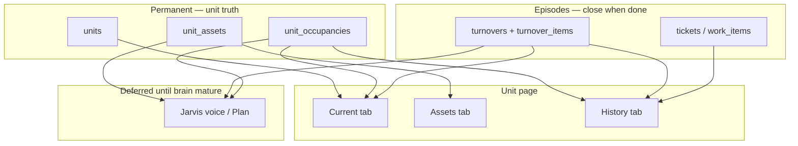

# Unit Lifecycle — build plan (occupancy, history, assets, turnover)

**Purpose:** Design north and phased build plan for **pro-grade unit truth** in Propera: who lived here when, what is installed in the unit, turnover episodes, and a read-only **unit history** — so the **brain** can answer situational questions before Jarvis is wired.

**Audience:** product, engineering, next agent implementing unit page, turnover, or Jarvis scope.

**Status:** **Phase 1–5 shipped** (occupancy, History, assets, nameplate OCR, operational scope compiler). Jarvis voice/plan tools (Phase 6) still deferred.

**Implementation order (non-negotiable):**

1. **Brain** — schema, DAL, portal API, validators  
2. **propera-app** — unit tabs (current, assets, history), capture UX (manual then vision)  
3. **Operational scope** — compiler reads unit situation (occupancy, active turnover, assets)  
4. **Jarvis** — read tools, then propose → confirm writes — **only after 1–3 are stable**

**Related:**

- [AGENTS.md](../AGENTS.md) · [PROPERA_GUARDRAILS.md](../../PROPERA_GUARDRAILS.md) · [PROPERA_NORTH_COMPASS.md](../../PROPERA_NORTH_COMPASS.md) · [PROPERA_JARVIS_NORTH_STAR.md](./PROPERA_JARVIS_NORTH_STAR.md) · [JARVIS_SPINE.md](./JARVIS_SPINE.md)
- Turnover engine (shipped, flag-gated): `src/dal/turnovers.js`, migration **039**, [PARITY_LEDGER.md](./PARITY_LEDGER.md)
- Unit hub today: `propera-app` `GET /api/properties/[code]/units/[unitId]` → tickets + active tenants only
- Vision precedents: `src/brain/shared/expenseScanVision.js`, `src/meterRuns/extractMeterReading.js`, turnover walkthrough photos
- [propera-app/docs/PROPERA_ARCHITECTURE_BOUNDARIES.md](../../propera-app/docs/PROPERA_ARCHITECTURE_BOUNDARIES.md) — cockpit vs brain
- Finance / vacancy interval: migration **064** `unit_status_history`

---

## Why this exists

Jarvis is only as good as the brain. Staff should be able to say:

- *"Start turnover for apt 511"* / *"Paint done"* / *"Create ticket for range replacement"* — turnover ops  
- *"Installed a new oven in 320 PENN, model WRS, serial XUAZ"* — asset registry  
- *"Problem with the dishwasher in 505 Morris"* — Jarvis already knows make/model/serial from the unit  

Today those fail or degrade because:

| Gap | Symptom |
|-----|---------|
| No **occupancy / lease history** | Past tenant, past lease, period-scoped money are missing or overwritten |
| No **unit asset registry** | Model/serial live only as ticket prose (if at all) |
| **Turnover** not in operational scope | Jarvis cannot resolve active turnover or punch-list items |
| **Unit page = current snapshot** | No history tab; past turnovers only on `/turnovers`; deactivated tenants hidden from hub query |

**Rule:** Build **permanent unit truth** and **episodic workflows** in the brain first. Jarvis is expression + proposals on top — not a substitute for missing tables.

---

## Core model — pro-grade mental map

Professional PMS / CMMS systems separate three layers:

```text
┌─────────────────────────────────────────────────────────────┐
│  UNIT (permanent) — physical space, catalog row `units`      │
│    ├── Occupancy episodes — who lived here [start → end]     │
│    ├── Installed assets — oven, DW, WH, locks (until replaced)│
│    ├── Turnover episodes — make-ready between occupancies    │
│    └── Ticket / work history — maintenance by unit label     │
└─────────────────────────────────────────────────────────────┘
```

| Layer | Lifetime | Example |
|-------|----------|---------|
| **Unit** | Permanent | Apt 505 @ Morris |
| **Occupancy** | Time-bounded | Tenant A, 2023-01-15 → 2024-06-30 |
| **Turnover** | Episode | Make-ready 2024-07-01 → 2024-07-22 → READY |
| **Unit asset** | Until replaced | Dishwasher Bosch SHX, serial ABC, installed 2024-03-12 |
| **Ticket** | Work episode | "Not draining" — closes; asset record remains |

**Tickets stay on the unit** (already true). **Money** should eventually scope to **occupancy/lease**, not mix all ledger lines on one unit row. **Assets attach to the unit**, not the tenant — the dishwasher stays when the lease turns.

---

## Current reality (2026-06)

### What ships today

| Area | Storage | UI | Notes |
|------|---------|-----|-------|
| **Unit catalog** | `units` | Property → unit detail | Status, notes, bed/bath |
| **Tickets** | `tickets` by property + `unit_label` | Unit hub lists all unit tickets (open + closed) | Persists across tenants |
| **Tenants** | `tenant_roster` | Unit hub: **active only** (`active=true`) | Deactivate = soft; row kept |
| **Lease** | `unit_leases` — **one row per unit** | Unit page lease editor | **Overwrites** on edit; no history (see **049** comment) |
| **Ledger** | `tenant_ledger_entries` by `unit_catalog_id` | Unit ledger tab | All tenants mixed on unit |
| **Turnover** | `turnovers`, `turnover_items` | `/turnovers` + unit section (**active only**) | DAL complete; flag `PROPERA_TURNOVER_ENGINE_ENABLED` |
| **Unit status intervals** | `unit_status_history` | Not on unit page | Vacancy timing / finance |
| **Unit assets** | ❌ | ❌ | — |
| **Occupancy history** | ❌ | ❌ | — |
| **Jarvis turnover / assets** | ❌ | — | Ticket ops only |

### Turnover item after DONE

Nothing is deleted. Rows remain in `turnover_items`; turnover becomes `READY`. Linked tickets keep `turnover_id` / `turnover_item_id`. **`current_blocker`** cleared when ready. Retrievable from `/turnovers`, not composed into unit history yet.

### Jarvis today for installs / issues

- **`propose_append_service_note`** → `tickets.service_notes` (requires **open** ticket; unstructured)  
- **`propose_create_service_request`** → new ticket; **no** turnover or asset link  
- No `register_unit_asset` or turnover mark-done proposals  

---

## Target architecture

```text
Staff / capture UI (propera-app)
  → Unit page tabs: Current | Assets | History
  → V2 portal API (service role + portal auth)
  → DAL (turnovers.js pattern — single module zone per domain)
  → Supabase canonical tables
  → Operational scope compiler (read-only situation pack)
  → [Later] Jarvis Ask / Plan tools → proposals → brain commit
```



**North compass:** Scope surfaces candidates; brain commits identity, policy, and writes. Jarvis never inserts asset or turnover rows directly.

---

## Pillar 1 — Occupancy & lease history

### Problem

- `unit_leases` is one row per unit — editing replaces history  
- Move-out is `tenant_roster.active = false`, not a dated occupancy close  
- Unit hub hides inactive roster rows  
- Ledger is unit-wide — past tenant balance not isolated  

### Target (V1 minimal)

**`unit_occupancies`** (name TBD):

| Column | Purpose |
|--------|---------|
| `unit_catalog_id` | FK `units.id` |
| `property_code` | Denormalized for queries |
| `tenant_roster_id` | Primary resident (nullable for vacant gap) |
| `started_at` / `ended_at` | Move-in / move-out |
| `status` | `current` \| `past` \| `pending` |
| `lease_snapshot_json` | Optional copy of rent/deposit/dates at start |
| `move_out_turnover_id` | Optional FK → `turnovers.id` |

**Lease history options (pick one in implementation PR):**

- **A)** Version `unit_leases`: add `ended_at`; new row on change; at most one `ended_at IS NULL` per unit  
- **B)** Store lease terms on occupancy row only; deprecate overwrite pattern on `unit_leases`  

**UI — Unit page Current tab:**

- Current occupancy + lease terms  
- Active tenant(s) from roster  

**UI — History tab:**

- Past occupancies (names, dates)  
- Link to tickets / ledger **for that period** (filter by date range + `tenant_roster_id` where available)  

**Events (brain):**

- Move-in → open occupancy  
- Move-out → close occupancy; optional **start turnover** (manual V1; auto-suggest V2)  

---

## Pillar 2 — Unit assets (installed equipment)

### Problem

Model, serial, warranty, and install date have no structured home. Ticket `service_notes` are wrong lifecycle (ticket closes; nameplate facts should not).

### Target

**`unit_assets`:**

| Column | Purpose |
|--------|---------|
| `unit_catalog_id` | FK `units.id` |
| `property_code` | Denormalized |
| `category` | `appliance` \| `fixture` \| `hvac` \| `lock` \| `other` |
| `asset_type` | `oven`, `dishwasher`, `range`, `water_heater`, … |
| `make`, `model`, `serial_number` | Nameplate fields |
| `installed_at` | Date |
| `installed_by` | Staff label or vendor |
| `warranty_start`, `warranty_end` | Optional V1 columns; alerts V2 |
| `status` | `active` \| `removed` \| `replaced` |
| `replaced_by_id` | Self-FK chain |
| `nameplate_photo_url` or storage ref | Evidence |
| `source_ticket_id`, `source_turnover_id` | Optional episode links |
| `metadata_json` | Manual URL, notes, vision confidence |
| `created_by`, audit timestamps | Portal actor |

**One active row per logical slot (V1 rule):** e.g. at most one active `dishwasher` per unit — replacing marks old `replaced`, inserts new.

### Capture UX — Assets tab (propera-app)

1. **List** active assets for unit (type, make, model, serial, install date)  
2. **Add** — manual form OR **photo nameplate** flow:  
   - Upload / camera → V2 vision extract (new `assetNameplateVision.js`, pattern from `expenseScanVision.js`)  
   - Staff **confirms** extracted fields (never blind commit)  
   - Save → DAL → storage for photo  
3. **Replace / remove** — status change + optional new row  
4. Repeat adds in one visit (range, DW, WH) — each row independent  

**Flag (suggested):** `PROPERA_UNIT_LIFECYCLE_ENABLED` (V2) + `NEXT_PUBLIC_PROPERA_UNIT_LIFECYCLE_ENABLED` (app) — shared with occupancies.

### Future intelligence (post-V1, not blocking)

- Parts lookup keyed by model  
- Manufacturer recalls / known issues (read tool or external API)  
- Warranty expiry digest  

Requires **structured model** on asset row first.

---

## Pillar 3 — Turnover linked to unit lifecycle

### What already ships

- `startTurnover`, punch list template, walkthrough items, mark item DONE, `createTicketFromTurnoverItem`, `markTurnoverReady`, blocker recompute  
- Portal API under `/api/portal/turnovers*`  
- App `/turnovers` + unit section (active turnover only)  

### Gaps to close (brain + app, pre-Jarvis)

| Gap | Target |
|-----|--------|
| Past turnovers on unit page | History tab lists READY/CANCELED for `unit_catalog_id` |
| Move-out → turnover | Optional: closing occupancy offers "Start turnover" |
| Unit history composition | Timeline: occupancies + turnovers + major tickets |
| Ticket ↔ turnover | Already on create from item; extend Jarvis create later |
| Scope compiler | Active turnover + punch list in operational scope when unit pinned |

### Turnover + assets together

During make-ready, staff may **replace appliances**. Flow:

1. Mark turnover item DONE (e.g. range)  
2. Register **unit asset** (photo nameplate) with `source_turnover_id`  
3. Create linked ticket if still needed (`createTicketFromTurnoverItem`)  

Asset truth survives after turnover is READY.

---

## Unit page — target tabs

| Tab | Contents |
|-----|----------|
| **Current** | Unit metadata, status, **current occupancy**, active lease, active tenant(s), **active turnover** (existing section), open tickets summary, ledger **current period** (when occupancy exists) |
| **Assets** | Installed equipment list, add/replace/remove, nameplate capture |
| **History** | Past occupancies, past turnovers (read-only detail link), closed tickets (filterable), past asset replacements, optional unit status intervals |

**Hub API evolution:** extend `GET .../units/[unitId]` or add focused routes — do not bloat one payload; prefer `/api/portal/units/:id/assets`, `/occupancies`, `/history` proxied from app.

---

## Operational scope (brain read pack)

Extend `compileOperationalScope.js` when unit is anchored:

| Slice | Source |
|-------|--------|
| `activeOccupancy` | `unit_occupancies` where `status=current` |
| `activeTurnover` | `turnovers` OPEN/IN_PROGRESS for unit |
| `turnoverBlocker` | `turnovers.current_blocker` |
| `unitAssets` | active `unit_assets` (summary: type → model) |

Extend `portal_page_context` / `portalPageContext.ts`:

- `unit_catalog_id`, `turnover_id` (when on turnover or unit page)  

Jarvis Ask uses this **before** any turnover/asset voice tools exist.

---

## Jarvis integration (Phase 4 — deferred)

**Do not implement until:**

- [ ] Occupancy V1 + History tab read path  
- [ ] Unit assets V1 + Assets tab + manual add  
- [ ] Turnover on History tab + scope compiler includes active turnover  
- [ ] Nameplate vision (optional but recommended before voice install claims)  
- [ ] Tests on DAL + portal routes  

### Later tools (proposal family)

| Staff intent | Proposal / read op | Brain commit |
|--------------|-------------------|--------------|
| What's in 505? / dishwasher model? | `list_unit_assets` / scope | Read only |
| Installed oven model WRS serial X | `propose_register_unit_asset` | `unit_assets` insert |
| Start turnover 511 | `propose_start_turnover` | `startTurnover` |
| Move-out inspection done / paint done | `propose_mark_turnover_item_done` | `updateTurnoverItem` |
| Add punch list items (repair list) | `propose_add_turnover_items` | `addTurnoverItem` batch |
| Create ticket for range (turnover) | `propose_create_turnover_ticket` | `createTicketFromTurnoverItem` |
| Dishwasher problem 505 | `propose_create_service_request` + **`unit_asset_id`** | Ticket + asset context |

**Anti-pattern:** Generic `propose_create_service_request` for turnover work without turnover/asset link — orphan tickets break ready gate.

Update `jarvisSystemPrompt.js`, `jarvisVoiceTools.js`, `types.js` (`PROPOSAL_OPS`), and [JARVIS_SPINE.md](./JARVIS_SPINE.md) when Phase 4 starts.

---

## Phased delivery

### Phase 0 — Doc + flags (this file)

- Lock vocabulary and order  
- No schema until Phase 1 PR  

### Phase 1 — Occupancy foundation (brain)

- [x] Migration: `unit_occupancies` + `portal_unit_occupancies_v1` (**087**); lease snapshot on open (does not version `unit_leases` yet)
- [x] DAL: `openUnitOccupancy`, `closeUnitOccupancy`, `listUnitOccupancies`, `getCurrentUnitOccupancy`, `patchUnitOccupancy`
- [x] Portal routes: `/api/portal/occupancies*` (gated)
- [x] Backfill: active roster + `unit_leases` snapshot in **087**
- [x] Tests: `tests/unitOccupanciesDal.test.js`

### Phase 2 — Unit History tab (app, read-only)

- [x] App proxy `/api/occupancies/*` + `occupancyShared.ts`
- [x] **Overview** tab: `UnitOccupancySection` (move-in / move-out)
- [x] **History** tab: past occupancies + past turnovers (`UnitHistorySection`)
- [x] Flag: `NEXT_PUBLIC_PROPERA_UNIT_LIFECYCLE_ENABLED=1`

### Phase 3 — Unit assets (brain + app)

- [x] Migration **`088_unit_assets_v1.sql`** — `unit_assets`, `portal_unit_assets_v1`
- [x] DAL **`src/dal/unitAssets.js`** + portal **`/api/portal/unit-assets*`** (same `PROPERA_UNIT_LIFECYCLE_ENABLED=1` gate)
- [x] App proxy **`/api/unit-assets/*`** + **`unitAssetsShared.ts`**
- [x] **Assets** tab: `UnitAssetsSection` — list, manual add, replace/remove, inline model/serial edit
- [ ] Nameplate photo upload (deferred to Phase 4 vision flow)

### Phase 4 — Nameplate vision (brain + app)

- [x] `assetNameplateVision.js` — JSON: make, model, serial, guessed `asset_type`, confidence
- [x] Portal `POST /api/portal/scan-unit-asset-nameplate` (lifecycle gate)
- [x] App proxy `/api/unit-assets/scan-nameplate` + nameplate upload + signed URL read
- [x] Migration **089** storage bucket `unit-asset-nameplates`
- [x] `UnitAssetEditorModal` — **Photo scan** (OCR pre-fill) or **Manual entry**; staff confirms before save
- [x] Full **Edit** + **Delete** on every asset row
- Env: `PROPERA_UNIT_ASSET_SCAN_PROVIDER` / `PROPERA_UNIT_ASSET_SCAN_MODEL` (falls back to expense scan vars)

### Phase 5 — Turnover on unit history + scope

- [x] Past turnovers on History tab (Phase 2)
- [x] `loadUnitLifecycleScope.js` + extend `compileOperationalScope` — occupancy, active turnover, blocker, assets
- [x] `portal_page_context` — `unit_catalog_id`, `turnover_id` (app + V2 envelope)
- [x] Unit page writes portal context for Jarvis Ask
- [x] Move-out → suggest turnover banner (UI only)
- [x] Tests: `operationalScope.test.js`, `operationalScopeUnitLifecycle.test.js`

### Phase 6 — Jarvis (after checklist above)

- Ask: unit situation, assets, turnover status  
- Plan: register asset, turnover mark-done, turnover-linked ticket create  
- Voice prompt rules + confirm receipts  
- Update AGENTS.md + HANDOFF_LOG  

---

## Schema / migration notes

- Next migration number: confirm against repo (**087+** after **086** `staff_jarvis_voice_enabled`)  
- Suggested filenames:  
  - `087_unit_occupancies_v1.sql`  
  - `088_unit_assets_v1.sql`  
- Do not reuse lease migration **049** semantics without explicit lease-history PR  
- RLS: follow turnover pattern (service role + portal routes; RLS enabled, no anon policies)  

---

## Guardrails

1. **propera-app** does not insert into `unit_assets`, `unit_occupancies`, or `turnovers` except via V2 portal API proxies.  
2. **Tickets / work_items** lifecycle unchanged — link via FKs, do not bypass `finalizeMaintenanceDraft` for turnover tickets.  
3. **Vision** proposes fields; staff confirms; brain commits.  
4. **Jarvis** proposes; brain validates; no direct asset/turnover writes from LLM tools.  
5. **Single-module patches** — occupancy DAL, assets DAL, turnover DAL stay separate; shared types in scope compiler only.  
6. Update **PARITY_LEDGER.md** only if GAS-class behavior changes (net-new domain = ledger row optional).  
7. Update **AGENTS.md** + this doc **Status** when a phase ships.  

---

## Success criteria

**Brain + app mature (Jarvis gate):**

- Staff can register assets on unit 505 with photo or manual entry; list persists after ticket close  
- Staff can see who lived in 505 and when; current vs past is clear  
- Past turnovers for 505 appear on History tab  
- Operational scope returns active turnover + asset summaries for pinned unit  
- Turnover create-ticket still links ticket ↔ item ↔ turnover (regression test)  

**Jarvis ready (Phase 6):**

- *"Problem with dishwasher in 505 Morris"* resolves unit + asset without asking model  
- *"Paint done for 511 turnover"* marks correct template item after confirm  
- *"Installed oven… model WRS serial X"* creates asset row, not ticket prose  

---

## Open decisions (resolve in Phase 1 PR)

| # | Question | Options |
|---|----------|---------|
| 1 | Lease history | Version `unit_leases` vs occupancy-only lease snapshot |
| 2 | One vs many assets per type | V1: one active dishwasher per unit |
| 3 | Ledger per occupancy | V1 read filter by dates; full accounting split deferred to finance roadmap |
| 4 | Auto-start turnover on move-out | V1 manual; V2 suggested action |
| 5 | Storage bucket for nameplates | New bucket vs `tenant_documents` pattern / PM attachments |

---

*Handoff: implement Phases 1–5 before Jarvis turnover/asset tools. Update this file Status table when each phase ships.*
