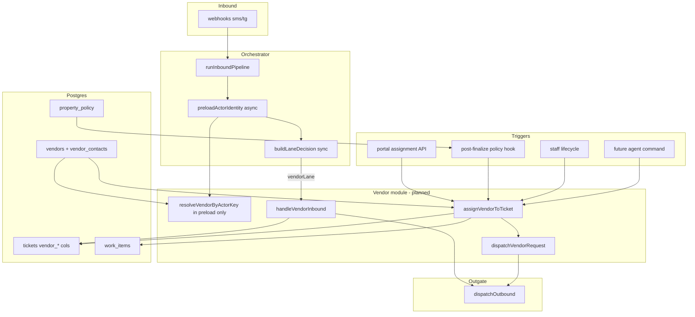

# Vendor lane — build plan (V1)

**Purpose:** Single source of truth for the **vendor routing lane** in propera-v2: how vendor phones are recognized, how vendors get assigned and dispatched, how they reply (YES/NO/availability), and how policy can auto-route by category. Phased so each slice can ship independently.

**Audience:** product, engineering, next agent implementing vendor work.

**Status:** **V0 + V1 + V2 shipped (2026-05)** — dispatch SMS, YES/NO inbound (`handleVendorInbound`), portal vendor status on `portal_tickets_v1` (`073_portal_tickets_vendor_lane.sql`). **V3 policy auto-route** not started.

**Related (do not duplicate here):**

- [ORCHESTRATOR_ROUTING.md](./ORCHESTRATOR_ROUTING.md) — inbound order; vendor lane today = stub at step 10
- [PM_ASSIGNMENT_OVERRIDE.md](./PM_ASSIGNMENT_OVERRIDE.md) — portal assign + `PM_OVERRIDE` guard
- [COMMUNICATION_ENGINE.md](./COMMUNICATION_ENGINE.md) — separate Twilio number; **not** vendor dispatch unless product explicitly chooses it
- [PROPERA_JARVIS_NORTH_STAR.md](./PROPERA_JARVIS_NORTH_STAR.md) — agent may not claim vendor assigned until brain executes
- [PROPERA_FINANCE_ROADMAP.md](./PROPERA_FINANCE_ROADMAP.md) — **vendor invoice / AP** is finance Phase 3; out of vendor-lane scope
- [FINANCIAL_INTAKE_V1.md](./FINANCIAL_INTAKE_V1.md) — staff `vendor_invoice` cost capture on tickets (orthogonal)
- GAS behavioral reference: `propera-gas-reference/26_VENDOR_ENGINE.gs`, `13_POLICY_ENGINE.gs` (`ASSIGN_VENDOR_BY_POLICY`)

**North compass alignment:**

- **Vendor is a branch, not the trunk** — in-house / PM / staff first; vendor when policy, skill, availability, or escalation requires it.
- **Canonical flow:** `signal → adapter → router/lane → vendor handler → DAL → lifecycle/policy (optional) → outgate`.
- **Vendor inbound must never enter `handleInboundCore`** (tenant maintenance intake).
- **All user-facing sends** go through `src/outgate/dispatchOutbound.js` only.
- **`propera-app`** sends signals (assign vendor); **V2** owns assignment, dispatch, and vendor reply semantics.

---

## Implementation guardrails (read before coding)

These are non-negotiable for every phase. Repeat them in PR descriptions so implementation does not drift.

### Portal requests; V2 decides

The cockpit may send **intent** (`assigned_vendor_id`, `dispatch: true`, optional note). **`propera-app` must never:**

- send Twilio/SMS or call `dispatchOutbound`
- implement dispatch dedupe, template choice, or `vendor_dispatch_at` writes
- treat “assign succeeded” in the UI as “vendor was texted” unless V2 response says so

**V2 portal routes** validate, call `assignVendorToTicket` / `dispatchVendorRequest`, audit in `event_log`, and return `{ assigned, dispatched, dispatchSkippedReason? }`. This is the easiest place for architecture drift — keep dispatch logic out of `propera-app` proxies and React handlers.

### Assignment ≠ dispatch

| Concern | What it is | Authority |
|---------|------------|-----------|
| **Assignment** | Operational ownership — `tickets.assigned_*`, `work_items.owner_*`, `vendor_status` when first contacting | **Authoritative.** Committed in DB first. |
| **Dispatch** | Outbound notification side effect — SMS to vendor via outgate | **Best-effort.** Runs after assignment when `dispatch: true`. |

**Dispatch failure must not roll back assignment** unless an explicit future flag says otherwise (none in v1). Log `VENDOR_DISPATCH_FAILED` / `VENDOR_DISPATCH_SKIPPED`; assignment and `VENDOR_ASSIGNED` remain true.

`assignVendorToTicket` should: (1) commit assignment in a single logical write; (2) call `dispatchVendorRequest` in a separate step; (3) return combined result without undoing (1) if (2) fails.

### PM_OVERRIDE is sacred

If `tickets.assignment_source = 'PM_OVERRIDE'`, **policy, staff lifecycle, and agent paths must not change** `assigned_type`, `assigned_id`, `assigned_name`, `assign_to`, or `assignment_source`. They may still update non-assignment fields (status, schedule, notes) per [PM_ASSIGNMENT_OVERRIDE.md](./PM_ASSIGNMENT_OVERRIDE.md).

Only a **new PM portal assign** (`source: 'PM_OVERRIDE'`) may replace vendor/staff on that ticket. Automatic vendor routing must **never** override a PM’s explicit assignment.

### No tenant-facing notifications in V1 / V2

Through **Phase V2** (inbound YES/NO):

- **Do not** send tenant SMS/TG/WA or use `TENANT_VENDOR_SCHEDULED` (or any tenant template).
- **Do** update `vendor_status`, `vendor_appt`, vendor reply context, `event_log`, and optional **internal** logs.
- **Manager notify** on decline/accept is **optional** and **internal-only** in V2 if implemented at all; full manager/tenant notify paths are **Phase V6**.

### Implementation order (do not reorder)

1. **V0** — vendor identity in DB + orchestrator preload (no async DB inside `lanePolicy.js`)
2. **V1** — `assignVendorToTicket` + `dispatchVendorRequest` + dispatch idempotency
3. **V2** — inbound `handleVendorInbound` (YES/NO)
4. **V3** — policy auto-route (only after V0–V1 are stable)

**Do not start V3 (policy auto-route)** before vendor identity and dispatch dedupe exist.

---

## What ships today vs gaps

| Layer | Status | Location |
|-------|--------|----------|
| Lane classification | **Partial** | `src/brain/router/decideLane.js` → `vendorLane` via `src/config/lanePolicy.js` (`VENDOR_PHONE_LAST10_LIST` env only) |
| Orchestrator | **V2 inbound** | `runInboundPipeline.js` → `handleVendorInbound`; system lane still stub |
| Vendor catalog | **Shipped** | `supabase/migrations/046_vendors_and_program_line_vendor.sql` — `vendors` + program line vendor |
| PM assign vendor on ticket | **Shipped** | `src/dal/portalTicketAssignment.js` → `assigned_type=VENDOR`, `work_items.owner_type=VENDOR` — **no SMS dispatch** |
| Portal routes | **Shipped** | `POST /api/portal/tickets/:ticketId/assignment`, `GET /api/portal/vendors-for-assignment`, `POST /api/portal/vendors` |
| propera-app UI | **Shipped** | `TicketDetailPanel` vendor tab; `/api/pm/vendors-for-assignment` |
| Policy auto-vendor | **Not started** | GAS: `ASSIGN_VENDOR_BY_POLICY` + `property_policy` keys |
| Vendor inbound (YES/NO) | **Shipped** | `src/vendor/handleVendorInbound.js`, `parseVendorReply.js` |
| Outbound dispatch SMS | **Shipped** | `dispatchVendorRequest` in `vendorAssignment.js` |
| Full policy rules engine | **Not started** | GAS `PolicyRules` sheet — use minimal `property_policy` keys in V3 |

**PARITY_LEDGER:** `26_VENDOR_ENGINE.gs` → **NOT STARTED** (update per phase when code lands).

---

## Routing modes (product map)

All assignment paths must converge on one brain service: **`assignVendorToTicket`** (see [Core service](#core-service-assignvendortoticket)).

| Mode | Trigger | Who decides vendor | Dispatch SMS | Phase |
|------|---------|-------------------|--------------|-------|
| **1. Self-routed (policy)** | Ticket created / finalized; category matches policy | `property_policy` key → `vendor_id` | Yes (default) | **V3** |
| **2. Portal action** | PM picks vendor on ticket in cockpit | Human + portal route | Yes (default on new assign) | **V1** (dispatch); assign already shipped |
| **3. Staff lifecycle** | Staff SMS: “needs vendor”, “dispatch”, etc. | Policy key or explicit vendor id only — never guess | Optional | **V4** |
| **4. Portal “route”** | Assign + send (or resend) to already-assigned vendor | Human | Yes / deduped | **V1** |
| **5. Agent (Jarvis Plan)** | “Schedule plumber for unit 303 PENN” | `propose_vendor_request` → confirm → `assignVendorToTicket` | **Partial** — portal Plan mode; trade→vendor name match |

**Staff lifecycle today:** `normalizeStaffOutcome.js` can emit `NEEDS_VENDOR` but does **not** assign or dispatch — see [Phase V4](#phase-v4--staff-needs_vendor).

**Finance:** Recording `vendor_invoice` on a ticket is [FINANCIAL_INTAKE_V1](./FINANCIAL_INTAKE_V1.md) / finance Phase 3 — link by `ticket_id` only; do not implement inside vendor lane.

---

## Architecture

```text
Inbound (SMS / WA / TG)
  → runInboundPipeline
  → preload actorIdentity (vendor? staff? — async, orchestrator only)
  → buildLaneDecision (sync; uses preloaded flags — not DB from lanePolicy)
  → vendorLane → handleVendorInbound     ← never handleInboundCore

Portal / policy / staff / agent
  → V2 route receives request only
  → assignVendorToTicket  (ownership write — authoritative)
  → dispatchVendorRequest (optional side effect — no rollback on failure)
  → dispatchOutbound
```



### Module boundaries (Patch Law)

| Path | Owns | Must not own |
|------|------|----------------|
| `src/brain/vendor/` | Inbound parse, reply intents, orchestration of DAL calls | Maintenance intake, portal auth, Twilio I/O |
| `src/dal/vendorAssignment.js` (name TBD) | `assignVendorToTicket`, `dispatchVendorRequest`; `resolveVendorByActorKey` (called from orchestrator preload only) | Template rendering (delegate to outgate) |
| `src/config/lanePolicy.js` | **Sync** lane hints: read `actorIdentity.isVendor` or env `VENDOR_PHONE_LAST10_LIST` — **no DB I/O** | Vendor YES/NO logic; async DAL |
| `src/inbound/runInboundPipeline.js` | `preloadActorIdentity`; wire vendor lane instead of stub | Assignment business rules |
| `src/outgate/` | Templates + send | Assignment or ticket policy |
| `propera-app` | UI + proxy: pass `assigned_vendor_id`, `dispatch` flag | Direct `tickets` writes; **any** Twilio/outgate; dedupe; template send |

**GAS reference — use for behavior, not structure:**

| GAS | V2 equivalent |
|-----|----------------|
| `readVendors_` / phone lookup | `vendors` + `vendor_contacts` + DAL |
| `assignVendorFromRow_` | `assignVendorToTicket` |
| `notifyVendorForTicket_` | `dispatchVendorRequest` → outgate |
| `handleVendorAcceptDecline_` | `handleVendorInbound` |
| `ASSIGN_VENDOR_BY_POLICY` | `resolveVendorIdForTicket` + assign hook |
| Early MAIN vendor gate before tenant core | **Do not duplicate** — single path: `vendorLane` → handler |

---

## Orchestrator integration

**Today (step 10):** `shouldShowNonMaintenanceLaneStub` → `buildNonMaintenanceLaneStub("vendorLane")` → static reply; `LANE_STUB` in `event_log`.

**Target (replace stub only for `vendorLane`):**

```javascript
// runInboundPipeline.js — early (before buildLaneDecision), async:
const actorIdentity = await preloadActorIdentity(routerParameter);
// actorIdentity: { isVendor, vendor?, isStaff, ... } from resolveVendorByActorKey + staff resolve

// buildLaneDecision(precursor, inbound, staffContext, actorIdentity) — sync
// decideLane / lanePolicy uses actorIdentity.isVendor OR env fallback — no DAL here

if (laneDecision.lane === "vendorLane" && shouldInvokeVendorLane({ precursor, ... })) {
  const vendor = actorIdentity.vendor; // already resolved
  vendorRun = await handleVendorInbound({ inbound, vendor, traceId, transportChannel });
}
// systemLane may remain stub until system lane is specified
```

**Why:** `decideLane` / `lanePolicy` today are sync and may run in tests without DB. **Never** call `resolveVendorByActorKey` from `src/config/lanePolicy.js`.

**Invariants:**

- `laneAllowsMaintenanceCore({ lane: "vendorLane" })` stays **false**.
- `src/adapters/tenantAgent/eligibility.js` already excludes `vendorLane` — no change required.
- Staff precursors (`STAFF_LIFECYCLE_GATE`, etc.) run **before** lane stub; vendor phones must not be staff roster matches.

See [ORCHESTRATOR_ROUTING.md](./ORCHESTRATOR_ROUTING.md) §4 — update that section when V2 lands.

---

## Identity (lane detection)

### Today

- `lanePolicy.isVendorActorKey(actorKey)` — last-10 match on `VENDOR_PHONE_LAST10_LIST` (comma-separated in `.env`).
- `vendors` table has **no phone** — catalog is for portal assignment only.

### Target (Phase V0)

**Migration:** next free number after latest repo migration (currently **`069_*`** — do not reuse `066`–`068`).

Proposed objects:

```sql
-- vendor_contacts: dispatch SMS identity
vendor_contacts (
  id uuid primary key default gen_random_uuid(),
  vendor_id text not null references vendors(vendor_id),
  phone_e164 text not null,
  role text not null default 'dispatch',  -- dispatch | billing
  active boolean not null default true,
  created_at timestamptz not null default now()
);
-- unique index on normalized last-10 of phone_e164

-- tickets: dispatch idempotency (prefer column over vendor_notes tokens)
alter table tickets add column if not exists vendor_dispatch_at timestamptz;
alter table tickets add column if not exists vendor_dispatched_to text default '';  -- vendor_id

-- vendor_conversation_ctx: YES/NO shorthand without ticket id in message
vendor_conversation_ctx (
  vendor_id text primary key references vendors(vendor_id),
  last_ticket_key text not null default '',
  last_human_ticket_id text not null default '',
  updated_at timestamptz not null default now()
);
```

**DAL (orchestrator-called only):**

- `resolveVendorByActorKey(actorKey)` → `{ vendorId, displayName, dispatchPhoneE164 } | null` — invoked from `preloadActorIdentity` in `runInboundPipeline.js`, not from config.

**Lane classification (sync):**

- `preloadActorIdentity` sets `actorIdentity.isVendor = true` when DAL resolves a vendor contact.
- `buildLaneDecision` / `decideLane` / `lanePolicy.isVendorActorKey(actorKey, actorIdentity)` uses **`actorIdentity.isVendor`** when present.
- **Fallback** (no DB / tests): `lanePolicy` last-10 match on `VENDOR_PHONE_LAST10_LIST` only — same as today.

**Operator steps:** seed `vendor_contacts` from legacy Vendors sheet / GAS export — document in [OUTSIDE_CURSOR.md](./OUTSIDE_CURSOR.md) when migration exists.

**V0 acceptance:** known vendor phone → `actorIdentity.isVendor` → `vendorLane` without env list; `npm test` lane tests pass with injected `actorIdentity` (no live DB in `lanePolicy`).

---

## `vendor_status` vocabulary (controlled text)

Column remains `text` in v1 (no DB enum required yet). **All writers** must use these values only (normalize case on write):

| Value | Meaning | Set by |
|-------|---------|--------|
| `Contacted` | Vendor assigned / dispatch attempted; awaiting reply | `assignVendorToTicket` when previous status empty |
| `Accepted` | Vendor YES / availability accepted | `handleVendorInbound` |
| `Declined` | Vendor NO | `handleVendorInbound` |
| `Scheduled` | Appointment window captured in `vendor_appt` | `handleVendorInbound` (may pair with `Accepted`) |
| `No Response` | Timeout / follow-up policy (optional) | Lifecycle timer — **V6** |

Do not invent ad hoc strings (`Contacted `, `accepted`, `VendorNotFound` on status column — use `event_log` for errors). GAS `VendorNotFound` maps to failed assign + log, not `vendor_status`.

---

## Core service: `assignVendorToTicket`

Single write contract for every trigger. Signature (conceptual):

```javascript
assignVendorToTicket({
  ticketLookup: { humanTicketId } | { ticketKey } | { ticketRowId },
  vendorId,
  source: "PM_OVERRIDE" | "POLICY" | "STAFF_COMMAND" | "AGENT",
  assignedBy: string,           // actor label for audit
  assignmentNote?: string,
  dispatch: boolean,            // default true for POLICY + new portal assign
  traceId: string,
  portalUserAccessToken?: string, // required for PM_OVERRIDE path
})
```

### Phase A — Assignment (authoritative)

Runs first; must complete successfully before dispatch is attempted.

1. Load ticket; reject `is_imported_history`.
2. `assertVendorAssignable(vendorId)` (extract from `portalTicketAssignment.js`).
3. **PM_OVERRIDE guard (hard stop):** if `assignment_source === 'PM_OVERRIDE'` and `source !== 'PM_OVERRIDE'`, **return success with `assignmentSkipped: true`** — do not mutate assignment columns. Policy, staff, and agent **never** overwrite PM human authority.
4. Patch `tickets`: `assigned_type = 'VENDOR'`, `assigned_id`, `assigned_name`, `assign_to`, `assigned_at`, `assignment_source` per `source`.
5. If `vendor_status` empty → `Contacted` ([vocabulary](#vendor_status-vocabulary-controlled-text)).
6. Patch `work_items`: `owner_type = 'VENDOR'`, `owner_id = vendorId`.
7. `appendEventLog` `VENDOR_ASSIGNED` (+ timeline when kinds exist).

If step 3 triggers, **do not dispatch** even when `dispatch: true` was requested.

### Phase B — Dispatch (side effect, optional)

Only after Phase A committed (and not skipped by PM_OVERRIDE guard).

8. If `dispatch` → `dispatchVendorRequest` (separate function; dedupe — below).
9. On dispatch success → `VENDOR_DISPATCH_SENT`; on failure/skip → log only; **do not revert** assignment.

Return shape example: `{ ok: true, assigned: true, dispatched: boolean, dispatchError?: string }`.

### Refactor

`applyPortalTicketAssignment` vendor branch → call `assignVendorToTicket` with `source: 'PM_OVERRIDE'` — portal route stays a thin gate; **no dispatch logic in propera-app**.

---

## Outbound dispatch: `dispatchVendorRequest`

**Not assignment.** Call only from V2 after ownership is written. Idempotent notification only.

```javascript
dispatchVendorRequest({ vendor, ticket, traceId })
```

| Step | Behavior |
|------|----------|
| Dedupe | Skip if `tickets.vendor_dispatch_at` set **and** `vendor_dispatched_to === vendor.vendorId`, or `event_log` contains `VENDOR_DISPATCH_SENT` for same pair |
| Payload | `propertyName`, `unit`, `category`, `issue` from ticket row |
| Template | `VENDOR_DISPATCH_REQUEST` (GSM-7 safe placeholders — mirror GAS `buildVendorDispatchMsg_`) |
| Send | `dispatchOutbound` to `vendor.dispatchPhoneE164` |
| Mark | Set `vendor_dispatch_at`, `vendor_dispatched_to`; append `VENDOR_DISPATCH_SENT` |
| Context | Update `vendor_conversation_ctx.last_ticket_key` for YES/NO shorthand |
| Failure | Log `VENDOR_DISPATCH_FAILED`; **do not** roll back assignment or clear `assigned_*` |

### From number (open decision)

| Option | Pros | Cons |
|--------|------|------|
| **Maintenance router number** | Same thread vendors may already know | Mixes tenant + vendor traffic on one line |
| **Dedicated vendor dispatch number** | Clear separation | Extra Twilio number + env |
| **Communication Engine number** | Already isolated | Product confusion — comms is broadcast, not dispatch |

**Default recommendation until product decides:** maintenance router number; document env `VENDOR_DISPATCH_FROM` override.

---

## Inbound: `handleVendorInbound`

**Entry:** `vendorLane`, precursor `PRECURSOR_EVALUATED`, vendor resolved, not staff/compliance/suppressed.

**Returns:** `{ brain, replyText?, outgate?, ticketUpdated? }` — same shape as staff/core runs for pipeline outgate.

### Message grammar (v1 — port GAS subset)

**V1/V2 notification rule:** update ticket fields + vendor reply SMS only. **No tenant outbound** until Phase V6.

| Pattern | Action |
|---------|--------|
| `YES` / `Y` [ticketId] [availability…] | `vendor_status` → `Accepted` (and `Scheduled` when appt parsed); `vendor_appt` from availability text; `event_log` only — **no** `TENANT_VENDOR_SCHEDULED` |
| `NO` / `N` [ticketId] [reason…] | `vendor_status` → `Declined`; optional internal/manager log in V2 — **no** tenant SMS |
| Availability-only (no YES prefix) | **Shipped** — `extractVendorAvailabilityText` + implicit YES when one active job (GAS `handleVendorAvailabilityOnly_`) |
| Unknown | `VENDOR_CONFIRM_INSTRUCTIONS` to vendor |

**Ticket resolution order:**

1. Ticket id token in message (human id `PROP-MMDDYY-####`)
2. Else `vendor_conversation_ctx.last_human_ticket_id`
3. Else reply `VENDOR_NEED_TICKET_ID`

**Ticket must be assigned to this vendor** (or open vendor dispatch context) before accept/decline mutates row — reject with `VENDOR_TICKET_NOT_FOUND` / `VENDOR_NOT_ASSIGNED` templates.

**Hard rule:** handler returns handled=true for all vendor phones; **never** fall through to tenant core.

### Template keys (outgate / `message_templates`)

| Key | When |
|-----|------|
| `VENDOR_DISPATCH_REQUEST` | Outbound dispatch |
| `VENDOR_CONFIRM_INSTRUCTIONS` | Unknown inbound |
| `VENDOR_NEED_TICKET_ID` | YES/NO without resolvable ticket |
| `VENDOR_TICKET_NOT_FOUND` | Bad ticket id |
| `TENANT_VENDOR_SCHEDULED` | After vendor YES + appt (tenant notify) — V6 |
| Manager notify templates | Decline / accept copies — V6 |

Seed templates in `message_templates` or document operator import in OUTSIDE_CURSOR.

---

## Policy auto-route (Phase V3)

**Minimal v1 — no full PolicyRules sheet port.**

### Policy keys (`property_policy`)

Convention: `{CATEGORY_SLUG}_VENDOR_ID` → `vendors.vendor_id` text.

Examples:

| policy_key | value | scope |
|------------|-------|-------|
| `PLUMBING_VENDOR_ID` | `VND_ACME_PLUMB` | property or `GLOBAL` |
| `HVAC_VENDOR_ID` | `VND_HVAC_CO` | property or `GLOBAL` |
| `ELECTRICAL_VENDOR_ID` | … | … |

Lookup: `resolveVendorIdForTicket({ propertyCode, category })` — property row first, then `GLOBAL` (same pattern as `lifecyclePolicyDal.js` / schedule policy).

### Hook point

Run **after ticket row exists** (post-finalize), not during intake compile:

- `finalizeMaintenance.js` success path, **or**
- dedicated `onTicketCreatedPolicyHooks` called from finalize

**Conditions to auto-assign:**

- Resolved `vendorId` non-empty
- Category matches key (normalize category slug)
- **`assignment_source !== 'PM_OVERRIDE'`** (mandatory — policy never fights PM)
- Ticket has **no** assignee **or** `assignment_source` is `POLICY` / empty (see open decision for staff)
- Optional flag: `property_policy.AUTO_VENDOR_DISPATCH_ENABLED` = true

**Action:** `assignVendorToTicket({ source: 'POLICY', dispatch: true, assignedBy: 'POLICY_ENGINE' })` — relies on PM_OVERRIDE guard in Phase A.

**Prerequisite:** V0 + V1 complete (identity + dispatch dedupe). **Do not ship V3 first.**

**Open decision:** May policy replace an existing **staff** assignee? **Recommended v1: no** — only empty `assigned_id` or already `assigned_type=VENDOR` with same policy path.

---

## Portal / propera-app (Phase V1)

**Already wired:**

- `POST /api/portal/tickets/:ticketId/assignment` with `assigned_vendor_id`
- `GET /api/portal/vendors-for-assignment`
- `POST /api/portal/vendors` (create catalog entry)

**V1 backend gap (V2 only):**

- Portal route calls `assignVendorToTicket({ source: 'PM_OVERRIDE', dispatch: true })` by default.
- Request body may include `dispatch_on_assign: boolean` (default `true`) — **intent only**; V2 runs dedupe, templates, and send.
- Response should expose `dispatched`, `dispatchSkippedReason`, `dispatchError` so UI can show “assigned but SMS failed” without guessing.

**propera-app may:**

- Show checkbox “Send dispatch SMS” → sets `dispatch_on_assign` on POST.
- Show “Resend dispatch” → POST with assign unchanged + `dispatch_only: true` (new V2 flag) for ops break-glass.

**propera-app must not:** implement Twilio, template rendering, or `vendor_dispatch_at` logic in Next.js routes beyond forwarding JSON to V2.

---

## Staff lifecycle (Phase V4)

**Today:** Keywords `vendor|contractor|dispatch` → `NEEDS_VENDOR` in `normalizeStaffOutcome.js`; no assign.

**V4 options:**

| Tier | Behavior |
|------|----------|
| **V4a (safe default)** | Reply: assign vendor in portal for ticket `{id}`; log `NEEDS_VENDOR` on WI / event_log |
| **V4b** | If `resolveVendorIdForTicket` returns id for ticket category → `assignVendorToTicket({ source: 'STAFF_COMMAND', dispatch: true })` |
| **V4c** | Parse `vendor_id` or vendor name token from staff message → validate → assign |

**Never** auto-assign without policy key or explicit vendor id in message.

---

## Agent path (Phase V5)

Per [PROPERA_JARVIS_NORTH_STAR.md](./PROPERA_JARVIS_NORTH_STAR.md):

- Agent may **propose** “assign vendor X to ticket Y”.
- Execution: internal portal-authenticated call or `POST /api/portal/tickets/:id/assignment` with brain validation.
- Agent must **not** write `tickets` via Supabase or invent dispatch confirmation text.

---

## Lifecycle depth (Phase V6)

Port when lifecycle engine is ready:

- WI transition to wait-vendor on dispatch (GAS `wiTransition_` / `WAIT_VENDOR`)
- `notifyManagerVendorDecision_` on decline
- `notifyTenantVendorScheduled_` on accept (dedupe tenant spam)
- Policy timers (GAS `SET_TIMER` + vendor follow-up) — use `lifecycle_timers` table

---

## Phased delivery

| Phase | Name | Deliverable | Acceptance |
|-------|------|-------------|------------|
| **V0** | Identity | Migration + `resolveVendorByActorKey` + `preloadActorIdentity`; sync lane via `actorIdentity` | DB vendor phone → `vendorLane`; **no** async DAL in `lanePolicy.js` |
| **V1** | Assign + dispatch | Phase A/B split; portal thin route; `VENDOR_DISPATCH_REQUEST` | Assign succeeds even if SMS fails; deduped dispatch on repeat assign |
| **V2** | Inbound lane | `handleVendorInbound`; replace stub | YES/NO updates controlled `vendor_status`; **no tenant SMS**; never enters core |
| **V3** | Policy auto-route | **After V0–V1 stable** — `property_policy` + post-finalize hook | Auto assign only when not `PM_OVERRIDE`; plumbing policy key works |
| **V4** | Staff NEEDS_VENDOR | Staff handler tier V4a or V4b | Staff “needs vendor” does not assign wrong vendor silently |
| **V5** | Agent assign | Agent adapter → assign API only | No assignment without `assignVendorToTicket` + event_log |
| **V6** | Lifecycle + notify | WI transitions, tenant/manager templates, timers | Matches GAS notify paths for accept/decline |

**Recommended implementation order:** V0 → V1 → V2 → V3 → V4 → V5 → V6. **Do not implement V3 before V0 and V1.**

**Finance vendor invoice:** separate track — [PROPERA_FINANCE_ROADMAP.md](./PROPERA_FINANCE_ROADMAP.md) Phase 3; optional link field on cost rows only.

---

## Event log and observability

| event | When |
|-------|------|
| `LANE_DECIDED` | Existing — lane `vendorLane` |
| `LANE_STUB` | **Remove for vendor** when V2 handler ships |
| `VENDOR_INBOUND_HANDLED` | Inbound parse result |
| `VENDOR_DISPATCH_SENT` | Successful dispatch |
| `VENDOR_DISPATCH_SKIPPED` | Dedupe or missing phone |
| `VENDOR_DISPATCH_FAILED` | Outbound send failed; assignment kept |
| `VENDOR_ASSIGNED` | Assignment patch applied |
| `VENDOR_ASSIGNMENT_SKIPPED_PM_OVERRIDE` | Policy/staff blocked by PM_OVERRIDE guard |
| `PORTAL_PM_TICKET_ASSIGNMENT` | Existing — keep for portal assign |

Structured logs: `log_kind: vendor`, `trace_id`, `vendor_id`, `ticket_key`, `brain`.

---

## Tests (per phase)

| Phase | Tests |
|-------|-------|
| V0 | `resolveVendorByActorKey` unit; `preloadActorIdentity` + sync lane with injected `actorIdentity` (no DB in lanePolicy) |
| V1 | assign + dispatch dedupe; portal integration mock |
| V2 | `tests/vendor/handleVendorInbound.test.js` — YES/NO/unknown; `routeInboundDecision` vendor never `computeCanEnterCore` |
| V3 | policy hook with PM_OVERRIDE blocked |
| V4 | staff NEEDS_VENDOR does not assign without policy |

Run full suite: `npm test` in `propera-v2`.

---

## Environment variables

| Variable | Purpose | Phase |
|----------|---------|-------|
| `VENDOR_PHONE_LAST10_LIST` | Fallback lane detection | Today → deprecate after V0 |
| `VENDOR_DISPATCH_ENABLED` | Kill switch for outbound SMS | V1 |
| `VENDOR_DISPATCH_FROM` | Override Twilio from (optional) | V1 |
| `VENDOR_INBOUND_ENABLED` | Kill switch for handler vs stub | V2 |
| `VENDOR_POLICY_AUTO_ASSIGN_ENABLED` | Kill switch for V3 hook | V3 |

Document all in `.env.example` when implemented.

---

## Open product decisions

Record decisions here when resolved:

| # | Question | Options | Decision |
|---|----------|---------|----------|
| 1 | SMS **From** number for vendor dispatch | Maintenance / dedicated vendor / comms number | _TBD_ |
| 2 | Policy overwrite of **staff** assignee | Never / only if empty / always | _TBD — recommend: only if empty_ |
| 3 | `vendor_status` shape | Controlled text vocabulary vs DB enum later | **Decided:** controlled text — see [vocabulary](#vendor_status-vocabulary-controlled-text) |
| 4 | Multi-vendor per category | Single policy id only in v1 | _TBD — v1: single_ |
| 5 | Resend dispatch override | Ops break-glass for dedupe | _TBD_ |

---

## Doc maintenance checklist

When a phase ships, update:

- [ ] This file — phase status table at top
- [ ] [PARITY_LEDGER.md](./PARITY_LEDGER.md) — `26_VENDOR_ENGINE.gs` row
- [ ] [ORCHESTRATOR_ROUTING.md](./ORCHESTRATOR_ROUTING.md) — §4 vendor lane
- [ ] [BRAIN_PORT_MAP.md](./BRAIN_PORT_MAP.md) — file paths + handoff row
- [ ] [AGENTS.md](../AGENTS.md) — “Where everything lives”
- [ ] [OUTSIDE_CURSOR.md](./OUTSIDE_CURSOR.md) — SQL seed + Twilio
- [ ] [HANDOFF_LOG.md](./HANDOFF_LOG.md) — dated session note

---

## File map (planned)

| File | Phase |
|------|-------|
| `supabase/migrations/069_vendor_lane_v1.sql` (name TBD) | V0 |
| `src/dal/vendorAssignment.js` | V0–V1 |
| `src/dal/vendorContacts.js` | V0 |
| `src/inbound/preloadActorIdentity.js` (or inline in pipeline) | V0 |
| `src/brain/vendor/handleVendorInbound.js` | V2 |
| `src/brain/vendor/parseVendorReply.js` | V2 |
| `src/brain/vendor/resolveVendorIdForTicket.js` | V3 |
| `src/dal/finalizeMaintenance.js` (hook call) | V3 |
| `tests/vendor/*.test.js` | V0–V4 |

**Existing files to touch:**

- `src/inbound/routeInboundDecision.js` — deprecate vendor stub text when handler lives; optional `actorIdentity` param on `buildLaneDecision`
- `src/dal/portalTicketAssignment.js` — V1 refactor
- `src/outgate/` template map — V1
